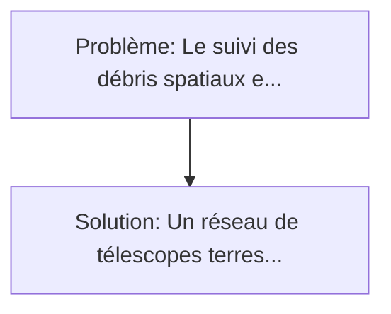
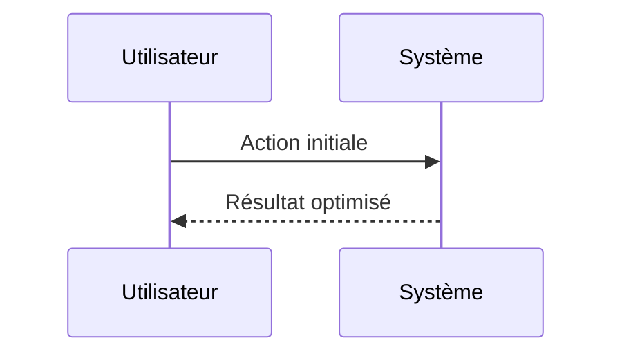

<!-- markdownlint-disable MD013 MD033 -->

[🇬🇧 English Version](./README.md)

# Neuromorphic Orbital Tracker

> **Résumé exécutif :** Un réseau de télescopes terrestres et orbitaux équipés de capteurs neuromorphiques (Event-based cameras). Le suivi des débris spatiaux et des manœuvres hostiles de satellites en orbite basse (LEO) repose sur des radars et télescopes optiques standards (frame-based).

---

## 1. Aperçu visuel & Effet Wahou

## 2. La thèse contrariante (Peter Thiel Style)

**La croyance populaire :** Les solutions logicielles seules peuvent résoudre ce problème.
**La vérité cachée :** Les algorithmes classiques de Computer Vision (CNN) sont inadaptés aux flux de données asynchrones (Event-based). Cela nécessite un couplage étroit entre un hardware optique très spécifique et une architecture logicielle (SNN) totalement différente des architectures Von Neumann classiques.

## 3. Le problème & La cible

- **Modèle économique :** B2B / B2G
- **Cible précise :** US Space Force, opérateurs de Space Situational Awareness (LeoLabs), et opérateurs de constellations de satellites (Starlink, Kuiper).
- **La douleur urgente :** Le suivi des débris spatiaux et des manœuvres hostiles de satellites en orbite basse (LEO) repose sur des radars et télescopes optiques standards (frame-based). Ces capteurs sont saturés par la quantité d'objets, génèrent des téraoctets de données vides (le ciel noir), et ont une latence trop élevée pour repérer des anomalies cinématiques à très grande vitesse.

## 4. Architecture technique & Plomberie

## 5. Modèle économique & Viabilité financière

| Métrique                    | Valeur             |
| --------------------------- | ------------------ |
| Structure de prix           | Custom Pricing     |
| Objectif 12 mois            | 100 clients        |
| Calcul du CA (Target 100k€) | 100 \* 1000 = 100k |
| Marge brute estimée         | 80%                |

## 6. Moteur de distribution & Fossé défensif (Moat)

- **Stratégie d'acquisition :** Ventes B2B directes
- **Moat (Barrière à l'entrée) :** Les algorithmes classiques de Computer Vision (CNN) sont inadaptés aux flux de données asynchrones (Event-based). Cela nécessite un couplage étroit entre un hardware optique très spécifique et une architecture logicielle (SNN) totalement différente des architectures Von Neumann classiques.

## 7. Grille d'évaluation détaillée

| Critère                           | Score VC (/100) | Score Terrain (/100) |
| --------------------------------- | --------------- | -------------------- |
| Thèse & Monopole / Urgence        | -- / 25         | -- / 25              |
| Moat / Résistance aux LLM natifs  | -- / 25         | -- / 25              |
| Scalabilité / Friction d'adoption | -- / 25         | -- / 25              |
| Unit Economics / ROI direct       | -- / 25         | -- / 25              |
| **TOTAL**                         | **-- / 100**    | **-- / 100**         |

> **Verdict VC :** En attente d'évaluation.

> **Verdict Terrain :** En attente d'évaluation.
