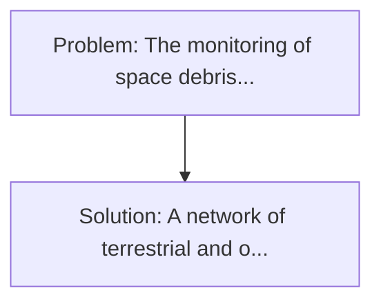
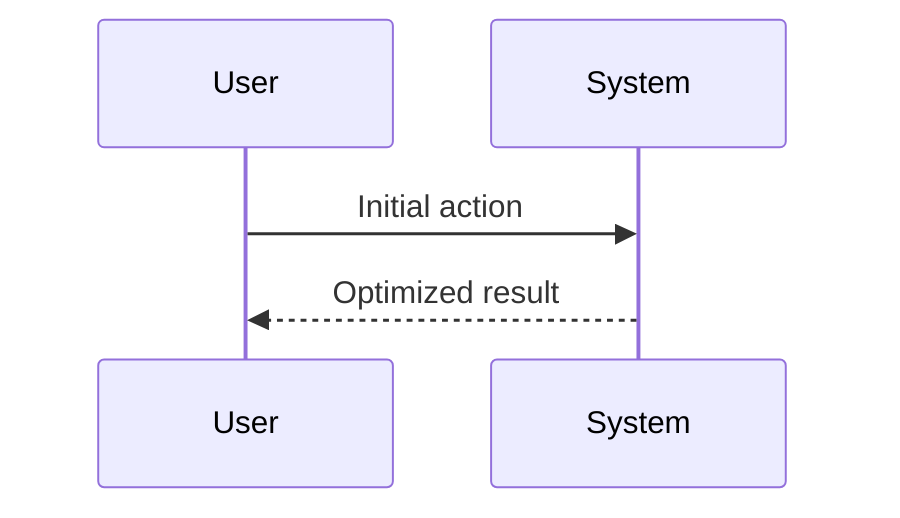

<!-- markdownlint-disable MD013 MD033 -->

[🇫🇷 Version Française](./README.fr.md)

# Neuromorphic Orbital Tracker

> **Executive Summary:** A network of terrestrial and orbital telescopes equipped with neuromorphic sensors (Event-based cameras). The monitoring of space debris and hostile low-orbit satellite manoeuvres (LEO) is based on standard (frame-based) optical radars and telescopes.

---

## 1. Visual Overview & Wow Effect

## 2. Contrarian Thesis (Peter Thiel Style)

**Popular Belief:** Generic software solutions can solve this.
**Hidden Truth:** Computer Vision's (CNN) classic algorithms are unsuitable for asynchronous data streams (Event-based). This requires a close coupling between a very specific optical hardware and a software architecture (SNN) completely different from the classical Von Neumann architectures.

## 3. Problem & Target Market

- **Business Model:** B2B / B2G
- **Target Audience:** US Space Force, operators of Space Situational Awareness (LeoLabs), and satellite constellation operators (Starlink, Kuiper).
- **Urgent Pain Point:** The monitoring of space debris and hostile low-orbit satellite manoeuvres (LEO) is based on standard (frame-based) optical radars and telescopes. These sensors are saturated by the quantity of objects, generate terabytes of empty data (the black sky), and have a latency too high to detect kinematic anomalies at very high speed.

## 4. Technical Architecture & Infrastructure

## 5. Business Model & Financial Viability

| Metric                 | Value              |
| ---------------------- | ------------------ |
| Pricing Structure      | Custom Pricing     |
| 12-Month Target        | 100 customers      |
| Revenue Formula        | 100 \* 1000 = 100k |
| Estimated Gross Margin | 80%                |

## 6. Distribution Engine & Moat

- **Acquisition Strategy:** Direct B2B Sales
- **Moat (Defensibility):** Computer Vision's (CNN) classic algorithms are unsuitable for asynchronous data streams (Event-based). This requires a close coupling between a very specific optical hardware and a software architecture (SNN) completely different from the classical Von Neumann architectures.

## 7. Detailed Evaluation Grid

| Criterion                   | VC Score (/100) | Market Score (/100) |
| --------------------------- | --------------- | ------------------- |
| Thesis & Monopoly / Urgency | -- / 25         | -- / 25             |
| Moat / LLM Immunity         | -- / 25         | -- / 25             |
| Scalability / UX Friction   | -- / 25         | -- / 25             |
| Unit Economics / ROI        | -- / 25         | -- / 25             |
| **TOTAL**                   | **-- / 100**    | **-- / 100**        |

> **VC Verdict:** Pending evaluation.

> **Market Verdict:** Pending evaluation.
