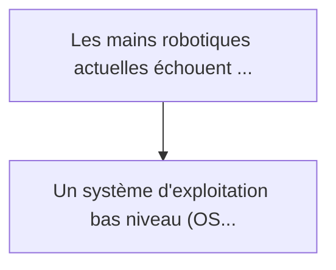
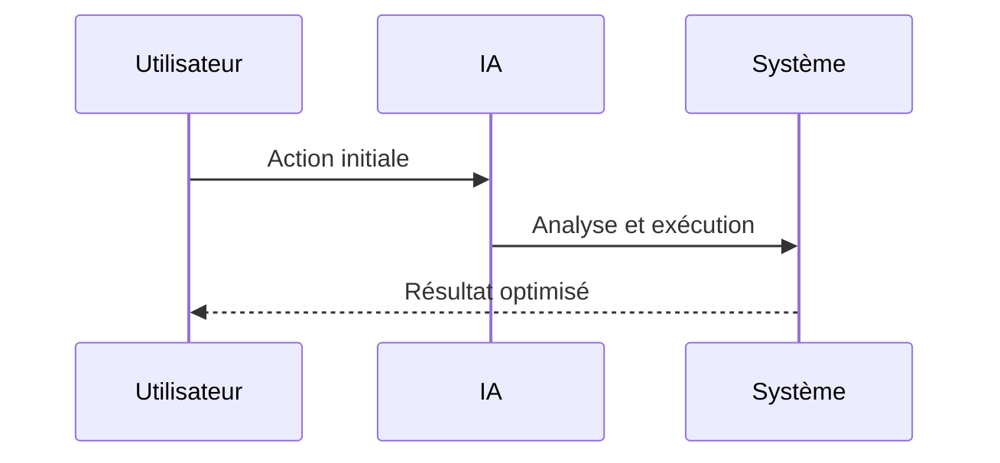

<!-- markdownlint-disable MD013 MD028 MD033 MD039 MD041 -->

[🇬🇧 English Version](./README.md)

# Neuromorphic Tactile Physics OS

> **Résumé exécutif :** Un système d'exploitation bas niveau (OS) couplé à une puce neuromorphique (Spiking Neural Networks) placée directement à la "périphérie" (dans le ...

---

## 1. Aperçu visuel & Effet Wahou

## 2. La thèse contrariante (Peter Thiel Style)

La croyance populaire : Les solutions génériques peuvent résoudre cela.
La vérité cachée : L'intelligence cloud ou un modèle d'IA classique (ex: un LLM ou un CNN lourd) induit une latence réseau ou de calcul incompatible avec les réflexes physiques instantanés nécessaires pour rattraper un objet qui glisse.

## 3. Le problème & La cible

Modèle économique : B2B
Cible précise : Fabricants de robots humanoïdes, automatisation logistique (picking), chirurgie robotique.
La douleur urgente : Les mains robotiques actuelles échouent dans la manipulation fine et dynamique (ex: manipuler des objets mous, glissants, ou inconnus). Les capteurs tactiles classiques génèrent des matrices de pression lourdes à traiter en temps réel, créant un goulot d'étranglement entre le capteur, le processeur central, et l'actuateur. La latence résultante (souvent > 50ms) provoque la chute de l'objet ou son écrasement.

## 4. Architecture technique & Plomberie

## 5. Modèle économique & Viabilité financière

| Métrique                    | Valeur             |
| --------------------------- | ------------------ |
| Structure de prix           | Prix sur mesure    |
| Objectif 12 mois            | 100 clients        |
| Calcul du CA (Target 100k€) | 100 \* 1000 = 100k |
| Marge brute estimée         | 80%                |

## 6. Moteur de distribution & Fossé défensif (Moat)

Stratégie d'acquisition : Vente B2B directe
Moat (Barrière à l'entrée) : L'intelligence cloud ou un modèle d'IA classique (ex: un LLM ou un CNN lourd) induit une latence réseau ou de calcul incompatible avec les réflexes physiques instantanés nécessaires pour rattraper un objet qui glisse.

## 7. Grille d'évaluation détaillée

| Critère                           | Score VC (/100) | Score Terrain (/100) |
| --------------------------------- | --------------- | -------------------- |
| Thèse & Monopole / Urgence        | 22 / 25         | -- / 25              |
| Moat / Résistance aux LLM natifs  | 24 / 25         | -- / 25              |
| Scalabilité / Friction d'adoption | 18 / 25         | -- / 25              |
| Unit Economics / ROI direct       | 21 / 25         | -- / 25              |
| **TOTAL**                         | **85 / 100**    | **-- / 100**         |

> **Verdict VC :** Neuromorphic Tactile OS est le pionnier de la couche essentielle d'informatique de périphérie pour la robotique avancée en traitant les données sensorielles via des réseaux de neurones à impulsions directement au niveau de la 'peau'. Cette approche profondément contrariante réduit considérablement la latence et la bande passante, créant un fossé matériel-logiciel massif. La friction d'intégration est élevée, mais l'établissement du système d'exploitation standard pour la perception tactile robotique garantit un monopole à long terme dans l'automatisation industrielle.

> **Verdict Terrain :** En attente d'évaluation.
