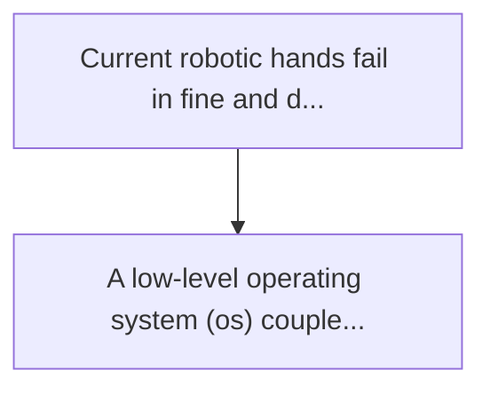
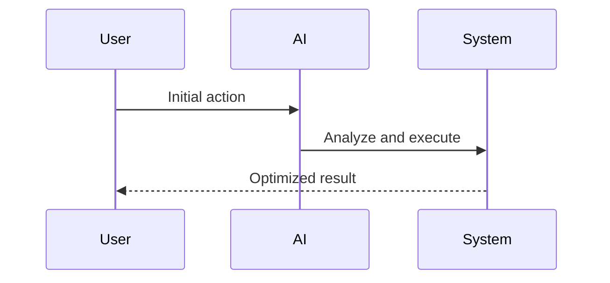

<!-- markdownlint-disable MD013 MD028 MD033 MD039 MD041 -->

[ 🇫🇷 Version Française ](./README.fr.md)

# Neuromorphic tactile physics os

> **Executive Summary:** A low-level operating system (os) coupled with a neuromorphic chip (spiking neural networks) placed directly at the "periphery" (in the ...

---

## 1. Visual Overview & Wow Effect

## 2. Contrarian Thesis (Peter Thiel Style)

Popular Belief: Generic solutions can solve this.
Hidden Truth: Cloud intelligence or a classic ai model (e.g. a heavy llm or cnn) induces network latency or computational latency incompatible with the instant physical reflexes necessary to catch an object that slides.

## 3. Problem & Target Market

Business Model: B2B
Target Audience: Manufacturers of humanoid robots, logistic automation (picking), robotic surgery.
Urgent Pain Point: Current robotic hands fail in fine and dynamic manipulation (e.g. handling soft, slippery, or unknown objects). conventional touch sensors generate heavy pressure matrices to process in real time, creating a bottleneck between the sensor, the central processor, and the actuator. the resulting latency (often > 50ms) causes the object to fall or crash.

## 4. Technical Architecture & Infrastructure

## 5. Business Model & Financial Viability

| Metric                 | Value              |
| ---------------------- | ------------------ |
| Pricing Structure      | Custom Pricing     |
| 12-Month Target        | 100 customers      |
| Revenue Formula        | 100 \* 1000 = 100k |
| Estimated Gross Margin | 80%                |

## 6. Distribution Engine & Moat

Acquisition Strategy: Direct B2B Sales
Moat (Defensibility): Cloud intelligence or a classic ai model (e.g. a heavy llm or cnn) induces network latency or computational latency incompatible with the instant physical reflexes necessary to catch an object that slides.

## 7. Detailed Evaluation Grid

| Criterion                   | VC Score (/100) | Market Score (/100) |
| --------------------------- | --------------- | ------------------- |
| Thesis & Monopoly / Urgency | -- / 25         | -- / 25             |
| Moat / LLM Immunity         | -- / 25         | -- / 25             |
| Scalability / UX Friction   | -- / 25         | -- / 25             |
| Unit Economics / ROI        | -- / 25         | -- / 25             |
| **TOTAL**                   | **-- / 100**    | **-- / 100**        |

> **VC Verdict:** Pending evaluation.

> **Market Verdict:** Pending evaluation.
