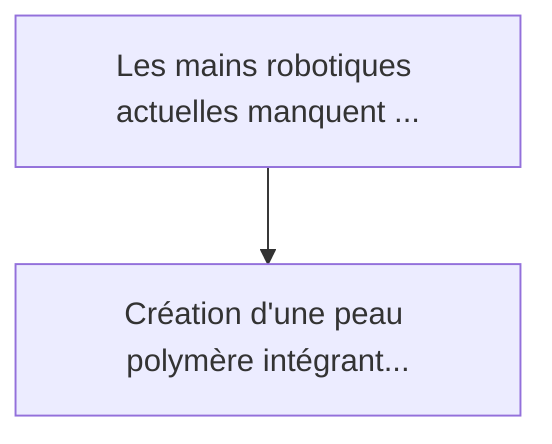
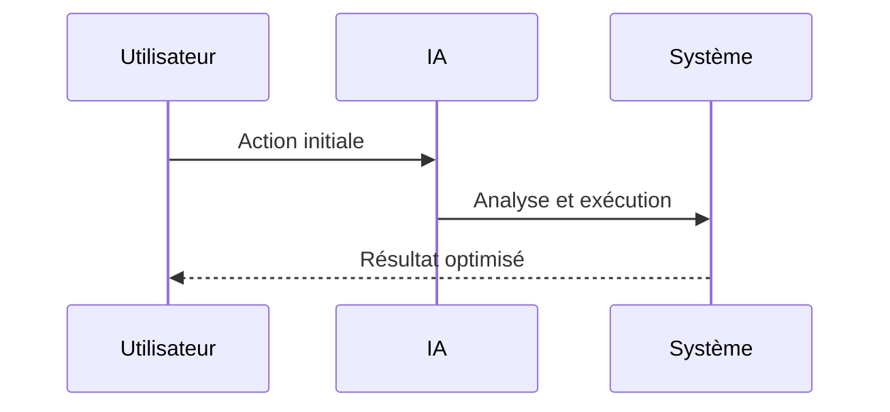

<!-- markdownlint-disable MD013 MD028 MD033 MD039 MD041 -->

[🇬🇧 English Version](./README.md)

# Neuromorphic Tactile Skin

> **Résumé exécutif :** Création d'une "peau" polymère intégrant des milliers de micro-capteurs de pression et de cisaillement, reliés à une architecture de puce neuromorp...

---

## 1. Aperçu visuel & Effet Wahou

## 2. La thèse contrariante (Peter Thiel Style)

La croyance populaire : Les solutions génériques peuvent résoudre cela.
La vérité cachée : Le goulot d'étranglement se situe au niveau de l'architecture de von Neumann classique et de la transmission de données physiques. Il faut inventer de nouveaux matériaux souples conducteurs, concevoir des ASIC neuromorphiques dédiés, et écrire de nouveaux paradigmes d'apprentissage (Spike Timing Dependent Plasticity) pour le contrôle moteur.

## 3. Le problème & La cible

Modèle économique : B2B
Cible précise : Fabricants de robots humanoïdes (Tesla, Figure), entreprises de logistique automatisée (Amazon), et concepteurs de prothèses médicales avancées.
La douleur urgente : Les mains robotiques actuelles manquent de dextérité fine car elles s'appuient principalement sur la vision par ordinateur, qui souffre d'occlusions. Les capteurs tactiles existants génèrent des volumes de données continus trop lourds à traiter en temps réel (latence) et sont fragiles.

## 4. Architecture technique & Plomberie

## 5. Modèle économique & Viabilité financière

| Métrique                    | Valeur             |
| --------------------------- | ------------------ |
| Structure de prix           | Prix sur mesure    |
| Objectif 12 mois            | 100 clients        |
| Calcul du CA (Target 100k€) | 100 \* 1000 = 100k |
| Marge brute estimée         | 80%                |

## 6. Moteur de distribution & Fossé défensif (Moat)

Stratégie d'acquisition : Vente B2B directe
Moat (Barrière à l'entrée) : Le goulot d'étranglement se situe au niveau de l'architecture de von Neumann classique et de la transmission de données physiques. Il faut inventer de nouveaux matériaux souples conducteurs, concevoir des ASIC neuromorphiques dédiés, et écrire de nouveaux paradigmes d'apprentissage (Spike Timing Dependent Plasticity) pour le contrôle moteur.

## 7. Grille d'évaluation détaillée

| Critère                           | Score VC (/100) | Score Terrain (/100) |
| --------------------------------- | --------------- | -------------------- |
| Thèse & Monopole / Urgence        | -- / 25         | -- / 25              |
| Moat / Résistance aux LLM natifs  | -- / 25         | -- / 25              |
| Scalabilité / Friction d'adoption | -- / 25         | -- / 25              |
| Unit Economics / ROI direct       | -- / 25         | -- / 25              |
| **TOTAL**                         | **-- / 100**    | **-- / 100**         |

> **Verdict VC :** En attente d'évaluation.

> **Verdict Terrain :** En attente d'évaluation.
