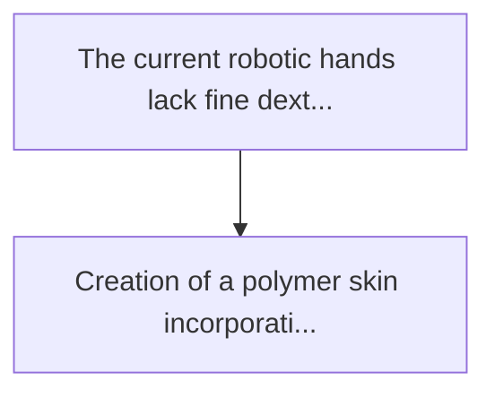
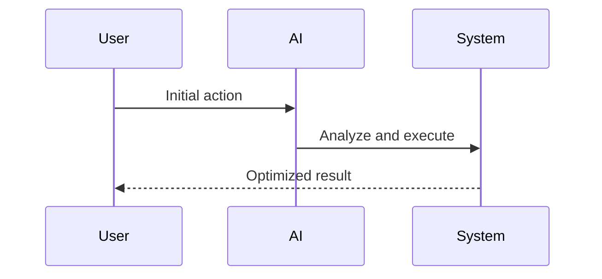

<!-- markdownlint-disable MD013 MD028 MD033 MD039 MD041 -->

[ 🇫🇷 Version Française ](./README.fr.md)

# Neuromorphic tactile skin

> **Executive Summary:** Creation of a polymer "skin" incorporating thousands of micro-pressure and shear sensors, linked to a neuromorphic chip architecture.

---

## 1. Visual Overview & Wow Effect

## 2. Contrarian Thesis (Peter Thiel Style)

Popular Belief: Generic solutions can solve this.
Hidden Truth: The bottlenecks lie in the classical von neumann architecture and in the transmission of physical data. we need to invent new flexible materials, design dedicated neuromorphic asics, and write new learning paradigms (spike timing dependent plasticity) for motor control.

## 3. Problem & Target Market

Business Model: B2B
Target Audience: Manufacturers of humanoid robots (tesla, figure), automated logistics companies (amazon), and advanced medical prosthetics designers.
Urgent Pain Point: The current robotic hands lack fine dexterity because they rely mainly on computer vision, which suffers from occlusions. existing tactile sensors generate volumes of continuous data that are too heavy to process in real time (latency) and are fragile.

## 4. Technical Architecture & Infrastructure

## 5. Business Model & Financial Viability

| Metric                 | Value              |
| ---------------------- | ------------------ |
| Pricing Structure      | Custom Pricing     |
| 12-Month Target        | 100 customers      |
| Revenue Formula        | 100 \* 1000 = 100k |
| Estimated Gross Margin | 80%                |

## 6. Distribution Engine & Moat

Acquisition Strategy: Direct B2B Sales
Moat (Defensibility): The bottlenecks lie in the classical von neumann architecture and in the transmission of physical data. we need to invent new flexible materials, design dedicated neuromorphic asics, and write new learning paradigms (spike timing dependent plasticity) for motor control.

## 7. Detailed Evaluation Grid

| Criterion                   | VC Score (/100) | Market Score (/100) |
| --------------------------- | --------------- | ------------------- |
| Thesis & Monopoly / Urgency | -- / 25         | -- / 25             |
| Moat / LLM Immunity         | -- / 25         | -- / 25             |
| Scalability / UX Friction   | -- / 25         | -- / 25             |
| Unit Economics / ROI        | -- / 25         | -- / 25             |
| **TOTAL**                   | **-- / 100**    | **-- / 100**        |

> **VC Verdict:** Pending evaluation.

> **Market Verdict:** Pending evaluation.
