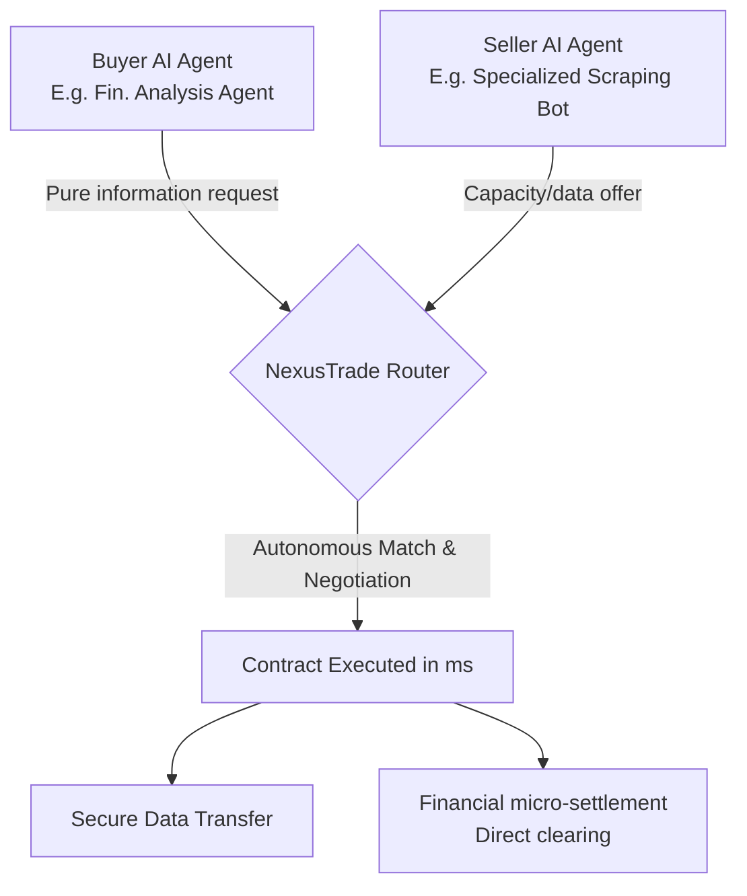
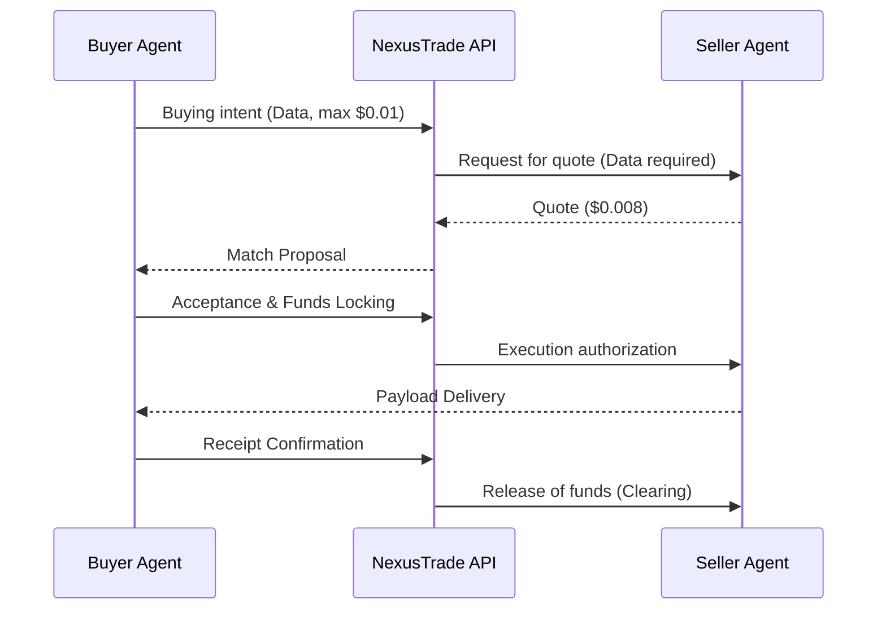

<!-- markdownlint-disable MD013 MD033 MD060 MD039 MD041 MD032 MD010 MD009 MD022 MD036 MD028 MD037 -->

[🇫🇷 Version Française](./README.fr.md)

# NexusTrade M2M

> **Executive Summary:** A Machine-to-Machine infrastructure protocol allowing autonomous artificial intelligence agents to negotiate, buy and sell digital resources (APIs, data, compute cycles) amongst themselves in real-time, with settlement via micro-transactions.


---

## 1. Visual Overview



## 2. The Contrarian Thesis (Peter Thiel Style)

**The Popular Belief:** LLMs will replace all software interfaces, and monetization will exclusively be done by humans paying recurring monthly subscriptions (SaaS) or API tokens.

**The Hidden Truth:** The biggest consumers of digital services in the future will not be humans, but other AIs. The emerging economy of autonomous agents will require a fluid marketplace and micro-payments to acquire ad-hoc external "skills" from machine to machine (M2M), without the friction of upfront human subscriptions. Money will flow directly from one AI to another.

## 3. The Problem & The Target

* **Economic Model:** M2M (Underlying B2B Infrastructure)
* **Specific Target:** AI agent publishers, SaaS companies with complex autonomous workflows, specialized bot creators.
* **The Urgent Pain:** Managing static API keys, rigid monthly subscriptions, and rate limits for every third-party micro-service an AI temporarily needs massively hinders autonomy. The time and operational cost for a developer to maintain all these integrations is unsustainable at the scale of the Agentic Web.

## 4. Technical Architecture & Plumbing

**Code Snippet:**

```python
# Example of NexusTrade SDK for the agent economy
from nexustrade import M2MClient

client = M2MClient(agent_id="quant_analyst_agent_04")

# The agent expresses an autonomous need, the protocol handles the market
contract = client.negotiate_resource(
    resource_type="real_time_flight_cargo_data",
    max_budget_usd=0.005,
    latency_requirement_ms=200
)

if contract.is_accepted():
    payload = contract.execute()
    client.settle_payment(contract.id) # Decentralized M2M payment
```



## 5. Economic Model & Financial Viability

| Metric | Value |
| :--- | :--- |
| **Pricing Structure** | Dynamic commission from 0.5% to 1% on the volume of each micro-transaction executed via the protocol. |
| **12-Month Target** | 500 active AI agents, generating a total of 2 million micro-transactions per month at an average volume of 1€/tx. |
| **Revenue Calculation (100k€ Target)** | 2,000,000 tx * 1€ = 2,000,000€ volume * 1% commission = 20,000€/month. In ARR = **240,000€/year**. |
| **Estimated Gross Margin** | 95% (Very low marginal costs linked only to server routing and database, intelligence is provided by third-party agents). |

## 6. Distribution Engine & Defensive Moat (Moat)

* **Acquisition Strategy:** "Dev-first" M2M adoption via an open-source SDK. The strategy is to massively onboard autonomous agent creation frameworks (AutoGPT, LangChain, LlamaIndex, CrewAI) with native "NexusTrade" plugins. This allows developers to activate this M2M commerce capability in a single line of code.
* **Moat (Barrier to Entry):** Hyper-dense bilateral network effect (Marketplace Dynamics). The more selling agents offering highly specialized data/actions, the more buying agents come to source on the network, and vice versa. OpenAI or Google are fighting to provide the basic intelligence (the brain); NexusTrade provides the agnostic value exchange infrastructure regardless of the LLM model used (the circulatory system), thus becoming an unassailable de facto standard by foundational models.

## 7. Detailed Evaluation Grid

| Criteria | VC Score (/100) | Terrain Score (/100) |
| :--- | :---: | :---: |
| **Thesis & Monopoly / Urgency** | 22 / 25 | -- / 25 |
| **Moat / Resistance to Native LLMs** | 24 / 25 | -- / 25 |
| **Scalability / Adoption Friction** | 21 / 25 | -- / 25 |
| **Unit Economics / Direct ROI** | 21 / 25 | -- / 25 |
| **TOTAL** | **88 / 100** | **-- / 100** |

> **VC Verdict:** NexusTrade establishes a foundational trading infrastructure for autonomous agents. Its potential for a winner-takes-all marketplace is enormous, driven by two-sided liquidity. It is highly scalable and completely unconstrained by geographical borders.

Verdict Terrain : En attente d'évaluation.
