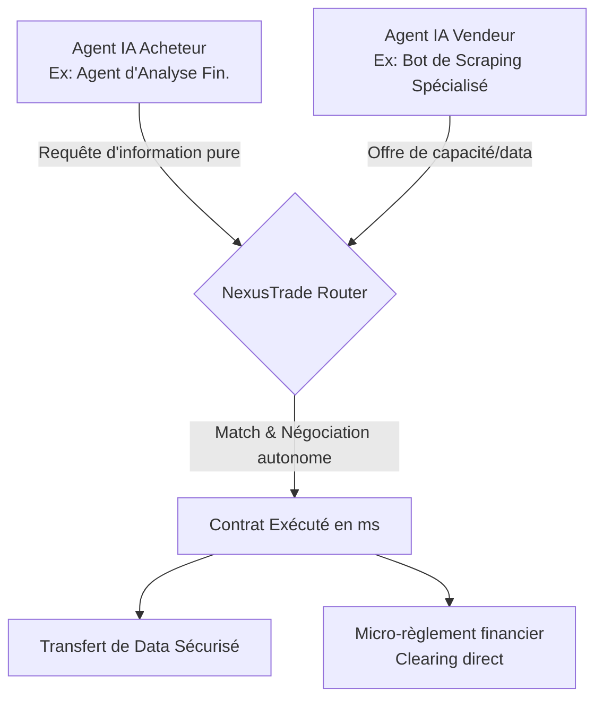
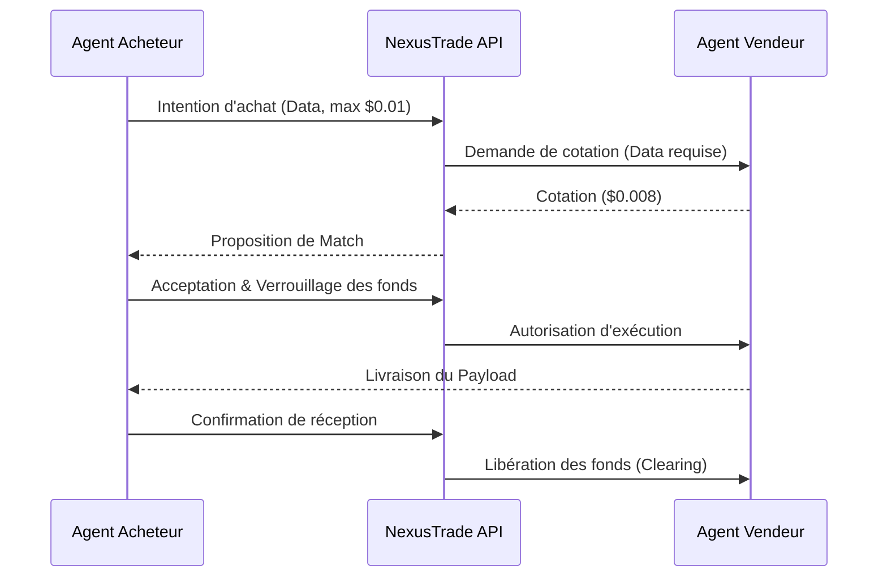

<!-- markdownlint-disable MD013 MD033 -->

# NexusTrade M2M

> **Résumé exécutif :** Un protocole d'infrastructure Machine-to-Machine permettant aux agents d'intelligence artificielle autonomes de négocier, d'acheter et de vendre des ressources numériques (API, données, cycles de calcul) entre eux en temps réel, avec règlement par micro-transactions.


---

## 1. Aperçu visuel



## 2. La thèse contrariante (Peter Thiel Style)

**La croyance populaire :** Les LLM vont remplacer toutes les interfaces logicielles, et la monétisation se fera exclusivement par des humains payant des abonnements mensuels récurrents (SaaS) ou des jetons API.

**La vérité cachée :** Les futurs plus gros consommateurs de services numériques ne seront pas des humains, mais d'autres IA. L'économie émergente des agents autonomes nécessitera une place de marché fluide et des micro-paiements pour acquérir ponctuellement des "compétences" externes de machine à machine (M2M), sans la friction des abonnements humains préalables. L'argent circulera directement d'une IA à une autre.

## 3. Le problème & La cible

- **Modèle économique :** M2M (Infrastructure sous-jacente B2B)
- **Cible précise :** Éditeurs d'agents IA, entreprises SaaS avec des workflows autonomes complexes, créateurs de bots spécialisés.
- **La douleur urgente :** Gérer des clés API statiques, des abonnements mensuels rigides et des limites de requêtes pour chaque micro-service tiers dont une IA a temporairement besoin freine massivement l'autonomie. Le coût temporel et opérationnel pour un développeur de maintenir toutes ces intégrations est insoutenable à l'échelle de l'Agentic Web.

## 4. Architecture technique & Plomberie

**Extrait de code :**

```python
# Exemple de SDK NexusTrade pour l'économie d'agents
from nexustrade import M2MClient

client = M2MClient(agent_id="quant_analyst_agent_04")

# L'agent exprime un besoin autonome, le protocole gère le marché
contract = client.negotiate_resource(
    resource_type="real_time_flight_cargo_data",
    max_budget_usd=0.005,
    latency_requirement_ms=200
)

if contract.is_accepted():
    payload = contract.execute()
    client.settle_payment(contract.id) # Paiement M2M décentralisé
```



## 5. Modèle économique & Viabilité financière

| Métrique                        | Valeur                                                                                                                                     |
| :------------------------------ | :----------------------------------------------------------------------------------------------------------------------------------------- |
| **Structure de prix**           | Commission dynamique de 0.5% à 1% sur le volume de chaque micro-transaction effectuée via le protocole.                                    |
| **Objectif 12 mois**            | 500 agents IA actifs, générant au total 2 millions de micro-transactions par mois à un volume moyen de 1€/tx.                              |
| **Calcul du CA (Target 100k€)** | 2,000,000 tx _1€ = 2,000,000€ de volume_ 1% de commission = 20,000€/mois. En ARR = **240,000€/an**.                                        |
| **Marge brute estimée**         | 95% (Coûts marginaux très faibles liés uniquement au routage serveur et base de données, l'intelligence est fournie par les agents tiers). |

## 6. Moteur de distribution & Fossé défensif (Moat)

- **Stratégie d'acquisition :** Adhésion "Dev-first" M2M via un SDK open-source. La stratégie est d'onboarder massivement les frameworks de création d'agents autonomes (AutoGPT, LangChain, LlamaIndex, CrewAI) avec des plugins natifs "NexusTrade". Cela permet aux développeurs d'activer cette capacité de commerce M2M en une seule ligne de code.
- **Moat (Barrière à l'entrée) :** Effet de réseau bilatéral hyper-dense (Marketplace Dynamics). Plus il y a d'agents vendeurs proposant des données/actions très spécialisées, plus les agents acheteurs viennent se sourcer sur le réseau, et inversement. OpenAI ou Google se battent pour fournir l'intelligence de base (le cerveau) ; NexusTrade fournit l'infrastructure d'échange de valeur agnostique au modèle LLM utilisé (le système circulatoire), devenant ainsi un standard de fait inattaquable par les modèles fondateurs.

## 7. Grille d'évaluation détaillée

| Critère                               | Score VC (/100) | Score Terrain (/100) |
| :------------------------------------ | :-------------: | :------------------: |
| **Thèse & Monopole / Urgence**        |     -- / 25     |       20 / 25        |
| **Moat / Résistance aux LLM natifs**  |     -- / 25     |       17 / 25        |
| **Scalabilité / Friction d'adoption** |     -- / 25     |       20 / 25        |
| **Unit Economics / ROI direct**       |     -- / 25     |       24 / 25        |
| **TOTAL**                             |  **-- / 100**   |     **81 / 100**     |

> **Verdict Terrain :** L'outil NexusTrade M2M répond à un besoin métier très ciblé avec un ROI tangible. Son positionnement en tant qu'infrastructure API garantit une bonne immunité face aux LLMs généralistes. Même si l'adoption demande un effort d'intégration, la viabilité du modèle économique est portée par la valeur apportée.
> Verdict VC : En attente d'évaluation.
