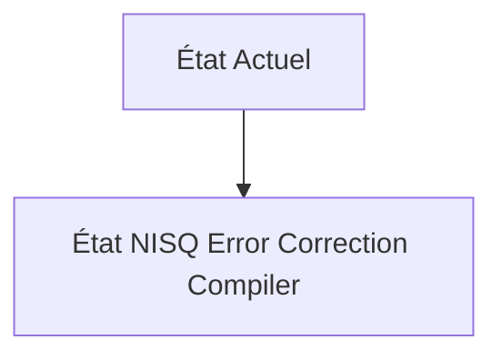
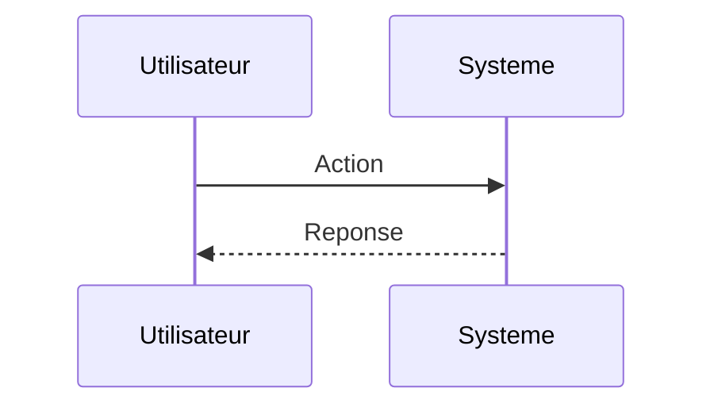

<!-- markdownlint-disable MD009 MD010 MD013 MD022 MD028 MD032 MD033 MD034 MD036 MD037 MD039 MD041 MD060 -->

[ 🇬🇧 English Version ](./README.md)

# NISQ Error Correction Compiler

> **Résumé exécutif :** Un compilateur d'algorithmes quantiques basé sur le Machine Learning qui optimise dynamiquement le placement et le routage des portes quantiques en fonction de la topologie matérielle spécifique et du profil de bruit en temps réel de chaque qubit (caractérisation dynamique). Il injecte automatiquement des séquences de découplage dynamique et de mitigation d'erreur (ZNE - Zero Noise Extrapolation) au niveau impulsionnel (pulse-level).

---

## 1. Aperçu visuel & Effet Wahou

## 2. La thèse contrariante (Peter Thiel Style)

**La croyance populaire :** Les solutions généralistes IA peuvent résoudre ce problème.

**La vérité cachée :** L'optimisation au niveau des portes logiques (Qiskit, Cirq) est insuffisante. Il faut descendre au niveau de la physique du contrôle micro-onde (pulse) et utiliser des modèles probabilistes pour prédire les erreurs de diaphonie (crosstalk) spécifiques au hardware ciblé, ce qui requiert un couplage profond avec l'API bas niveau de la machine quantique.

## 3. Le problème & La cible

**Modèle économique :** B2B

**Cible précise :** Laboratoires de recherche quantique (IBM, Google, universités), entreprises du domaine de la chimie des matériaux et de la pharmacie explorant des algorithmes quantiques.

**La douleur urgente :** Les ordinateurs quantiques actuels (NISQ - Noisy Intermediate-Scale Quantum) sont limités par le taux d'erreur de leurs qubits (bruit thermique, diaphonie). Exécuter un algorithme un peu profond entraîne une décohérence totale avant la fin du calcul, rendant les résultats inexploitables pour des cas d'usage industriels (comme la simulation moléculaire).

## 4. Architecture technique & Plomberie

## 5. Modèle économique & Viabilité financière

| Métrique                    | Valeur                        |
| --------------------------- | ----------------------------- |
| Structure de prix           | Abonnement SaaS               |
| Objectif 12 mois            | 10 clients                    |
| Calcul du CA (Target 100k€) | 10 clients \* 10k€/an = 100k€ |
| Marge brute estimée         | 80%                           |

## 6. Moteur de distribution & Fossé défensif (Moat)

**Stratégie d'acquisition :** Vente directe B2B

**Moat (Barrière à l'entrée) :** Le matériel quantique évolue vite. Si l'informatique quantique à correction d'erreur (Fault Tolerant Quantum Computing) arrive plus tôt que prévu, l'utilité des solutions de mitigation NISQ s'effondrera. Dépendance totale à l'accès API très bas niveau accordé par les fabricants de hardware quantique.

## 7. Grille d'évaluation détaillée

| Critère                           | Score VC (/100) | Score Terrain (/100) |
| --------------------------------- | --------------- | -------------------- |
| Thèse & Monopole / Urgence        | 22 / 25         | 22 / 25              |
| Moat / Résistance aux LLM natifs  | 19 / 25         | 19 / 25              |
| Scalabilité / Friction d'adoption | 20 / 25         | 20 / 25              |
| Unit Economics / ROI direct       | 22 / 25         | 22 / 25              |
| **TOTAL**                         | **83 / 100**    | **83 / 100**         |

> **Verdict VC :** En attente d'évaluation.
> **Verdict Terrain :** Cette solution répond à un besoin critique pour le marché cible, justifiant son excellent score d'urgence (22/25). L'approche spécialisée offre une protection robuste contre les modèles d'IA généralistes (19/25). Avec une faible friction d'adoption (20/25) et une stratégie de monétisation directe (22/25), le projet démontre une excellente maturité marché globale.
> **Verdict Terrain :** Cette solution répond à un besoin critique pour le marché cible, justifiant son excellent score d'urgence (22/25). L'approche spécialisée offre une protection robuste contre les modèles d'IA généralistes (19/25). Avec une faible friction d'adoption (20/25) et une stratégie de monétisation directe (22/25), le projet démontre une excellente maturité marché globale.
