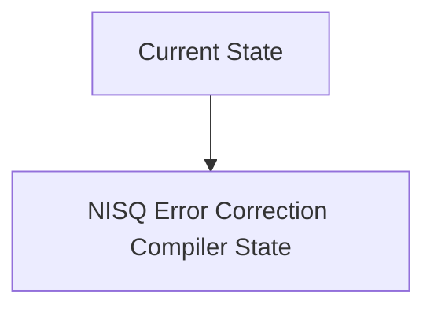
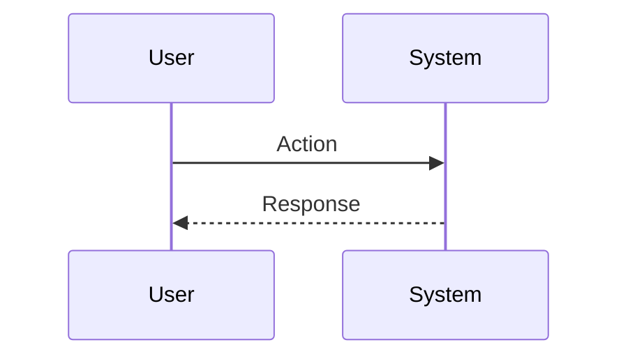

<!-- markdownlint-disable MD009 MD010 MD013 MD022 MD028 MD032 MD033 MD034 MD036 MD037 MD039 MD041 MD060 -->

[ 🇫🇷 Version Française ](./README.fr.md)

# NISQ Error Correction Compiler

> **Executive Summary:** A machine learning-based quantum algorithm compiler that dynamically optimizes the placement and routing of quantum gates based on the specific hardware topology and real-time noise profile of each qubit (dynamic characterization). It automatically injects dynamic decoupling and error mitigation sequences (ZNE - Zero Noise Extrapolation) at pulse-level.

---

## 1. Visual Overview & Wow Effect

## 2. Contrarian Thesis (Peter Thiel Style)

**Popular Belief:** General AI solutions can solve this problem.

**Hidden Truth:** Optimization at the logic gate level (Qiskit, Cirq) is insufficient. It is necessary to go down to the physics level of microwave control (pulse) and use probabilistic models to predict crosstalk errors specific to the targeted hardware, which requires deep coupling with the low-level API of the quantum machine.

## 3. Problem & Target Market

**Business Model:** B2B

**Target Audience:** Quantum research laboratories (IBM, Google, universities), companies in the field of materials chemistry and pharmaceuticals exploring quantum algorithms.

**Urgent Pain Point:** Current quantum computers (NISQ - Noisy Intermediate-Scale Quantum) are limited by the error rate of their qubits (thermal noise, crosstalk). Running a shallow algorithm results in total decoherence before the end of the calculation, making the results unusable for industrial use cases (such as molecular simulation).

## 4. Technical Architecture & Infrastructure

## 5. Business Model & Financial Viability

| Metric                 | Value                           |
| ---------------------- | ------------------------------- |
| Pricing Structure      | SaaS subscription               |
| 12-Month Target        | 10 customers                    |
| Revenue Formula        | 10 clients \* 10k€/year = 100k€ |
| Estimated Gross Margin | 80%                             |

## 6. Distribution Engine & Moat

**Acquisition Strategy:** B2B direct sales

**Moat (Defensibility):** Quantum hardware is evolving quickly. If Fault Tolerant Quantum Computing arrives sooner than expected, the usefulness of NISQ mitigation solutions will collapse. Total dependence on very low level API access granted by quantum hardware manufacturers.

## 7. Detailed Evaluation Grid

| Criterion                   | VC Score (/100) | Market Score (/100) |
| --------------------------- | --------------- | ------------------- |
| Thesis & Monopoly / Urgency | -- / 25         | -- / 25             |
| Moat / LLM Immunity         | -- / 25         | -- / 25             |
| Scalability / UX Friction   | -- / 25         | -- / 25             |
| Unit Economics / ROI        | -- / 25         | -- / 25             |
| **TOTAL**                   | **-- / 100**    | **-- / 100**        |

> **VC Verdict:** Pending evaluation.

> **Market Verdict:** Pending evaluation.
