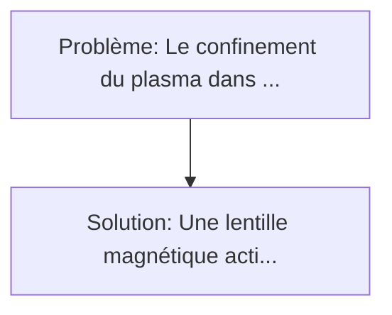
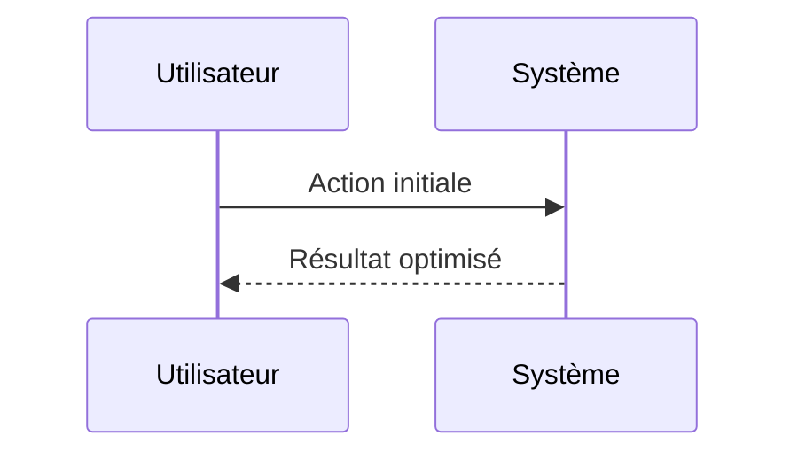

<!-- markdownlint-disable MD013 MD033 -->

[🇬🇧 English Version](./README.md)

# Lentille Magnétique pour Fusion Nucléaire (Nuclear Fusion Magnetic Lens)

> **Résumé exécutif :** Une "lentille magnétique" active pilotée par un agent IA de renforcement (Reinforcement Learning) qui contrôle un réseau ultra-rapide de bobines d'induction secondaires entourant la chambre. Le confinement du plasma dans un Tokamak à 100 millions de degrés nécessite des électroaimants supraconducteurs colossaux.

---

## 1. Aperçu visuel & Effet Wahou

## 2. La thèse contrariante (Peter Thiel Style)

**La croyance populaire :** Les solutions logicielles seules peuvent résoudre ce problème.
**La vérité cachée :** L'inférence du modèle d'IA doit tourner localement (pas de cloud possible à cause de la latence) et piloter directement du hardware électromagnétique extrême dans un environnement hautement radiatif.

## 3. Le problème & La cible

- **Modèle économique :** B2B
- **Cible précise :** Startups de fusion nucléaire privées (Commonwealth Fusion Systems, Helion) et grands projets gouvernementaux (ITER).
- **La douleur urgente :** Le confinement du plasma dans un Tokamak à 100 millions de degrés nécessite des électroaimants supraconducteurs colossaux. Même avec des aimants HTS (High-Temperature Superconductors), les instabilités magnétiques du plasma (disruptions) causent la perte de la réaction de fusion ou détruisent la paroi interne du réacteur, bloquant l'atteinte du seuil de rentabilité énergétique (Q>1) continu.

## 4. Architecture technique & Plomberie

## 5. Modèle économique & Viabilité financière

| Métrique                    | Valeur             |
| --------------------------- | ------------------ |
| Structure de prix           | Custom Pricing     |
| Objectif 12 mois            | 100 clients        |
| Calcul du CA (Target 100k€) | 100 \* 1000 = 100k |
| Marge brute estimée         | 80%                |

## 6. Moteur de distribution & Fossé défensif (Moat)

- **Stratégie d'acquisition :** Ventes B2B directes
- **Moat (Barrière à l'entrée) :** L'inférence du modèle d'IA doit tourner localement (pas de cloud possible à cause de la latence) et piloter directement du hardware électromagnétique extrême dans un environnement hautement radiatif.

## 7. Grille d'évaluation détaillée

| Critère                           | Score VC (/100) | Score Terrain (/100) |
| --------------------------------- | --------------- | -------------------- |
| Thèse & Monopole / Urgence        | -- / 25         | -- / 25              |
| Moat / Résistance aux LLM natifs  | -- / 25         | -- / 25              |
| Scalabilité / Friction d'adoption | -- / 25         | -- / 25              |
| Unit Economics / ROI direct       | -- / 25         | -- / 25              |
| **TOTAL**                         | **-- / 100**    | **-- / 100**         |

> **Verdict VC :** En attente d'évaluation.

> **Verdict Terrain :** En attente d'évaluation.
