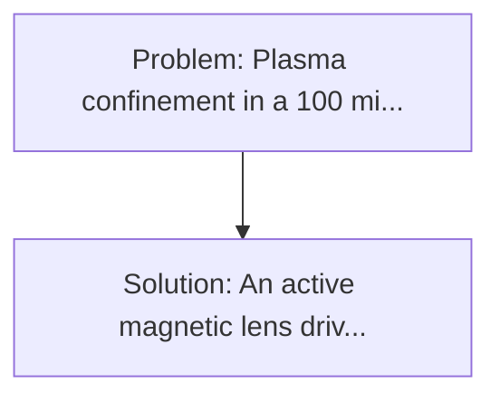
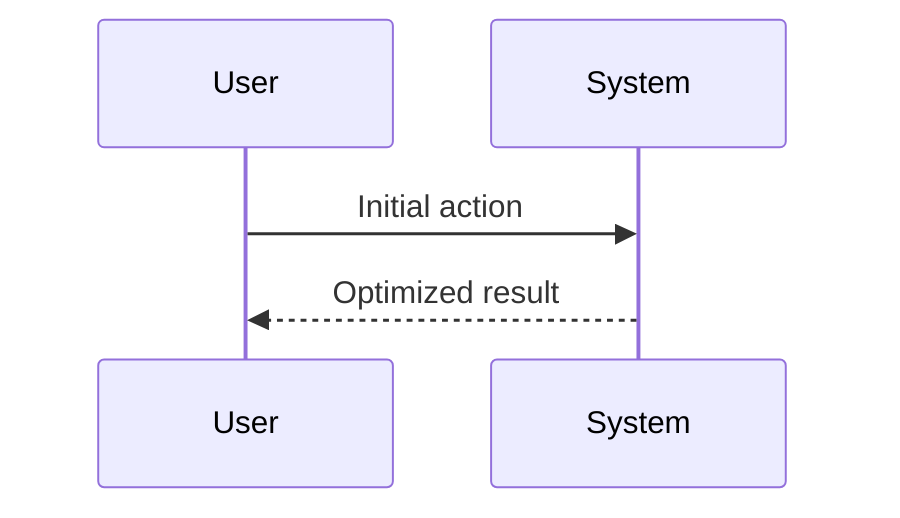

<!-- markdownlint-disable MD013 MD033 -->

[🇫🇷 Version Française](./README.fr.md)

# Magnetic Lens for Nuclear Fusion (Nuclear Fusion Magnetic Lens)

> **Executive Summary:** An active "magnetic lens" driven by a Reinforcement Learning (IA) agent that controls an ultra-fast network of secondary induction coils surrounding the chamber. Plasma confinement in a 100 million-degree Tokamak requires colossal superconducting electromagnets.

---

## 1. Visual Overview & Wow Effect

## 2. Contrarian Thesis (Peter Thiel Style)

**Popular Belief:** Generic software solutions can solve this.
**Hidden Truth:** The inference of the AI model must rotate locally (no cloud possible because of latency) and directly pilot extreme electromagnetic hardware in a highly radiative environment.

## 3. Problem & Target Market

- **Business Model:** B2B
- **Target Audience:** Private Nuclear Fusion Startups (Commonwealth Fusion Systems, Helion) and Major Government Projects (ITER).
- **Urgent Pain Point:** Plasma confinement in a 100 million-degree Tokamak requires colossal superconducting electromagnets. Even with high-temperature superconductors (HTS) magnets, magnetic plasma instability (disruptions) causes the loss of the fusion reaction or destroys the internal wall of the reactor, blocking the achievement of the energy efficiency threshold (Q>1).

## 4. Technical Architecture & Infrastructure

## 5. Business Model & Financial Viability

| Metric                 | Value              |
| ---------------------- | ------------------ |
| Pricing Structure      | Custom Pricing     |
| 12-Month Target        | 100 customers      |
| Revenue Formula        | 100 \* 1000 = 100k |
| Estimated Gross Margin | 80%                |

## 6. Distribution Engine & Moat

- **Acquisition Strategy:** Direct B2B Sales
- **Moat (Defensibility):** The inference of the AI model must rotate locally (no cloud possible because of latency) and directly pilot extreme electromagnetic hardware in a highly radiative environment.

## 7. Detailed Evaluation Grid

| Criterion                   | VC Score (/100) | Market Score (/100) |
| --------------------------- | --------------- | ------------------- |
| Thesis & Monopoly / Urgency | -- / 25         | -- / 25             |
| Moat / LLM Immunity         | -- / 25         | -- / 25             |
| Scalability / UX Friction   | -- / 25         | -- / 25             |
| Unit Economics / ROI        | -- / 25         | -- / 25             |
| **TOTAL**                   | **-- / 100**    | **-- / 100**        |

> **VC Verdict:** Pending evaluation.

> **Market Verdict:** Pending evaluation.
