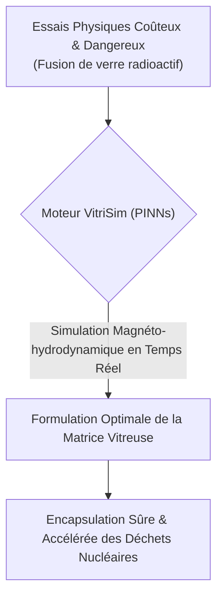
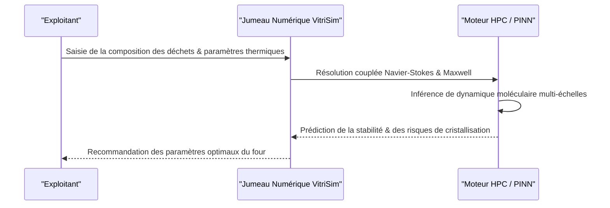

<!-- markdownlint-disable MD009 MD010 MD013 MD022 MD028 MD032 MD033 MD034 MD036 MD037 MD039 MD041 MD060 -->

[ 🇬🇧 English Version ](./README.md)

# VitriSim

> **Résumé exécutif :** VitriSim déploie un jumeau numérique basé sur des réseaux de neurones informés par la physique (PINNs) pour simuler la magnéto-hydrodynamique complexe de la vitrification des déchets nucléaires de haute activité, permettant aux exploitants d'optimiser les formulations de verre en temps réel sans essais physiques coûteux et dangereux.

---

## 1. Aperçu visuel & Effet Wahou

## 2. La thèse contrariante (Peter Thiel Style)

**La croyance populaire :** La seule façon d'améliorer l'encapsulation des déchets nucléaires est de procéder à des décennies de tests physiques lents et itératifs dans des installations blindées (cellules chaudes) coûtant des milliards.
**La vérité cachée :** La dynamique des fluides et la thermodynamique complexes du verre radioactif en fusion peuvent être simulées avec précision à l'aide de réseaux de neurones informés par la physique (PINNs). En combinant la dynamique moléculaire multi-échelles avec l'IA, nous pouvons effectuer des milliers de cycles de fusion virtuels en quelques heures, optimisant le processus de vitrification en toute sécurité dans un jumeau numérique avant même d'allumer un four à induction physique.

## 3. Le problème & La cible

**Modèle économique :** B2B / B2G
**Cible précise :** Agences nationales de gestion des déchets radioactifs, exploitants de centrales nucléaires (EDF, Tepco) et sous-traitants en démantèlement.
**La douleur urgente :** Le processus de vitrification des déchets nucléaires de haute activité (HA) est extrêmement complexe, coûteux et lent. Les erreurs de formulation ou de maîtrise des températures dans les fours à induction (entraînant des cristallisations parasites) coûtent des dizaines de millions d'euros par raté et allongent drastiquement les délais de sécurisation. L'impossibilité de tester physiquement à l'échelle sans générer des déchets supplémentaires rend l'optimisation itérative quasi impossible.

## 4. Architecture technique & Plomberie

## 5. Modèle économique & Viabilité financière

| Métrique                | Valeur                                                                 |
| ----------------------- | ---------------------------------------------------------------------- |
| **Structure de prix**   | Licence Entreprise Annuelle (par installation) + Facturation au calcul |
| **Objectif 12 mois**    | 2 contrats pilotes avec des agences gouvernementales majeures          |
| **Calcul du CA**        | 2 Contrats \* 50 000€/an                                               |
| **Marge brute estimée** | >85% (SaaS à très haute valeur ajoutée)                                |

## 6. Moteur de distribution & Fossé défensif (Moat)

**Stratégie d'acquisition :** Ventes B2B/B2G de haut niveau, ciblant les agences nationales de démantèlement en démontrant des millions d'euros d'économies opérationnelles par installation.
**Moat (Barrière à l'entrée) :** Un LLM textuel ou un tableur ne peut pas résoudre les équations différentielles partielles de Navier-Stokes couplées aux effets magnétiques et chimiques à haute température. Il faut un moteur de simulation spécialisé et brevetable. De plus, l'entraînement de ce moteur nécessite l'accès à des données historiques de vitrification hautement classifiées et propriétaires (secret industriel/défense), créant une barrière d'accès aux données insurmontable. Le temps de R&D très long nécessitant des doctorants en physique des matériaux et simulation numérique consolide ce fossé.

## 7. Grille d'évaluation détaillée

| Critère                               | Score VC (/100) | Score Terrain (/100) |
| ------------------------------------- | --------------- | -------------------- |
| **Thèse & Monopole / Urgence**        | -- / 25         | -- / 25              |
| **Moat / Résistance aux LLM natifs**  | -- / 25         | -- / 25              |
| **Scalabilité / Friction d'adoption** | -- / 25         | -- / 25              |
| **Unit Economics / ROI direct**       | -- / 25         | -- / 25              |
| **TOTAL**                             | -- / 100        | -- / 100             |

> **Verdict VC :** En attente d'évaluation.
> **Verdict Terrain :** En attente d'évaluation.
