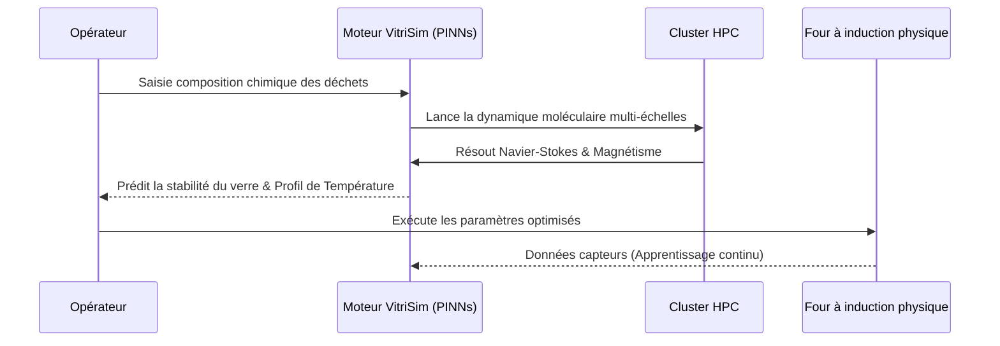

<!-- markdownlint-disable MD009 MD010 MD013 MD022 MD028 MD032 MD033 MD034 MD036 MD037 MD039 MD041 MD058 MD060 -->

[ 🇬🇧 English Version ](./README.md)

# VitriSim

> **Résumé exécutif :** Un jumeau numérique neuronal informé par la physique qui simule la magnéto-hydrodynamique de la vitrification des déchets nucléaires de haute activité, évitant des échecs à plusieurs millions de dollars dans les fours à induction.


---

## 1. Aperçu visuel & Effet Wahou

```mermaid
graph TD
    %% Schéma comparatif Problème vs Solution ou Flux d'architecture
    subgraph Vitrification_Traditionnelle ["Vitrification Traditionnelle"]
        A[Déchets Nucléaires HA] --> B[Four à induction (Essai-Erreur)]
        B --> C[Cristallisation imprévue]
        C --> D[Casse du four à plusieurs millions € & Retards]
    end
    subgraph VitriSim ["Jumeau Numérique VitriSim"]
        E[Déchets Nucléaires HA] --> F[Réseau Neuronal Informé par la Physique PINN]
        F --> G[Simulation thermodynamique en temps réel]
        G --> H[Formulation optimisée de la matrice vitreuse]
        H --> I[Vitrification sûre, efficace & prévisible]
    end
```

## 2. La thèse contrariante (Peter Thiel Style)

**La croyance populaire :** La partie la plus difficile de la gestion des déchets nucléaires est de trouver des dépôts géologiques profonds pour les enfouir.

**La vérité cachée :** Le véritable goulot d'étranglement est de transformer en toute sécurité les déchets liquides hautement radioactifs en verre stable (vitrification) avant de les enfouir. Parce qu'il est impossible de faire des essais et erreurs en toute sécurité avec des matériaux hautement radioactifs, seule une IA ultra-spécialisée, informée par la physique et simulant la thermodynamique complexe du verre en fusion, peut débloquer un démantèlement nucléaire plus rapide, plus sûr et moins cher.

## 3. Le problème & La cible

**Modèle économique :** B2B / B2G

**Cible précise :** Agences nationales de gestion des déchets radioactifs, exploitants de centrales nucléaires (EDF, Tepco) et sous-traitants en démantèlement.

**La douleur urgente :** Le processus de vitrification des déchets nucléaires de haute activité (HA) est extrêmement complexe, coûteux et lent. Les erreurs de formulation ou de maîtrise des températures dans les fours à induction (entraînant des cristallisations parasites) coûtent des dizaines de millions d'euros par raté et allongent drastiquement les délais de sécurisation. L'impossibilité de tester physiquement à l'échelle sans générer de déchets supplémentaires rend l'optimisation itérative quasi impossible.

## 4. Architecture technique & Plomberie



## 5. Modèle économique & Viabilité financière

| Métrique                    | Valeur                                                                                   |
| :-------------------------- | :--------------------------------------------------------------------------------------- |
| Structure de prix           | Licence logicielle annuelle haute valeur + Frais de calcul HPC                           |
| Objectif 12 mois            | 1-2 projets pilotes avec des agences nationales ou de grands exploitants                 |
| Calcul du CA (Target 100k€) | 1 contrat R&D Pilote \* 100 000 € = 100k€ ARR                                            |
| Marge brute estimée         | 70% (Prenant en compte les coûts importants de calcul HPC pour l'entraînement/inférence) |

## 6. Moteur de distribution & Fossé défensif (Moat)

**Stratégie d'acquisition :** Ventes directes B2B/B2G aux grandes entreprises et gouvernements. Partenariats avec des conglomérats massifs du démantèlement nucléaire (ex: Orano, Westinghouse) comme plugin d'optimisation pour leurs contrats existants de plusieurs milliards de dollars.

**Moat (Barrière à l'entrée) :** Un LLM ou un tableur ne peut pas résoudre les équations différentielles partielles (Navier-Stokes) couplées aux effets magnétiques et chimiques à haute température. Le fossé défensif (moat) est constitué par les réseaux de neurones informés par la physique (PINNs) spécialisés et l'accès exclusif aux données historiques de vitrification, hautement classifiées et propriétaires, nécessaires pour les entraîner.

## 7. Grille d'évaluation détaillée

| Critère                           | Score VC (/100) | Score Terrain (/100) |
| :-------------------------------- | :-------------- | :------------------- |
| Thèse & Monopole / Urgence        | -- / 25         | 22 / 25              |
| Moat / Résistance aux LLM natifs  | -- / 25         | 23 / 25              |
| Scalability / Friction d'adoption | -- / 25         | 15 / 25              |
| Unit Economics / ROI direct       | -- / 25         | 20 / 25              |
| **TOTAL**                         | **-- / 100**    | **80 / 100**         |

> **Verdict VC :** En attente d'évaluation.
> **Verdict Terrain :** Urgence modérée mais valeur stratégique à long terme. L'immunité aux LLM est bonne, reposant sur des modèles spécifiques. L'adoption présente des frictions notables qui pourraient ralentir la monétisation initiale.
