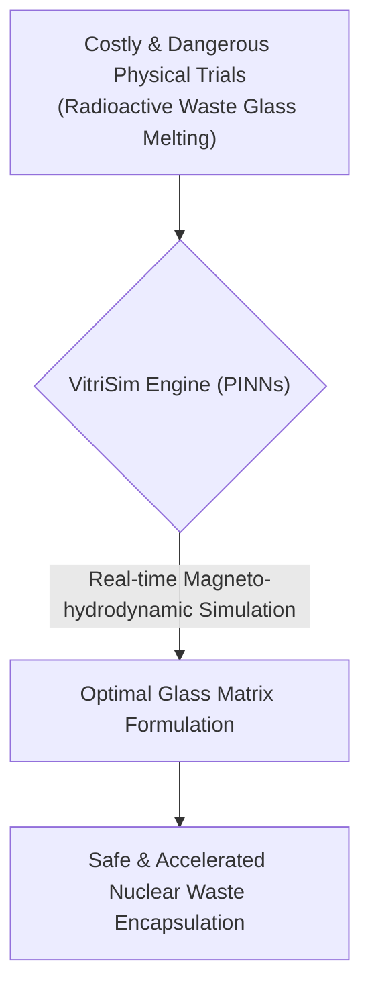
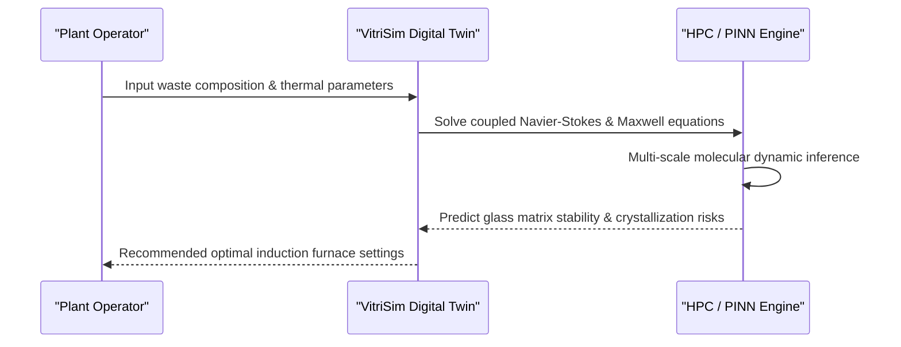

<!-- markdownlint-disable MD009 MD010 MD013 MD022 MD028 MD032 MD033 MD034 MD036 MD037 MD039 MD041 MD060 -->

[ 🇫🇷 Version Française ](./README.fr.md)

# VitriSim

> **Executive Summary:** VitriSim provides a Physics-Informed Neural Network (PINN) digital twin to simulate the highly complex magneto-hydrodynamics of high-level nuclear waste vitrification, enabling operators to optimize glass formulations in real-time without costly and dangerous physical trials.

---

## 1. Visual Overview & Wow Effect

## 2. Contrarian Thesis (Peter Thiel Style)

**Popular Belief:** The only way to improve nuclear waste encapsulation is through decades of slow, iterative physical testing in highly shielded, billion-dollar hot cell facilities.
**Hidden Truth:** The complex fluid dynamics and thermodynamics of molten radioactive glass can be accurately simulated using Physics-Informed Neural Networks (PINNs). By combining multi-scale molecular dynamics with AI, we can perform thousands of virtual melting cycles in hours, optimizing the vitrification process safely in a digital twin before a single physical induction furnace is fired.

## 3. Problem & Target Market

**Business Model:** B2B / B2G
**Target Audience:** National radioactive waste management agencies, nuclear power plant operators (EDF, Tepco), and decommissioning subcontractors.
**Urgent Pain Point:** The vitrification process of High-Level Waste (HLW) is extremely complex, costly, and slow. Errors in formulation or temperature control in induction furnaces (leading to parasitic crystallizations) cost tens of millions of euros per failure and drastically extend security deadlines. The impossibility of physical testing at scale without generating additional waste makes iterative optimization nearly impossible.

## 4. Technical Architecture & Infrastructure

## 5. Business Model & Financial Viability

| Metric                     | Value                                                    |
| -------------------------- | -------------------------------------------------------- |
| **Pricing Structure**      | Annual Enterprise License (per facility) + Compute Usage |
| **12-Month Target**        | 2 major government agency pilot contracts                |
| **Revenue Formula**        | 2 Contracts \* €50,000/year                              |
| **Estimated Gross Margin** | >85% (High-value SaaS)                                   |

## 6. Distribution Engine & Moat

**Acquisition Strategy:** High-level enterprise/government sales, targeting national decommissioning agencies and demonstrating millions in saved operational costs per facility.
**Moat (Defensibility):** A standard LLM or spreadsheet cannot solve the partial differential Navier-Stokes equations coupled with magnetic and chemical effects at high temperatures. It requires a highly specialized, patentable simulation engine. Furthermore, training this engine requires access to highly classified, proprietary historical vitrification data, creating an insurmountable data barrier for new entrants. The extreme R&D depth required in material physics and numerical simulation further entrenches the moat.

## 7. Detailed Evaluation Grid

| Criterion                       | VC Score (/100) | Market Score (/100) |
| ------------------------------- | --------------- | ------------------- |
| **Thesis & Monopoly / Urgency** | -- / 25         | -- / 25             |
| **Moat / LLM Immunity**         | -- / 25         | -- / 25             |
| **Scalability / UX Friction**   | -- / 25         | -- / 25             |
| **Unit Economics / ROI**        | -- / 25         | -- / 25             |
| **TOTAL**                       | -- / 100        | -- / 100            |

> **VC Verdict:** Pending evaluation.
> **Market Verdict:** Pending evaluation.
