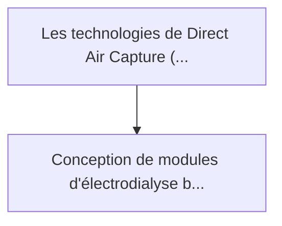
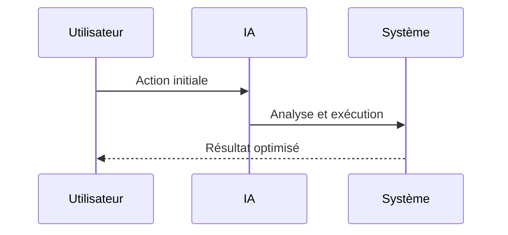

<!-- markdownlint-disable MD013 MD028 MD033 MD039 MD041 -->

[🇬🇧 English Version](./README.md)

# Ocean CO2 Electrodialysis

> **Résumé exécutif :** Conception de modules d'électrodialyse bipolaire à flux continu, intégrés aux infrastructures existantes (usines de dessalement, plateformes offsho...

---

## 1. Aperçu visuel & Effet Wahou

## 2. La thèse contrariante (Peter Thiel Style)

La croyance populaire : Les solutions génériques peuvent résoudre cela.
La vérité cachée : C'est un défi de chimie des matériaux (membranes d'échange ionique) et d'ingénierie des procédés. La capture du carbone nécessite des infrastructures physiques lourdes, une optimisation électrochimique fine et une gestion de la corrosion marine, loin des capacités d'un logiciel.

## 3. Le problème & La cible

Modèle économique : B2B (Marchés du carbone) / B2G
Cible précise : Entreprises technologiques achetant des crédits carbone haute qualité (Microsoft, Stripe), gouvernements, et industries lourdes cherchant à compenser leurs émissions résiduelles.
La douleur urgente : Les technologies de Direct Air Capture (DAC) sont extrêmement énergivores en raison de la faible concentration de CO2 dans l'air (400 ppm). L'océan contient 150 fois plus de CO2 par volume que l'air, mais son extraction est historiquement coûteuse et complexe.

## 4. Architecture technique & Plomberie

## 5. Modèle économique & Viabilité financière

| Métrique                    | Valeur             |
| --------------------------- | ------------------ |
| Structure de prix           | Prix sur mesure    |
| Objectif 12 mois            | 100 clients        |
| Calcul du CA (Target 100k€) | 100 \* 1000 = 100k |
| Marge brute estimée         | 80%                |

## 6. Moteur de distribution & Fossé défensif (Moat)

Stratégie d'acquisition : Vente B2B directe
Moat (Barrière à l'entrée) : C'est un défi de chimie des matériaux (membranes d'échange ionique) et d'ingénierie des procédés. La capture du carbone nécessite des infrastructures physiques lourdes, une optimisation électrochimique fine et une gestion de la corrosion marine, loin des capacités d'un logiciel.

## 7. Grille d'évaluation détaillée

| Critère                           | Score VC (/100) | Score Terrain (/100) |
| --------------------------------- | --------------- | -------------------- |
| Thèse & Monopole / Urgence        | 23 / 25         | -- / 25              |
| Moat / Résistance aux LLM natifs  | 22 / 25         | -- / 25              |
| Scalabilité / Friction d'adoption | 19 / 25         | -- / 25              |
| Unit Economics / ROI direct       | 21 / 25         | -- / 25              |
| **TOTAL**                         | **85 / 100**    | **-- / 100**         |

> **Verdict VC :** La capture directe dans l'océan via l'électrodialyse est une alternative massivement évolutive et profondément contrariante à la capture directe de l'air terrestre. En tirant parti de la concentration naturelle de carbone dans l'océan et en s'appuyant sur les infrastructures de dessalement existantes, elle améliore considérablement l'économie unitaire. Ce jeu technologique climatique à l'échelle industrielle construit un fossé massif en matière de matériel et de processus, totalement immunisé contre les perturbations des LLMs.

> **Verdict Terrain :** En attente d'évaluation.
