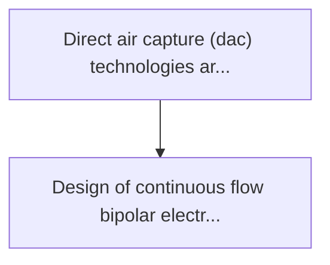
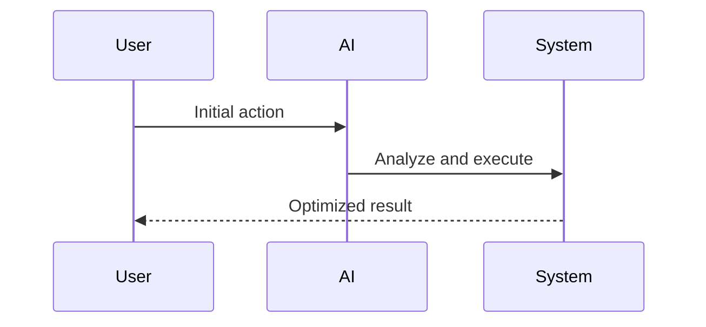

<!-- markdownlint-disable MD013 MD028 MD033 MD039 MD041 -->

[ 🇫🇷 Version Française ](./README.fr.md)

# Ocean co2 electrodialysis

> **Executive Summary:** Design of continuous flow bipolar electrodialysis modules, integrated with existing infrastructures (desalination plants, offsho platforms, etc.)

---

## 1. Visual Overview & Wow Effect

## 2. Contrarian Thesis (Peter Thiel Style)

Popular Belief: Generic solutions can solve this.
Hidden Truth: It is a challenge of material chemistry (ion exchange membranes) and process engineering. carbon capture requires heavy physical infrastructure, fine electrochemical optimization and marine corrosion management, far from software capabilities.

## 3. Problem & Target Market

Business Model: B2B (Marchés du carbone) / B2G
Target Audience: Technology companies buying high quality carbon credits (microsoft, stripe), governments, and heavy industries seeking to offset their residual emissions.
Urgent Pain Point: Direct air capture (dac) technologies are extremely energy efficient because of the low co2 concentration in the air (400 ppm). the ocean contains 150 times more co2 per volume than air, but its extraction is historically expensive and complex.

## 4. Technical Architecture & Infrastructure

## 5. Business Model & Financial Viability

| Metric                 | Value              |
| ---------------------- | ------------------ |
| Pricing Structure      | Custom Pricing     |
| 12-Month Target        | 100 customers      |
| Revenue Formula        | 100 \* 1000 = 100k |
| Estimated Gross Margin | 80%                |

## 6. Distribution Engine & Moat

Acquisition Strategy: Direct B2B Sales
Moat (Defensibility): It is a challenge of material chemistry (ion exchange membranes) and process engineering. carbon capture requires heavy physical infrastructure, fine electrochemical optimization and marine corrosion management, far from software capabilities.

## 7. Detailed Evaluation Grid

| Criterion                   | VC Score (/100) | Market Score (/100) |
| --------------------------- | --------------- | ------------------- |
| Thesis & Monopoly / Urgency | -- / 25         | -- / 25             |
| Moat / LLM Immunity         | -- / 25         | -- / 25             |
| Scalability / UX Friction   | -- / 25         | -- / 25             |
| Unit Economics / ROI        | -- / 25         | -- / 25             |
| **TOTAL**                   | **-- / 100**    | **-- / 100**        |

> **VC Verdict:** Pending evaluation.

> **Market Verdict:** Pending evaluation.
