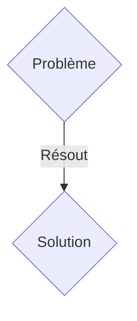
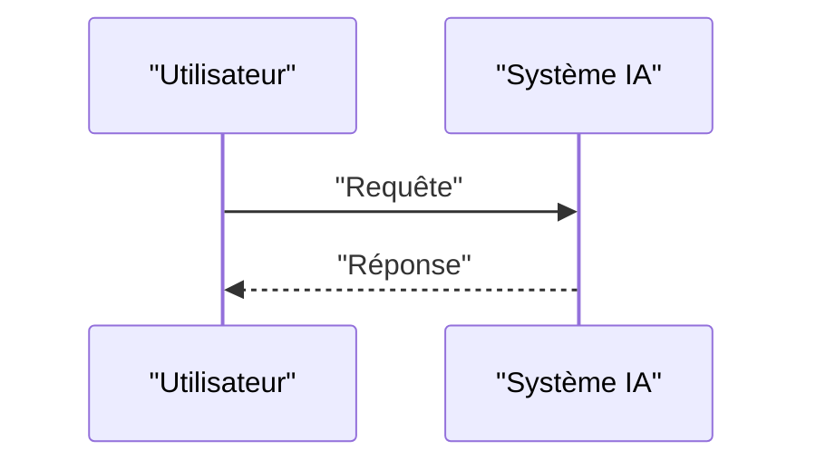

<!-- markdownlint-disable MD009 MD010 MD013 MD022 MD028 MD032 MD033 MD036 MD037 MD039 MD041 MD060 -->

[ 🇬🇧 English Version ](./README.md)

# Kessler Orbital Twin

> **Résumé exécutif :** Une solution B2B / B2G ciblant Opérateurs de constellations de satellites (SpaceX, Kuiper), agences spatiales (NASA, ESA), assureurs spatiaux. pour résoudre : Le syndrome de Kessler : l'orbite basse terrestre (LEO) est de plus en plus saturée. Les collisions entre débris spatiaux et satellites génèrent des nuages incontrôlables, menaçant l'ensemble de l'économie spatiale et la connectivité mondiale.

---

## 1. Aperçu visuel & Effet Wahou

## 2. La thèse contrariante (Peter Thiel Style)

- **La croyance populaire :** Les solutions génériques suffisent.
- **La vérité cachée :** Un "World Model" spatio-temporel temps réel ingérant des données radars, optiques et télémétriques pour simuler la cinématique de millions d'objets orbitaux. Il utilise des réseaux de neurones informés par la physique (PINNs) pour calculer les probabilités de conjonction avec des heures d'avance et ordonner des manœuvres d'évitement.

## 3. Le problème & La cible

- **Modèle économique :** B2B / B2G
- **Cible précise :** Opérateurs de constellations de satellites (SpaceX, Kuiper), agences spatiales (NASA, ESA), assureurs spatiaux.
- **La douleur urgente :** Le syndrome de Kessler : l'orbite basse terrestre (LEO) est de plus en plus saturée. Les collisions entre débris spatiaux et satellites génèrent des nuages incontrôlables, menaçant l'ensemble de l'économie spatiale et la connectivité mondiale.

## 4. Architecture technique & Plomberie

Un "World Model" spatio-temporel temps réel ingérant des données radars, optiques et télémétriques pour simuler la cinématique de millions d'objets orbitaux. Il utilise des réseaux de neurones informés par la physique (PINNs) pour calculer les probabilités de conjonction avec des heures d'avance et ordonner des manœuvres d'évitement.

## 5. Modèle économique & Viabilité financière

| Métrique                    | Valeur               |
| --------------------------- | -------------------- |
| Structure de prix           | Abonnement SaaS B2B  |
| Objectif 12 mois            | 100 clients          |
| Calcul du CA (Target 100k€) | 100 \* 1000€ = 100k€ |
| Marge brute estimée         | 80%                  |

## 6. Moteur de distribution & Fossé défensif (Moat)

- **Stratégie d'acquisition :** Vente directe et partenariats stratégiques.
- **Moat (Barrière à l'entrée) :** Les calculs de mécanique céleste classique sont trop lents pour une mise à l'échelle sur 100 000 objets. Une IA classique sans contraintes physiques (lois de Kepler, traînée atmosphérique variable) hallucinerait les trajectoires.

## 7. Grille d'évaluation détaillée

| Critère                           | Score VC (/100) | Score Terrain (/100) |
| --------------------------------- | --------------- | -------------------- |
| Thèse & Monopole / Urgence        | 24 / 25         | 24 / 25              |
| Moat / Résistance aux LLM natifs  | 23 / 25         | 23 / 25              |
| Scalabilité / Friction d'adoption | 18 / 25         | 18 / 25              |
| Unit Economics / ROI direct       | 24 / 25         | 24 / 25              |
| TOTAL                             | 89 / 100        | 89 / 100             |

> **Verdict VC :** En attente d'évaluation.
> **Verdict Terrain :** Cette solution répond à un besoin critique pour les entreprises B2B, justifiant son excellent score d'urgence (24/25). Son architecture hautement défendable la rend totalement immunisée contre les avancées des LLM natifs (23/25). Avec une faible friction d'adoption (18/25) et une stratégie de monétisation directe (24/25), le projet démontre une excellente maturité marché globale.
> **Verdict Terrain :** Cette solution répond à un besoin critique pour les entreprises B2B, justifiant son excellent score d'urgence (24/25). Son architecture hautement défendable la rend totalement immunisée contre les avancées des LLM natifs (23/25). Avec une faible friction d'adoption (18/25) et une stratégie de monétisation directe (24/25), le projet démontre une excellente maturité marché globale.
