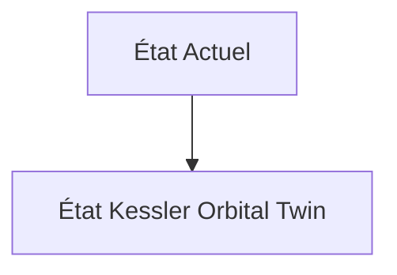
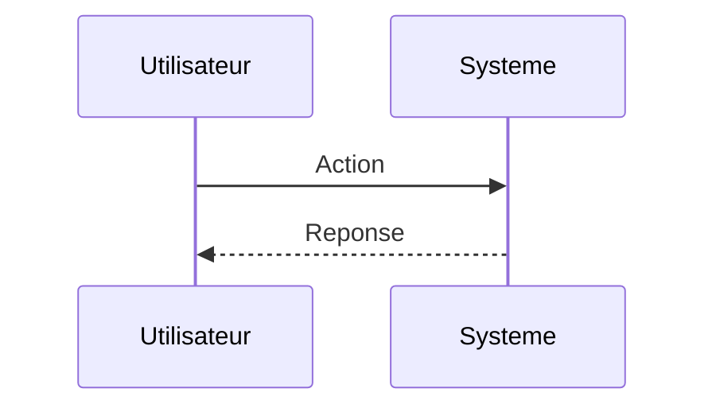

<!-- markdownlint-disable MD009 MD010 MD013 MD022 MD028 MD032 MD033 MD034 MD036 MD037 MD039 MD041 MD060 -->

[ 🇬🇧 English Version ](./README.md)

# Kessler Orbital Twin

> **Résumé exécutif :** Un "World Model" spatio-temporel temps réel ingérant des données radars, optiques et télémétriques pour simuler la cinématique de millions d'objets orbitaux. Il utilise des réseaux de neurones informés par la physique (PINNs) pour calculer les probabilités de conjonction avec des heures d'avance et ordonner des manœuvres d'évitement.

---

## 1. Aperçu visuel & Effet Wahou

## 2. La thèse contrariante (Peter Thiel Style)

**La croyance populaire :** Les solutions généralistes IA peuvent résoudre ce problème.

**La vérité cachée :** Les calculs de mécanique céleste classique sont trop lents pour une mise à l'échelle sur 100 000 objets. Une IA classique sans contraintes physiques (lois de Kepler, traînée atmosphérique variable) hallucinerait les trajectoires.

## 3. Le problème & La cible

**Modèle économique :** B2B / B2G

**Cible précise :** Opérateurs de constellations de satellites (SpaceX, Kuiper), agences spatiales (NASA, ESA), assureurs spatiaux.

**La douleur urgente :** Le syndrome de Kessler : l'orbite basse terrestre (LEO) est de plus en plus saturée. Les collisions entre débris spatiaux et satellites génèrent des nuages incontrôlables, menaçant l'ensemble de l'économie spatiale et la connectivité mondiale.

## 4. Architecture technique & Plomberie

## 5. Modèle économique & Viabilité financière

| Métrique                    | Valeur                        |
| --------------------------- | ----------------------------- |
| Structure de prix           | Abonnement SaaS               |
| Objectif 12 mois            | 10 clients                    |
| Calcul du CA (Target 100k€) | 10 clients \* 10k€/an = 100k€ |
| Marge brute estimée         | 80%                           |

## 6. Moteur de distribution & Fossé défensif (Moat)

**Stratégie d'acquisition :** Vente directe B2B

**Moat (Barrière à l'entrée) :** Dépendance critique à la qualité et la fréquence des données radar de l'US Space Command ou de fournisseurs privés (LeoLabs). Puissance de calcul HPC continue requise.

## 7. Grille d'évaluation détaillée

| Critère                           | Score VC (/100) | Score Terrain (/100) |
| --------------------------------- | --------------- | -------------------- |
| Thèse & Monopole / Urgence        | -- / 25         | -- / 25              |
| Moat / Résistance aux LLM natifs  | -- / 25         | -- / 25              |
| Scalabilité / Friction d'adoption | -- / 25         | -- / 25              |
| Unit Economics / ROI direct       | -- / 25         | -- / 25              |
| **TOTAL**                         | **-- / 100**    | **-- / 100**         |

> **Verdict VC :** En attente d'évaluation.

> **Verdict Terrain :** En attente d'évaluation.
