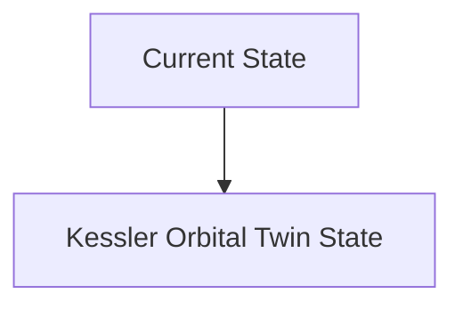
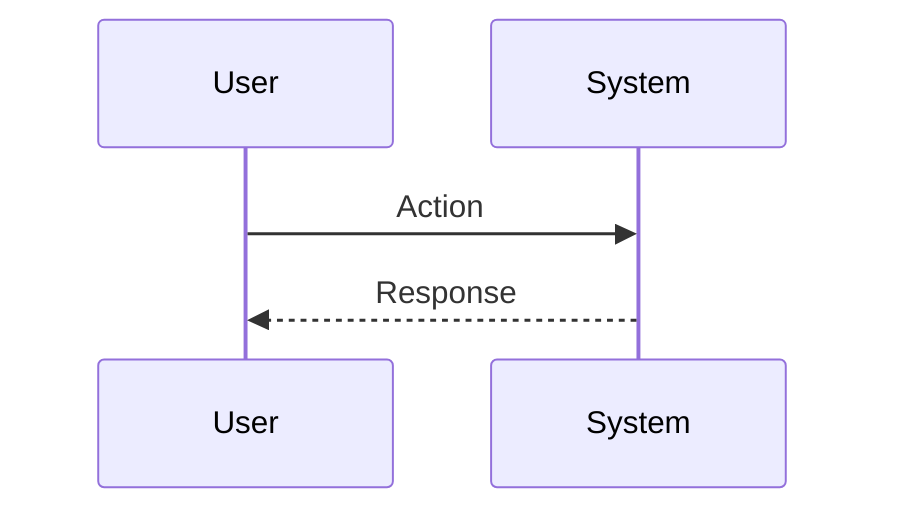

<!-- markdownlint-disable MD009 MD010 MD013 MD022 MD028 MD032 MD033 MD034 MD036 MD037 MD039 MD041 MD060 -->

[ 🇫🇷 Version Française ](./README.fr.md)

# Kessler Orbital Twin

> **Executive Summary:** A real-time spatio-temporal "World Model" ingesting radar, optical and telemetric data to simulate the kinematics of millions of orbital objects. It uses physics-informed neural networks (PINNs) to calculate conjunction probabilities hours in advance and order avoidance maneuvers.

---

## 1. Visual Overview & Wow Effect

## 2. Contrarian Thesis (Peter Thiel Style)

**Popular Belief:** General AI solutions can solve this problem.

**Hidden Truth:** Classical celestial mechanics calculations are too slow to scale to 100,000 objects. A classic AI without physical constraints (Kepler's laws, variable atmospheric drag) would hallucinate the trajectories.

## 3. Problem & Target Market

**Business Model:** B2B / B2G

**Target Audience:** Satellite constellation operators (SpaceX, Kuiper), space agencies (NASA, ESA), space insurers.

**Urgent Pain Point:** Kessler syndrome: low Earth orbit (LEO) is increasingly saturated. Collisions between space debris and satellites generate uncontrollable clouds, threatening the entire space economy and global connectivity.

## 4. Technical Architecture & Infrastructure

## 5. Business Model & Financial Viability

| Metric                 | Value                           |
| ---------------------- | ------------------------------- |
| Pricing Structure      | SaaS subscription               |
| 12-Month Target        | 10 customers                    |
| Revenue Formula        | 10 clients \* 10k€/year = 100k€ |
| Estimated Gross Margin | 80%                             |

## 6. Distribution Engine & Moat

**Acquisition Strategy:** B2B direct sales

**Moat (Defensibility):** Critical dependence on the quality and frequency of radar data from US Space Command or private providers (LeoLabs). Continuous HPC computing power required.

## 7. Detailed Evaluation Grid

| Criterion                   | VC Score (/100) | Market Score (/100) |
| --------------------------- | --------------- | ------------------- |
| Thesis & Monopoly / Urgency | -- / 25         | -- / 25             |
| Moat / LLM Immunity         | -- / 25         | -- / 25             |
| Scalability / UX Friction   | -- / 25         | -- / 25             |
| Unit Economics / ROI        | -- / 25         | -- / 25             |
| **TOTAL**                   | **-- / 100**    | **-- / 100**        |

> **VC Verdict:** Pending evaluation.

> **Market Verdict:** Pending evaluation.
