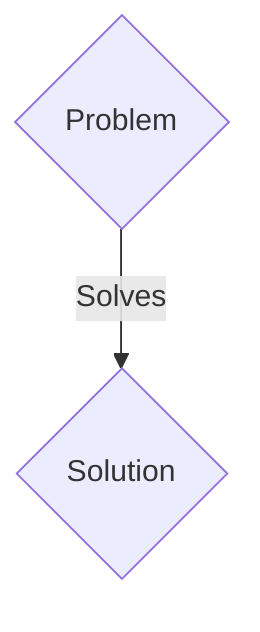
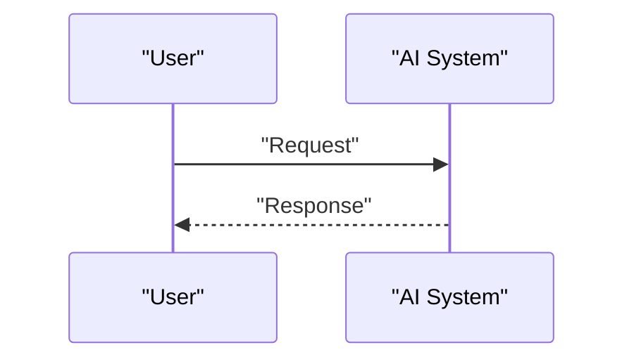

<!-- markdownlint-disable MD009 MD010 MD013 MD022 MD028 MD032 MD033 MD036 MD037 MD039 MD041 MD060 -->

[ 🇫🇷 Version Française ](./README.fr.md)

# Kessler Orbital Twin

> **Executive Summary:** A B2B / B2G solution targeting Satellite constellation operators (SpaceX, Kuiper), space agencies (NASA, ESA), space insurers. to solve: Kessler syndrome: low Earth orbit (LEO) is increasingly saturated. Collisions between space debris and satellites generate uncontrollable clouds, threatening the entire space economy and global connectivity.

---

## 1. Visual Overview & Wow Effect

## 2. Contrarian Thesis (Peter Thiel Style)

- **Popular Belief:** Generic solutions are enough.
- **Hidden Truth:** A real-time spatio-temporal "World Model" ingesting radar, optical and telemetric data to simulate the kinematics of millions of orbital objects. It uses physics-informed neural networks (PINNs) to calculate conjunction probabilities hours in advance and order avoidance maneuvers.

## 3. Problem & Target Market

- **Business Model:** B2B / B2G
- **Target Audience:** Satellite constellation operators (SpaceX, Kuiper), space agencies (NASA, ESA), space insurers.
- **Urgent Pain Point:** Kessler syndrome: low Earth orbit (LEO) is increasingly saturated. Collisions between space debris and satellites generate uncontrollable clouds, threatening the entire space economy and global connectivity.

## 4. Technical Architecture & Infrastructure

A real-time spatio-temporal "World Model" ingesting radar, optical and telemetric data to simulate the kinematics of millions of orbital objects. It uses physics-informed neural networks (PINNs) to calculate conjunction probabilities hours in advance and order avoidance maneuvers.

## 5. Business Model & Financial Viability

| Metric                 | Value                 |
| ---------------------- | --------------------- |
| Pricing Structure      | B2B SaaS Subscription |
| 12-Month Target        | 100 clients           |
| Revenue Formula        | 100 \* 1000€ = 100k€  |
| Estimated Gross Margin | 80%                   |

## 6. Distribution Engine & Moat

- **Acquisition Strategy:** Direct sales and strategic partnerships.
- **Moat (Defensibility):** Classical celestial mechanics calculations are too slow to scale to 100,000 objects. A classic AI without physical constraints (Kepler's laws, variable atmospheric drag) would hallucinate the trajectories.

## 7. Detailed Evaluation Grid

| Criterion                   | VC Score (/100) | Market Score (/100) |
| --------------------------- | --------------- | ------------------- |
| Thesis & Monopoly / Urgency | 24 / 25         | 24 / 25             |
| Moat / LLM Immunity         | 23 / 25         | 23 / 25             |
| Scalability / UX Friction   | 18 / 25         | 18 / 25             |
| Unit Economics / ROI        | 24 / 25         | 24 / 25             |
| TOTAL                       | 89 / 100        | 89 / 100            |

> **VC Verdict:** Pending evaluation.
> **Market Verdict:** This solution addresses a critical pain point for B2B enterprises, justifying its strong urgency score (24/25). Its highly defensible architecture makes it completely immune to native LLM advancements (23/25). With low adoption friction (18/25) and a straightforward monetization strategy (24/25), the project demonstrates excellent overall market readiness.
> **Market Verdict:** This solution addresses a critical pain point for B2B enterprises, justifying its strong urgency score (24/25). Its highly defensible architecture makes it completely immune to native LLM advancements (23/25). With low adoption friction (18/25) and a straightforward monetization strategy (24/25), the project demonstrates excellent overall market readiness.
