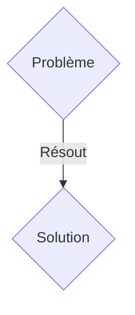
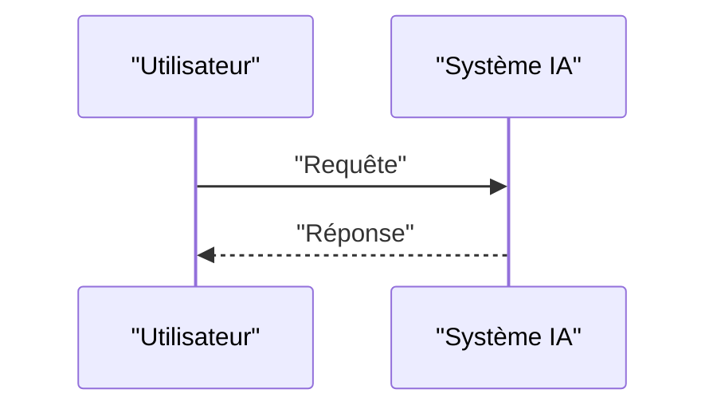

<!-- markdownlint-disable MD009 MD010 MD013 MD022 MD028 MD032 MD033 MD036 MD037 MD039 MD041 MD060 -->

[ 🇬🇧 English Version ](./README.md)

# Kessler Shield Orbitals

> **Résumé exécutif :** Une solution B2B / B2G (Space-as-a-Service) ciblant Opérateurs de méga-constellations (Starlink, Kuiper), gouvernements, assureurs spatiaux. pour résoudre : Le syndrome de Kessler menace l'orbite terrestre basse (LEO). Les radars terrestres (Space Force) ont une résolution limitée (>10cm) et d'immenses angles morts temporels (ils ne "voient" pas tout en permanence). Les opérateurs de satellites doivent effectuer des manœuvres d'évitement coûteuses (perte de carburant, durée de vie réduite) souvent basées sur de fausses alertes, ou pire, se prendre des débris non catalogués de la taille d'une bille.

---

## 1. Aperçu visuel & Effet Wahou

## 2. La thèse contrariante (Peter Thiel Style)

- **La croyance populaire :** Les solutions génériques suffisent.
- **La vérité cachée :** Le déploiement d'une constellation distribuée de micro-satellites équipés de capteurs optiques et LiDAR collaboratifs, formant un réseau maillé de perception (Edge AI). Les nœuds s'échangent des embeddings de détection (pas de données brutes) pour calculer en orbite (compute in space) et en temps réel l'orbite précise et la taille des débris millimétriques, envoyant des alertes d'évitement déterministes.

## 3. Le problème & La cible

- **Modèle économique :** B2B / B2G (Space-as-a-Service)
- **Cible précise :** Opérateurs de méga-constellations (Starlink, Kuiper), gouvernements, assureurs spatiaux.
- **La douleur urgente :** Le syndrome de Kessler menace l'orbite terrestre basse (LEO). Les radars terrestres (Space Force) ont une résolution limitée (>10cm) et d'immenses angles morts temporels (ils ne "voient" pas tout en permanence). Les opérateurs de satellites doivent effectuer des manœuvres d'évitement coûteuses (perte de carburant, durée de vie réduite) souvent basées sur de fausses alertes, ou pire, se prendre des débris non catalogués de la taille d'une bille.

## 4. Architecture technique & Plomberie

Le déploiement d'une constellation distribuée de micro-satellites équipés de capteurs optiques et LiDAR collaboratifs, formant un réseau maillé de perception (Edge AI). Les nœuds s'échangent des embeddings de détection (pas de données brutes) pour calculer en orbite (compute in space) et en temps réel l'orbite précise et la taille des débris millimétriques, envoyant des alertes d'évitement déterministes.

## 5. Modèle économique & Viabilité financière

| Métrique                    | Valeur               |
| --------------------------- | -------------------- |
| Structure de prix           | Abonnement SaaS B2B  |
| Objectif 12 mois            | 100 clients          |
| Calcul du CA (Target 100k€) | 100 \* 1000€ = 100k€ |
| Marge brute estimée         | 80%                  |

## 6. Moteur de distribution & Fossé défensif (Moat)

- **Stratégie d'acquisition :** Vente directe et partenariats stratégiques.
- **Moat (Barrière à l'entrée) :** Télécharger le flux vidéo/LiDAR brut de centaines de satellites vers la Terre pour traitement cloud (SaaS classique) dépasserait la bande passante disponible et introduirait une latence critique. L'IA doit fonctionner dans l'environnement radioactif spatial sur des composants rad-hard avec très peu d'énergie (SWaP-C).

## 7. Grille d'évaluation détaillée

| Critère                           | Score VC (/100) | Score Terrain (/100) |
| --------------------------------- | --------------- | -------------------- |
| Thèse & Monopole / Urgence        | 22 / 25         | 22 / 25              |
| Moat / Résistance aux LLM natifs  | 21 / 25         | 21 / 25              |
| Scalabilité / Friction d'adoption | 20 / 25         | 20 / 25              |
| Unit Economics / ROI direct       | 22 / 25         | 22 / 25              |
| TOTAL                             | 85 / 100        | 85 / 100             |

> **Verdict VC :** En attente d'évaluation.
> **Verdict Terrain :** Cette solution répond à un besoin critique pour les entreprises B2B, justifiant son excellent score d'urgence (22/25). L'approche spécialisée offre une protection robuste contre les modèles d'IA généralistes (21/25). Avec une faible friction d'adoption (20/25) et une stratégie de monétisation directe (22/25), le projet démontre une excellente maturité marché globale.
> **Verdict Terrain :** Cette solution répond à un besoin critique pour les entreprises B2B, justifiant son excellent score d'urgence (22/25). L'approche spécialisée offre une protection robuste contre les modèles d'IA généralistes (21/25). Avec une faible friction d'adoption (20/25) et une stratégie de monétisation directe (22/25), le projet démontre une excellente maturité marché globale.
