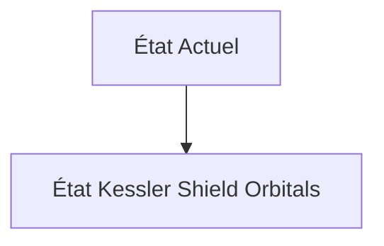
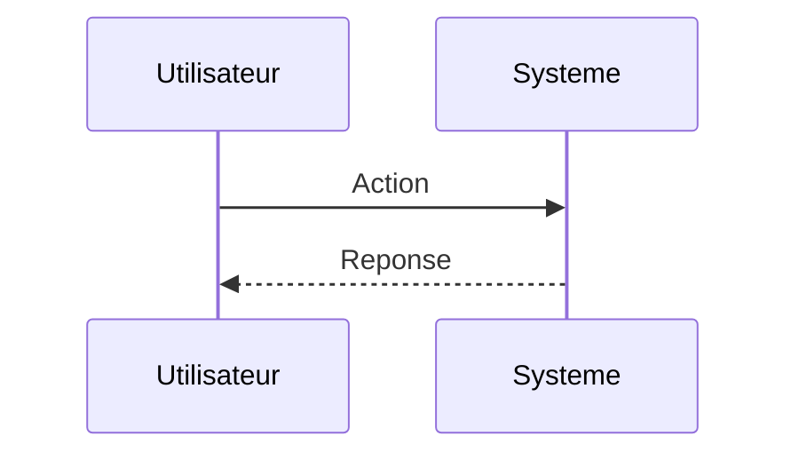

<!-- markdownlint-disable MD009 MD010 MD013 MD022 MD028 MD032 MD033 MD034 MD036 MD037 MD039 MD041 MD060 -->

[ 🇬🇧 English Version ](./README.md)

# Kessler Shield Orbitals

> **Résumé exécutif :** Le déploiement d'une constellation distribuée de micro-satellites équipés de capteurs optiques et LiDAR collaboratifs, formant un réseau maillé de perception (Edge AI). Les nœuds s'échangent des embeddings de détection (pas de données brutes) pour calculer en orbite (compute in space) et en temps réel l'orbite précise et la taille des débris millimétriques, envoyant des alertes d'évitement déterministes.

---

## 1. Aperçu visuel & Effet Wahou

## 2. La thèse contrariante (Peter Thiel Style)

**La croyance populaire :** Les solutions généralistes IA peuvent résoudre ce problème.

**La vérité cachée :** Télécharger le flux vidéo/LiDAR brut de centaines de satellites vers la Terre pour traitement cloud (SaaS classique) dépasserait la bande passante disponible et introduirait une latence critique. L'IA doit fonctionner dans l'environnement radioactif spatial sur des composants rad-hard avec très peu d'énergie (SWaP-C).

## 3. Le problème & La cible

**Modèle économique :** B2B / B2G (Space-as-a-Service)

**Cible précise :** Opérateurs de méga-constellations (Starlink, Kuiper), gouvernements, assureurs spatiaux.

**La douleur urgente :** Le syndrome de Kessler menace l'orbite terrestre basse (LEO). Les radars terrestres (Space Force) ont une résolution limitée (>10cm) et d'immenses angles morts temporels (ils ne "voient" pas tout en permanence). Les opérateurs de satellites doivent effectuer des manœuvres d'évitement coûteuses (perte de carburant, durée de vie réduite) souvent basées sur de fausses alertes, ou pire, se prendre des débris non catalogués de la taille d'une bille.

## 4. Architecture technique & Plomberie

## 5. Modèle économique & Viabilité financière

| Métrique                    | Valeur                        |
| --------------------------- | ----------------------------- |
| Structure de prix           | Abonnement SaaS               |
| Objectif 12 mois            | 10 clients                    |
| Calcul du CA (Target 100k€) | 10 clients \* 10k€/an = 100k€ |
| Marge brute estimée         | 80%                           |

## 6. Moteur de distribution & Fossé défensif (Moat)

**Stratégie d'acquisition :** Vente directe B2B

**Moat (Barrière à l'entrée) :** CAPEX massif pour le lancement de la constellation initiale. Réglementation complexe sur les opérations spatiales autonomes et la responsabilité en cas de collision manquée.

## 7. Grille d'évaluation détaillée

| Critère                           | Score VC (/100) | Score Terrain (/100) |
| --------------------------------- | --------------- | -------------------- |
| Thèse & Monopole / Urgence        | -- / 25         | -- / 25              |
| Moat / Résistance aux LLM natifs  | -- / 25         | -- / 25              |
| Scalabilité / Friction d'adoption | -- / 25         | -- / 25              |
| Unit Economics / ROI direct       | -- / 25         | -- / 25              |
| **TOTAL**                         | **-- / 100**    | **-- / 100**         |

> **Verdict VC :** En attente d'évaluation.

> **Verdict Terrain :** En attente d'évaluation.
