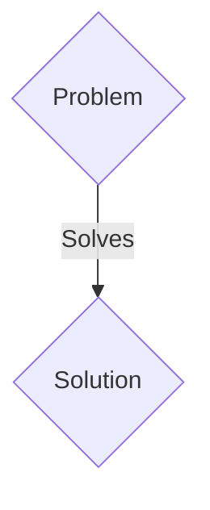
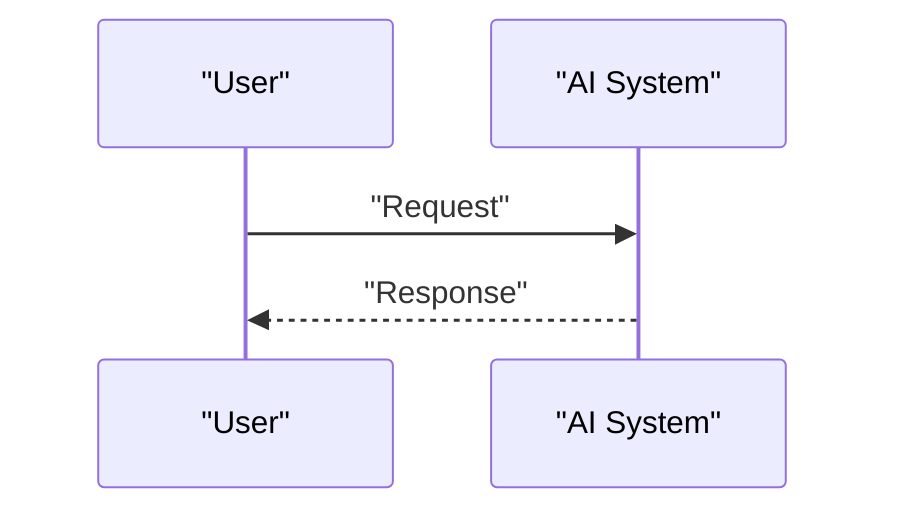

<!-- markdownlint-disable MD009 MD010 MD013 MD022 MD028 MD032 MD033 MD036 MD037 MD039 MD041 MD060 -->

[ 🇫🇷 Version Française ](./README.fr.md)

# Kessler Shield Orbitals

> **Executive Summary:** A B2B / B2G (Space-as-a-Service) solution targeting Mega-constellation operators (Starlink, Kuiper), governments, space insurers. to solve: Kessler syndrome threatens low Earth orbit (LEO). Terrestrial radars (Space Force) have limited resolution (>10cm) and immense temporal blind spots (they do not "see" everything all the time). Satellite operators must carry out costly evasive maneuvers (loss of fuel, reduced lifespan) often based on false alarms, or worse, encounter uncatalogued debris the size of a marble.

---

## 1. Visual Overview & Wow Effect

## 2. Contrarian Thesis (Peter Thiel Style)

- **Popular Belief:** Generic solutions are enough.
- **Hidden Truth:** The deployment of a distributed constellation of micro-satellites equipped with collaborative optical and LiDAR sensors, forming a perception mesh network (Edge AI). The nodes exchange detection embeddings (no raw data) to calculate in orbit (compute in space) and in real time the precise orbit and size of millimeter debris, sending deterministic avoidance alerts.

## 3. Problem & Target Market

- **Business Model:** B2B / B2G (Space-as-a-Service)
- **Target Audience:** Mega-constellation operators (Starlink, Kuiper), governments, space insurers.
- **Urgent Pain Point:** Kessler syndrome threatens low Earth orbit (LEO). Terrestrial radars (Space Force) have limited resolution (>10cm) and immense temporal blind spots (they do not "see" everything all the time). Satellite operators must carry out costly evasive maneuvers (loss of fuel, reduced lifespan) often based on false alarms, or worse, encounter uncatalogued debris the size of a marble.

## 4. Technical Architecture & Infrastructure

The deployment of a distributed constellation of micro-satellites equipped with collaborative optical and LiDAR sensors, forming a perception mesh network (Edge AI). The nodes exchange detection embeddings (no raw data) to calculate in orbit (compute in space) and in real time the precise orbit and size of millimeter debris, sending deterministic avoidance alerts.

## 5. Business Model & Financial Viability

| Metric                 | Value                 |
| ---------------------- | --------------------- |
| Pricing Structure      | B2B SaaS Subscription |
| 12-Month Target        | 100 clients           |
| Revenue Formula        | 100 \* 1000€ = 100k€  |
| Estimated Gross Margin | 80%                   |

## 6. Distribution Engine & Moat

- **Acquisition Strategy:** Direct sales and strategic partnerships.
- **Moat (Defensibility):** Uploading the raw video/LiDAR feed from hundreds of satellites to Earth for cloud processing (classic SaaS) would exceed available bandwidth and introduce critical latency. AI must operate in the space radioactive environment on rad-hard components with very little energy (SWaP-C).

## 7. Detailed Evaluation Grid

| Criterion                   | VC Score (/100) | Market Score (/100) |
| --------------------------- | --------------- | ------------------- |
| Thesis & Monopoly / Urgency | -- / 25         | -- / 25             |
| Moat / LLM Immunity         | -- / 25         | -- / 25             |
| Scalability / UX Friction   | -- / 25         | -- / 25             |
| Unit Economics / ROI        | -- / 25         | -- / 25             |
| TOTAL                       | -- / 100        | -- / 100            |

> **VC Verdict:** Pending evaluation.
> **Market Verdict:** Pending evaluation.
