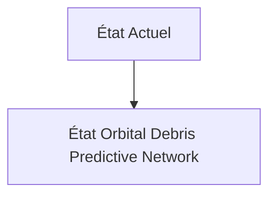
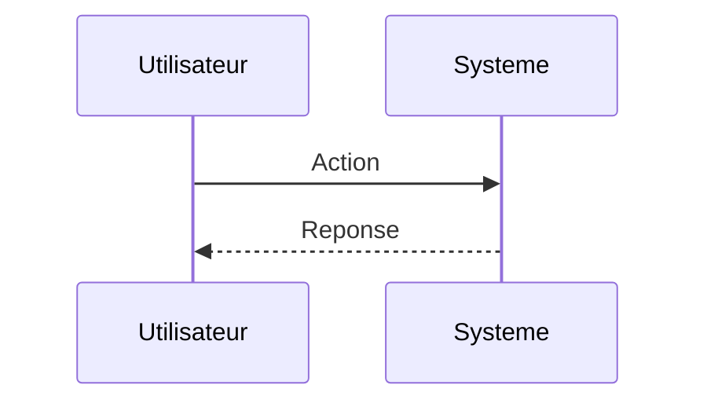

<!-- markdownlint-disable MD009 MD010 MD013 MD022 MD028 MD032 MD033 MD034 MD036 MD037 MD039 MD041 MD060 -->

[ 🇬🇧 English Version ](./README.md)

# Orbital Debris Predictive Network

> **Résumé exécutif :** Un réseau de capteurs optiques et LiDAR embarqués directement en tant que "hosted payloads" sur des satellites commerciaux, couplé à une IA de perception spatiale temps réel à l'edge pour détecter, caractériser et cataloguer de manière autonome les micro-débris (<10cm) non tracés. Les données alimentent un World Model orbital pour l'évitement automatisé.

---

## 1. Aperçu visuel & Effet Wahou

## 2. La thèse contrariante (Peter Thiel Style)

**La croyance populaire :** Les solutions généralistes IA peuvent résoudre ce problème.

**La vérité cachée :** Les bases de données existantes (comme celle de l'US Space Command) sont des systèmes fermés et basés sur des architectures monolithiques incapables de traiter la fusion de capteurs en orbite à la milliseconde près. Les modèles de trajectoire classiques divergent trop vite sans données visuelles locales.

## 3. Le problème & La cible

**Modèle économique :** B2B

**Cible précise :** Opérateurs de constellations de satellites (SpaceX, Amazon Kuiper), agences spatiales gouvernementales (NASA, ESA), et assureurs spatiaux.

**La douleur urgente :** Le syndrome de Kessler devient une réalité. Avec des dizaines de milliers de nouveaux satellites en LEO (Low Earth Orbit), la probabilité de collisions catastrophiques augmentent de façon exponentielle, menaçant des milliards d'infrastructures et l'accès même à l'espace. Le suivi actuel basé sur les radars au sol est trop lent, imprécis, et ne suit que les gros débris.

## 4. Architecture technique & Plomberie

## 5. Modèle économique & Viabilité financière

| Métrique                    | Valeur                        |
| --------------------------- | ----------------------------- |
| Structure de prix           | Abonnement SaaS               |
| Objectif 12 mois            | 10 clients                    |
| Calcul du CA (Target 100k€) | 10 clients \* 10k€/an = 100k€ |
| Marge brute estimée         | 80%                           |

## 6. Moteur de distribution & Fossé défensif (Moat)

**Stratégie d'acquisition :** Vente directe B2B

**Moat (Barrière à l'entrée) :** Coût exorbitant de lancement des charges utiles. Nécessité d'obtenir des partenariats avec les opérateurs de satellites pour héberger les capteurs. Résilience du hardware au rayonnement cosmique.

## 7. Grille d'évaluation détaillée

| Critère                           | Score VC (/100) | Score Terrain (/100) |
| --------------------------------- | --------------- | -------------------- |
| Thèse & Monopole / Urgence        | -- / 25         | -- / 25              |
| Moat / Résistance aux LLM natifs  | -- / 25         | -- / 25              |
| Scalabilité / Friction d'adoption | -- / 25         | -- / 25              |
| Unit Economics / ROI direct       | -- / 25         | -- / 25              |
| **TOTAL**                         | **-- / 100**    | **-- / 100**         |

> **Verdict VC :** En attente d'évaluation.

> **Verdict Terrain :** En attente d'évaluation.
