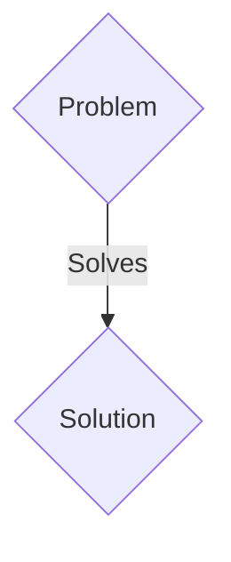
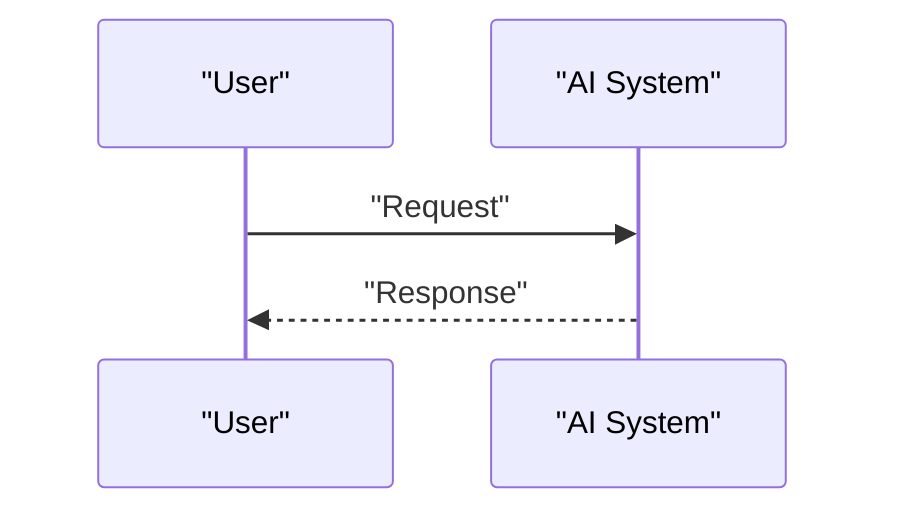

<!-- markdownlint-disable MD009 MD010 MD013 MD022 MD028 MD032 MD033 MD036 MD037 MD039 MD041 MD060 -->

[ 🇫🇷 Version Française ](./README.fr.md)

# Orbital Debris Predictive Network

> **Executive Summary:** A B2B solution targeting Satellite constellation operators (SpaceX, Amazon Kuiper), government space agencies (NASA, ESA), and space insurers. to solve: Kessler syndrome becomes a reality. With tens of thousands of new satellites in LEO (Low Earth Orbit), the likelihood of catastrophic collisions increases exponentially, threatening billions of infrastructure and even access to space. Current tracking based on ground radars is too slow, imprecise, and only tracks large debris.

---

## 1. Visual Overview & Wow Effect

## 2. Contrarian Thesis (Peter Thiel Style)

- **Popular Belief:** Generic solutions are enough.
- **Hidden Truth:** A network of optical and LiDAR sensors embedded directly as "hosted payloads" on commercial satellites, coupled with real-time spatial perception AI at the edge to autonomously detect, characterize and catalog untraceable micro-debris (<10cm). The data feeds an orbital World Model for automated avoidance.

## 3. Problem & Target Market

- **Business Model:** B2B
- **Target Audience:** Satellite constellation operators (SpaceX, Amazon Kuiper), government space agencies (NASA, ESA), and space insurers.
- **Urgent Pain Point:** Kessler syndrome becomes a reality. With tens of thousands of new satellites in LEO (Low Earth Orbit), the likelihood of catastrophic collisions increases exponentially, threatening billions of infrastructure and even access to space. Current tracking based on ground radars is too slow, imprecise, and only tracks large debris.

## 4. Technical Architecture & Infrastructure

A network of optical and LiDAR sensors embedded directly as "hosted payloads" on commercial satellites, coupled with real-time spatial perception AI at the edge to autonomously detect, characterize and catalog untraceable micro-debris (<10cm). The data feeds an orbital World Model for automated avoidance.

## 5. Business Model & Financial Viability

| Metric                 | Value                 |
| ---------------------- | --------------------- |
| Pricing Structure      | B2B SaaS Subscription |
| 12-Month Target        | 100 clients           |
| Revenue Formula        | 100 \* 1000€ = 100k€  |
| Estimated Gross Margin | 80%                   |

## 6. Distribution Engine & Moat

- **Acquisition Strategy:** Direct sales and strategic partnerships.
- **Moat (Defensibility):** Existing databases (like that of the US Space Command) are closed systems and based on monolithic architectures incapable of processing the fusion of sensors in orbit to the millisecond. Classic trajectory models diverge too quickly without local visual data.

## 7. Detailed Evaluation Grid

| Criterion                   | VC Score (/100) | Market Score (/100) |
| --------------------------- | --------------- | ------------------- |
| Thesis & Monopoly / Urgency | -- / 25         | -- / 25             |
| Moat / LLM Immunity         | -- / 25         | -- / 25             |
| Scalability / UX Friction   | -- / 25         | -- / 25             |
| Unit Economics / ROI        | -- / 25         | -- / 25             |
| TOTAL                       | -- / 100        | -- / 100            |

> **VC Verdict:** Pending evaluation.
> **Market Verdict:** Pending evaluation.
