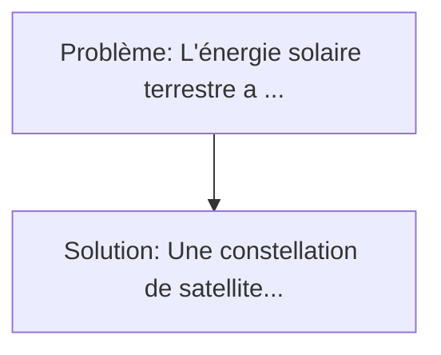
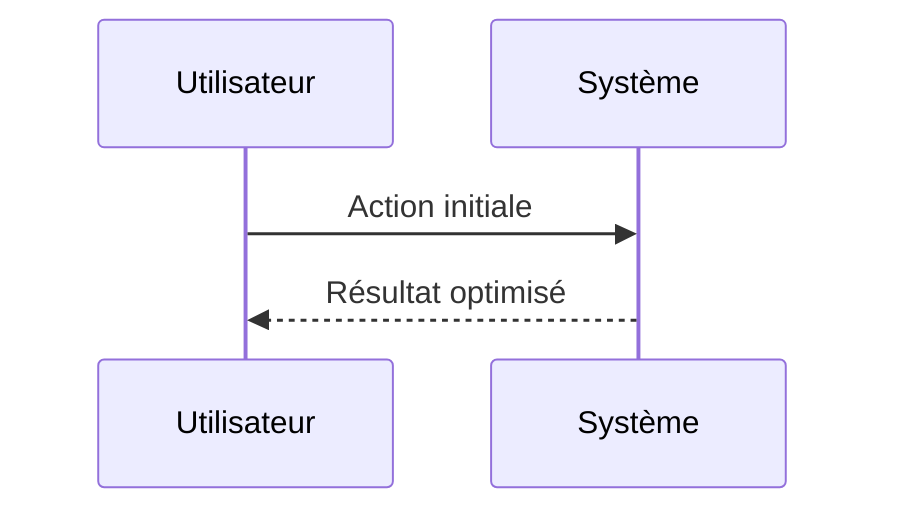

<!-- markdownlint-disable MD013 MD033 -->

[🇬🇧 English Version](./README.md)

# Réflecteurs Solaires Orbitaux pour Fermes Solaires Terrestres (Orbital Solar Reflector)

> **Résumé exécutif :** Une constellation de satellites ultra-légers en orbite héliosynchrone agissant comme des miroirs spatiaux directionnels (foils réflecteurs) contrôlés avec précision pour rediriger la lumière du soleil directement sur les fermes solaires terrestres existantes pendant la nuit ou le crépuscule (concept du miroir de Znamya modernisé). L'énergie solaire terrestre a un défaut majeur : elle s'arrête la nuit, nécessitant un stockage par batteries lithium-ion extrêmement cher à l'échelle du Gigawatt, ou l'utilisation de centrales à gaz "peaker" polluantes et onéreuses.

---

## 1. Aperçu visuel & Effet Wahou

## 2. La thèse contrariante (Peter Thiel Style)

**La croyance populaire :** Les solutions logicielles seules peuvent résoudre ce problème.
**La vérité cachée :** C'est un problème d'ingénierie spatiale complexe nécessitant la fabrication de voiles solaires ultra-fines (nanomatériaux), des systèmes de pointage de précision orbitale (ACS), et de la navigation orbitale dynamique, hors de portée d'un logiciel cloud.

## 3. Le problème & La cible

- **Modèle économique :** B2B
- **Cible précise :** Opérateurs de parcs solaires terrestres massifs (utility-scale) qui souffrent de la "courbe du canard" et de la baisse de production la nuit ou aux pics de demande (le soir).
- **La douleur urgente :** L'énergie solaire terrestre a un défaut majeur : elle s'arrête la nuit, nécessitant un stockage par batteries lithium-ion extrêmement cher à l'échelle du Gigawatt, ou l'utilisation de centrales à gaz "peaker" polluantes et onéreuses.

## 4. Architecture technique & Plomberie

## 5. Modèle économique & Viabilité financière

| Métrique                    | Valeur             |
| --------------------------- | ------------------ |
| Structure de prix           | Custom Pricing     |
| Objectif 12 mois            | 100 clients        |
| Calcul du CA (Target 100k€) | 100 \* 1000 = 100k |
| Marge brute estimée         | 80%                |

## 6. Moteur de distribution & Fossé défensif (Moat)

- **Stratégie d'acquisition :** Ventes B2B directes
- **Moat (Barrière à l'entrée) :** C'est un problème d'ingénierie spatiale complexe nécessitant la fabrication de voiles solaires ultra-fines (nanomatériaux), des systèmes de pointage de précision orbitale (ACS), et de la navigation orbitale dynamique, hors de portée d'un logiciel cloud.

## 7. Grille d'évaluation détaillée

| Critère                           | Score VC (/100) | Score Terrain (/100) |
| --------------------------------- | --------------- | -------------------- |
| Thèse & Monopole / Urgence        | -- / 25         | -- / 25              |
| Moat / Résistance aux LLM natifs  | -- / 25         | -- / 25              |
| Scalabilité / Friction d'adoption | -- / 25         | -- / 25              |
| Unit Economics / ROI direct       | -- / 25         | -- / 25              |
| **TOTAL**                         | **-- / 100**    | **-- / 100**         |

> **Verdict VC :** En attente d'évaluation.

> **Verdict Terrain :** En attente d'évaluation.
