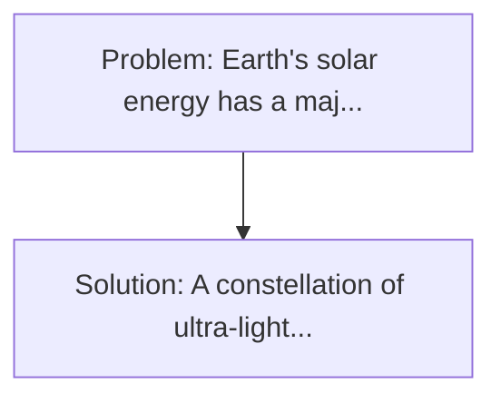
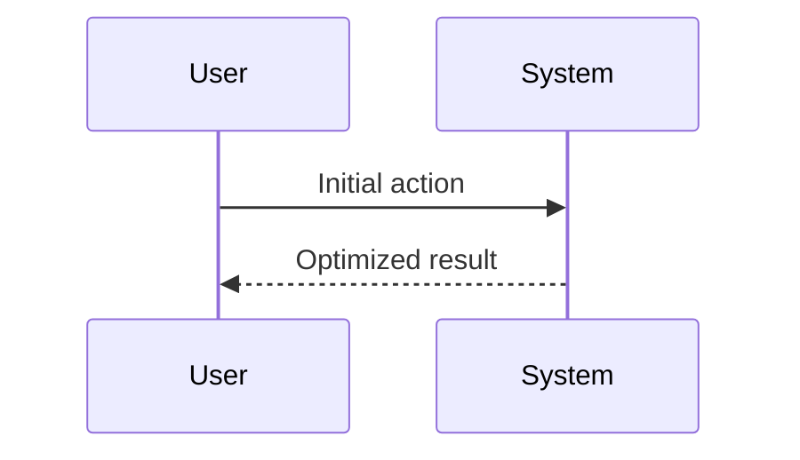

<!-- markdownlint-disable MD013 MD033 -->

[🇫🇷 Version Française](./README.fr.md)

# Orbital Solar Reflectors for Terrestrial Solar Farms (Orbital Solar Reflector)

> **Executive Summary:** A constellation of ultra-light satellites in heliosynchronous orbit acting as directional spatial mirrors (reflectors) accurately controlled to redirect sunlight directly to existing terrestrial solar farms during the night or dusk (concept of the modernized Znamya mirror). Earth's solar energy has a major defect: it stops at night, requiring extremely expensive lithium-ion battery storage at the Gigawatt scale, or the use of polluting and expensive "peaker" gas plants.

---

## 1. Visual Overview & Wow Effect

## 2. Contrarian Thesis (Peter Thiel Style)

**Popular Belief:** Generic software solutions can solve this.
**Hidden Truth:** This is a complex space engineering problem requiring the manufacture of ultra-fine (nano-material) solar sails, orbital precision scoring systems (ACS), and dynamic orbital navigation, out of reach of cloud software.

## 3. Problem & Target Market

- **Business Model:** B2B
- **Target Audience:** Operators of massive terrestrial solar parks (utility-scale) that suffer from the "duck curve" and the drop in production at night or at peak demand (in the evening).
- **Urgent Pain Point:** Earth's solar energy has a major defect: it stops at night, requiring extremely expensive lithium-ion battery storage at the Gigawatt scale, or the use of polluting and expensive "peaker" gas plants.

## 4. Technical Architecture & Infrastructure

## 5. Business Model & Financial Viability

| Metric                 | Value              |
| ---------------------- | ------------------ |
| Pricing Structure      | Custom Pricing     |
| 12-Month Target        | 100 customers      |
| Revenue Formula        | 100 \* 1000 = 100k |
| Estimated Gross Margin | 80%                |

## 6. Distribution Engine & Moat

- **Acquisition Strategy:** Direct B2B Sales
- **Moat (Defensibility):** This is a complex space engineering problem requiring the manufacture of ultra-fine (nano-material) solar sails, orbital precision scoring systems (ACS), and dynamic orbital navigation, out of reach of cloud software.

## 7. Detailed Evaluation Grid

| Criterion                   | VC Score (/100) | Market Score (/100) |
| --------------------------- | --------------- | ------------------- |
| Thesis & Monopoly / Urgency | -- / 25         | -- / 25             |
| Moat / LLM Immunity         | -- / 25         | -- / 25             |
| Scalability / UX Friction   | -- / 25         | -- / 25             |
| Unit Economics / ROI        | -- / 25         | -- / 25             |
| **TOTAL**                   | **-- / 100**    | **-- / 100**        |

> **VC Verdict:** Pending evaluation.

> **Market Verdict:** Pending evaluation.
