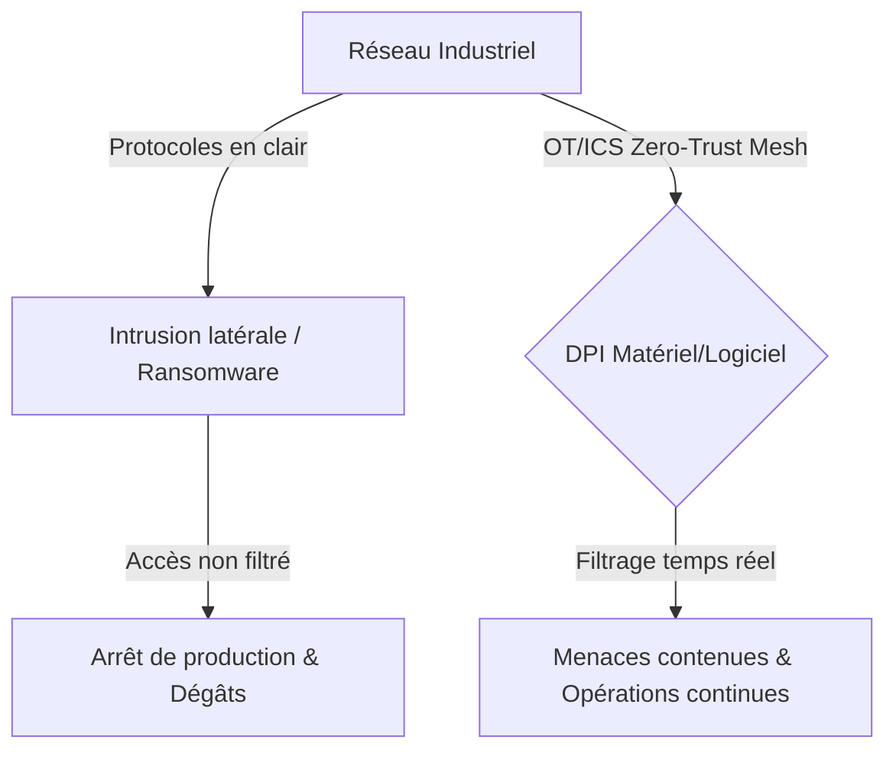
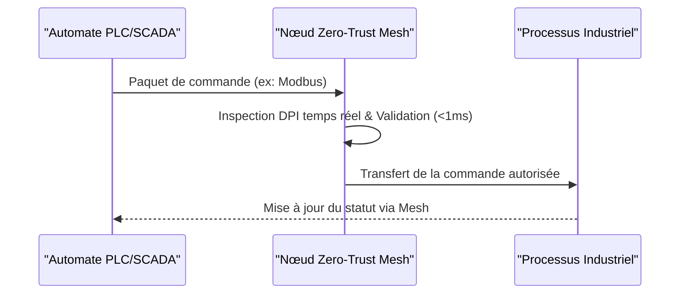

<!-- markdownlint-disable MD009 MD010 MD013 MD022 MD028 MD032 MD033 MD034 MD036 MD037 MD039 MD041 MD058 MD060 -->

[🇬🇧 English Version](./README.md)

# OT/ICS Zero-Trust Micro-Segmentation Mesh

> **Résumé exécutif :** Une architecture de maillage Zero-Trust bas niveau pour les systèmes de contrôle industriel (OT/ICS) offrant une inspection approfondie des paquets en temps réel sans introduire de latence.

---

## 1. Aperçu visuel & Effet Wahou

## 2. La thèse contrariante (Peter Thiel Style)

La croyance populaire : Les solutions de sécurité IT traditionnelles (VPN, firewalls) peuvent être adaptées pour sécuriser les réseaux industriels.
La vérité cachée : Les solutions IT sont incompatibles avec les contraintes temps-réel (millisecondes) des automates et ne comprennent pas les protocoles propriétaires industriels. Une véritable architecture Zero-Trust doit opérer au niveau réseau le plus bas, air-gapped du cloud, garantissant une continuité opérationnelle absolue sans introduire de latence bloquante.

## 3. Le problème & La cible

Modèle économique : B2B
Cible précise : Opérateurs d'infrastructures critiques (OIV/OSE), réseaux électriques, usines chimiques, traitement des eaux, et grands sites manufacturiers.
La douleur urgente : Les systèmes de contrôle industriel (OT/ICS) utilisent des protocoles legacy en clair (Modbus, DNP3) sans authentification. Une intrusion latérale peut se propager instantanément, paralysant la production et menaçant la sécurité physique des installations, entraînant des pertes chiffrées en millions par heure.

## 4. Architecture technique & Plomberie

## 5. Modèle économique & Viabilité financière

| Métrique                    | Valeur                                          |
| --------------------------- | ----------------------------------------------- |
| Structure de prix           | Licence par site basée sur le volume de nœuds   |
| Objectif 12 mois            | 3 à 5 sites pilotes d'infrastructures critiques |
| Calcul du CA (Target 100k€) | 4 \* 25k = 100k                                 |
| Marge brute estimée         | 85%                                             |

## 6. Moteur de distribution & Fossé défensif (Moat)

Stratégie d'acquisition : Ventes directes aux RSSI (CISO) d'infrastructures critiques, partenariats avec des intégrateurs industriels.
Moat (Barrière à l'entrée) : L'exigence de certifications industrielles strictes (IEC 62443), le besoin critique de zéro latence et la résistance culturelle des ingénieurs d'exploitation à modifier des réseaux de production actifs créent une barrière à l'entrée massive pour les fournisseurs de cybersécurité SaaS ou cloud standards.

## 7. Grille d'évaluation détaillée

| Critère                           | Score VC (/100) | Score Terrain (/100) |
| --------------------------------- | --------------- | -------------------- |
| Thèse & Monopole / Urgence        | -- / 25         | -- / 25              |
| Moat / Résistance aux LLM natifs  | -- / 25         | -- / 25              |
| Scalabilité / Friction d'adoption | -- / 25         | -- / 25              |
| Unit Economics / ROI direct       | -- / 25         | -- / 25              |
| **TOTAL**                         | **-- / 100**    | **-- / 100**         |

> **Verdict VC :** En attente d'évaluation.

> **Verdict Terrain :** En attente d'évaluation.
