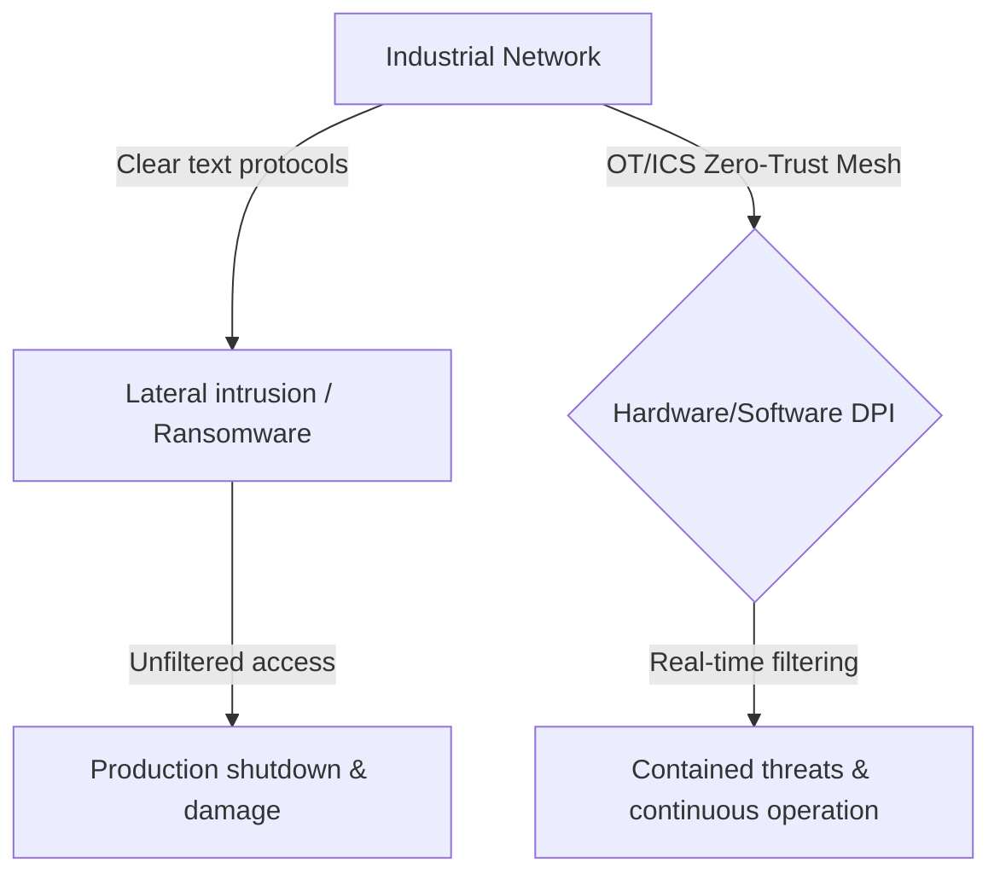
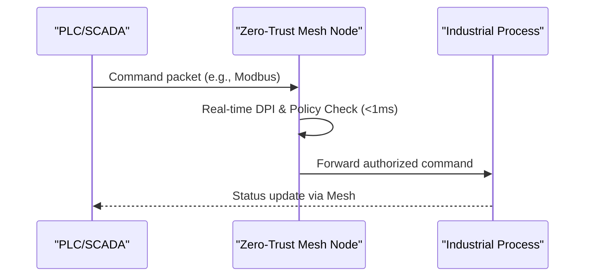

<!-- markdownlint-disable MD009 MD010 MD013 MD022 MD028 MD032 MD033 MD034 MD036 MD037 MD039 MD041 MD058 MD060 -->

[🇫🇷 Version Française](./README.fr.md)

# OT/ICS Zero-Trust Micro-Segmentation Mesh

> **Executive Summary:** A low-level Zero-Trust mesh architecture for industrial control systems (OT/ICS) providing real-time deep packet inspection without introducing latency.

---

## 1. Visual Overview & Wow Effect

## 2. Contrarian Thesis (Peter Thiel Style)

Popular Belief: Traditional IT security solutions like VPNs and firewalls can be ported to secure industrial networks.
Hidden Truth: IT solutions are incompatible with the real-time constraints (milliseconds) of PLCs and do not understand proprietary industrial protocols. A true Zero-Trust architecture must operate at the lowest network layer, air-gapped from the cloud, ensuring absolute operational continuity without introducing blocking latency.

## 3. Problem & Target Market

Business Model: B2B
Target Audience: Operators of Critical Infrastructures (OIV/OSE), electrical grids, chemical plants, water treatment, and large manufacturing sites.
Urgent Pain Point: OT/ICS systems use legacy clear-text protocols (Modbus, DNP3) without authentication. A lateral intrusion can spread instantly, paralyzing production and threatening physical safety, leading to losses in the millions per hour.

## 4. Technical Architecture & Infrastructure

## 5. Business Model & Financial Viability

| Metric                 | Value                                      |
| ---------------------- | ------------------------------------------ |
| Pricing Structure      | Per-site licensing based on node volume    |
| 12-Month Target        | 3 to 5 critical infrastructure pilot sites |
| Revenue Formula        | 4 \* 25k = 100k                            |
| Estimated Gross Margin | 85%                                        |

## 6. Distribution Engine & Moat

Acquisition Strategy: Direct sales to CISOs of critical infrastructure, partnerships with industrial integrators.
Moat (Defensibility): The requirement for strict industrial certifications (IEC 62443), the critical need for zero latency, and the cultural resistance of plant engineers to touch active production networks create a massive barrier to entry for standard SaaS or cloud-only cybersecurity vendors.

## 7. Detailed Evaluation Grid

| Criterion                   | VC Score (/100) | Market Score (/100) |
| --------------------------- | --------------- | ------------------- |
| Thesis & Monopoly / Urgency | -- / 25         | -- / 25             |
| Moat / LLM Immunity         | -- / 25         | -- / 25             |
| Scalability / UX Friction   | -- / 25         | -- / 25             |
| Unit Economics / ROI        | -- / 25         | -- / 25             |
| **TOTAL**                   | **-- / 100**    | **-- / 100**        |

> **VC Verdict:** Pending evaluation.

> **Market Verdict:** Pending evaluation.
