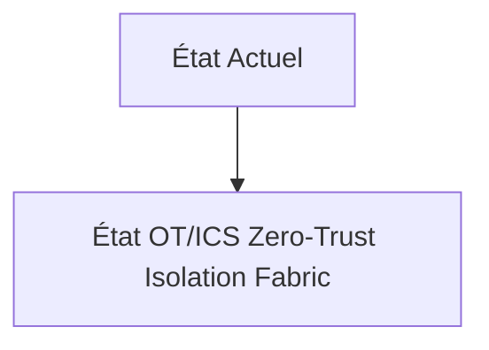
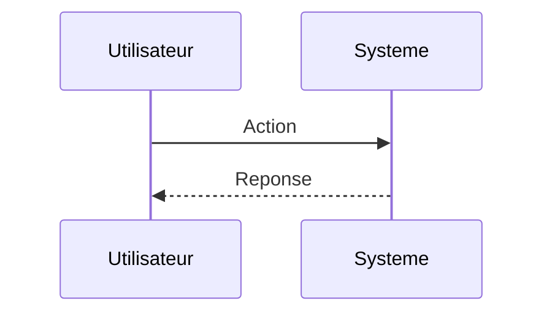

<!-- markdownlint-disable MD009 MD010 MD013 MD022 MD028 MD032 MD033 MD034 MD036 MD037 MD039 MD041 MD060 -->

[ 🇬🇧 English Version ](./README.md)

# OT/ICS Zero-Trust Isolation Fabric

> **Résumé exécutif :** Un maillage de sécurité (fabric) matériel et logiciel déployé au niveau de la couche 2 du réseau (L2). Des micro-firewalls sur rail DIN qui appliquent un Zero-Trust déterministe (micro-segmentation) avec une inspection profonde des protocoles industriels propriétaires (Modbus, DNP3, Profinet) pour isoler les machines sans casser la latence temps réel requise par l'usine.

---

## 1. Aperçu visuel & Effet Wahou

## 2. La thèse contrariante (Peter Thiel Style)

**La croyance populaire :** Les solutions généralistes IA peuvent résoudre ce problème.

**La vérité cachée :** L'IT security (Crowdstrike, Palo Alto) nécessite l'installation d'agents sur des OS modernes. On ne peut pas installer un agent sur un automate Siemens des années 90 qui gère une vanne de pression. Un simple scan réseau SaaS ferait crasher l'automate.

## 3. Le problème & La cible

**Modèle économique :** B2B

**Cible précise :** Industries lourdes, usines d'armement, centrales nucléaires, usines de traitement des eaux, et chaînes logistiques maritimes (ports).

**La douleur urgente :** L'IT (informatique classique) et l'OT (Operation Technology, les automates industriels) convergent, exposant des automates programmables (PLC) vieux de 20 ans, impossibles à patcher, aux ransomwares et attaques par états-nations. Un hack entraîne l'arrêt physique de la production, ou pire, un désastre industriel.

## 4. Architecture technique & Plomberie

## 5. Modèle économique & Viabilité financière

| Métrique                    | Valeur                        |
| --------------------------- | ----------------------------- |
| Structure de prix           | Abonnement SaaS               |
| Objectif 12 mois            | 10 clients                    |
| Calcul du CA (Target 100k€) | 10 clients \* 10k€/an = 100k€ |
| Marge brute estimée         | 80%                           |

## 6. Moteur de distribution & Fossé défensif (Moat)

**Stratégie d'acquisition :** Vente directe B2B

**Moat (Barrière à l'entrée) :** Forte réticence à l'adoption des ingénieurs OT qui craignent la perturbation des opérations. Certification industrielle matérielle longue et coûteuse (IEC 62443).

## 7. Grille d'évaluation détaillée

| Critère                           | Score VC (/100) | Score Terrain (/100) |
| --------------------------------- | --------------- | -------------------- |
| Thèse & Monopole / Urgence        | -- / 25         | -- / 25              |
| Moat / Résistance aux LLM natifs  | -- / 25         | -- / 25              |
| Scalabilité / Friction d'adoption | -- / 25         | -- / 25              |
| Unit Economics / ROI direct       | -- / 25         | -- / 25              |
| **TOTAL**                         | **-- / 100**    | **-- / 100**         |

> **Verdict VC :** En attente d'évaluation.

> **Verdict Terrain :** En attente d'évaluation.
