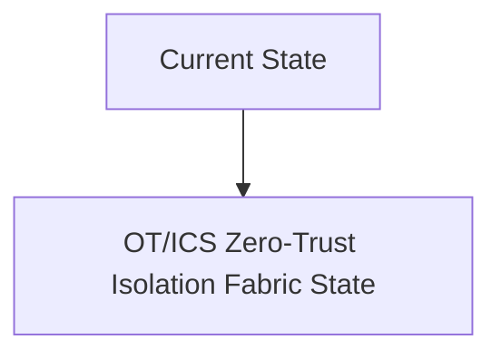
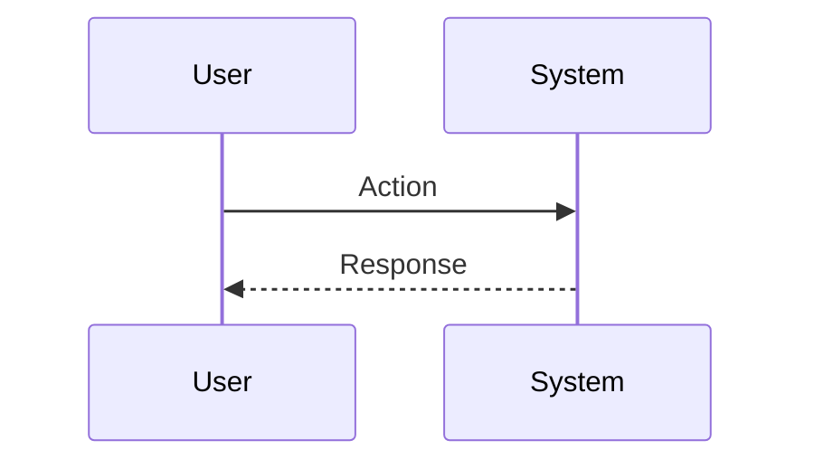

<!-- markdownlint-disable MD009 MD010 MD013 MD022 MD028 MD032 MD033 MD034 MD036 MD037 MD039 MD041 MD060 -->

[ 🇫🇷 Version Française ](./README.fr.md)

# OT/ICS Zero-Trust Isolation Fabric

> **Executive Summary:** A hardware and software security mesh (fabric) deployed at layer 2 of the network (L2). DIN rail micro-firewalls that apply deterministic Zero-Trust (micro-segmentation) with deep inspection of proprietary industrial protocols (Modbus, DNP3, Profinet) to isolate machines without breaking the real-time latency required by the factory.

---

## 1. Visual Overview & Wow Effect

## 2. Contrarian Thesis (Peter Thiel Style)

**Popular Belief:** General AI solutions can solve this problem.

**Hidden Truth:** IT security (Crowdstrike, Palo Alto) requires the installation of agents on modern OS. You cannot install an agent on a Siemens PLC from the 90s which manages a pressure valve. A simple SaaS network scan would crash the controller.

## 3. Problem & Target Market

**Business Model:** B2B

**Target Audience:** Heavy industries, weapons factories, nuclear power plants, water treatment plants, and maritime logistics chains (ports).

**Urgent Pain Point:** IT (conventional computing) and OT (Operation Technology) are converging, exposing 20-year-old, impossible-to-patch programmable logic controllers (PLCs) to ransomware and nation-state attacks. A hack leads to the physical shutdown of production, or worse, an industrial disaster.

## 4. Technical Architecture & Infrastructure

## 5. Business Model & Financial Viability

| Metric                 | Value                           |
| ---------------------- | ------------------------------- |
| Pricing Structure      | SaaS subscription               |
| 12-Month Target        | 10 customers                    |
| Revenue Formula        | 10 clients \* 10k€/year = 100k€ |
| Estimated Gross Margin | 80%                             |

## 6. Distribution Engine & Moat

**Acquisition Strategy:** B2B direct sales

**Moat (Defensibility):** Strong reluctance to adoption from OT engineers who fear disruption to operations. Long and expensive hardware industrial certification (IEC 62443).

## 7. Detailed Evaluation Grid

| Criterion                   | VC Score (/100) | Market Score (/100) |
| --------------------------- | --------------- | ------------------- |
| Thesis & Monopoly / Urgency | -- / 25         | -- / 25             |
| Moat / LLM Immunity         | -- / 25         | -- / 25             |
| Scalability / UX Friction   | -- / 25         | -- / 25             |
| Unit Economics / ROI        | -- / 25         | -- / 25             |
| **TOTAL**                   | **-- / 100**    | **-- / 100**        |

> **VC Verdict:** Pending evaluation.

> **Market Verdict:** Pending evaluation.
