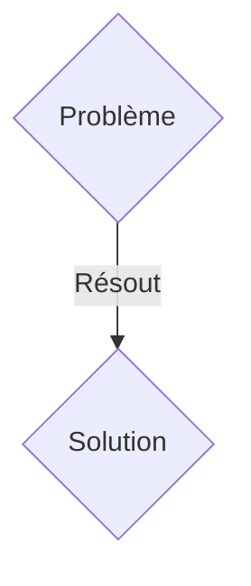
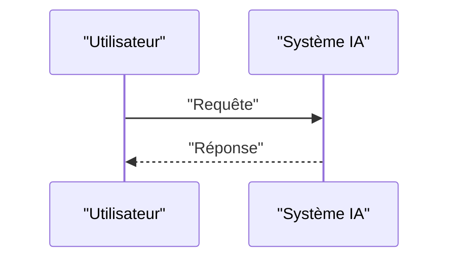

<!-- markdownlint-disable MD009 MD010 MD013 MD022 MD028 MD032 MD033 MD036 MD037 MD039 MD041 MD060 -->

[ 🇬🇧 English Version ](./README.md)

# Firmware Trust OT

> **Résumé exécutif :** Une solution B2B ciblant Infrastructures critiques (centrales électriques, usines de traitement des eaux, pipelines), fabricants d'automates (PLCs). pour résoudre : Les automates industriels (OT/ICS) exécutent souvent des firmwares vieux de 10 ans sans mécanisme d'authentification cryptographique. Une mise à jour compromise (Supply Chain Attack) ou un accès physique permet de prendre le contrôle d'infrastructures physiques critiques (ex: Stuxnet).

---

## 1. Aperçu visuel & Effet Wahou

## 2. La thèse contrariante (Peter Thiel Style)

- **La croyance populaire :** Les solutions génériques suffisent.
- **La vérité cachée :** Une architecture Zero-Trust implantée au niveau du micro-contrôleur : un micro-hyperviseur bare-metal qui isole l'exécution du code industriel (ladder logic) des piles réseau, et valide l'intégrité de la mémoire en temps réel via des puces TPM (Trusted Platform Module).

## 3. Le problème & La cible

- **Modèle économique :** B2B
- **Cible précise :** Infrastructures critiques (centrales électriques, usines de traitement des eaux, pipelines), fabricants d'automates (PLCs).
- **La douleur urgente :** Les automates industriels (OT/ICS) exécutent souvent des firmwares vieux de 10 ans sans mécanisme d'authentification cryptographique. Une mise à jour compromise (Supply Chain Attack) ou un accès physique permet de prendre le contrôle d'infrastructures physiques critiques (ex: Stuxnet).

## 4. Architecture technique & Plomberie

Une architecture Zero-Trust implantée au niveau du micro-contrôleur : un micro-hyperviseur bare-metal qui isole l'exécution du code industriel (ladder logic) des piles réseau, et valide l'intégrité de la mémoire en temps réel via des puces TPM (Trusted Platform Module).

## 5. Modèle économique & Viabilité financière

| Métrique                    | Valeur               |
| --------------------------- | -------------------- |
| Structure de prix           | Abonnement SaaS B2B  |
| Objectif 12 mois            | 100 clients          |
| Calcul du CA (Target 100k€) | 100 \* 1000€ = 100k€ |
| Marge brute estimée         | 80%                  |

## 6. Moteur de distribution & Fossé défensif (Moat)

- **Stratégie d'acquisition :** Vente directe et partenariats stratégiques.
- **Moat (Barrière à l'entrée) :** Les solutions IT classiques (EDR type Crowdstrike, VPNs) ne peuvent pas être installées sur un automate industriel de 500 MHz avec 2 Mo de RAM fonctionnant sous un OS temps réel (RTOS). Il faut une ingénierie de bas niveau (C/Rust) respectant des contraintes de temps réel strictes.

## 7. Grille d'évaluation détaillée

| Critère                           | Score VC (/100) | Score Terrain (/100) |
| --------------------------------- | --------------- | -------------------- |
| Thèse & Monopole / Urgence        | -- / 25         | -- / 25              |
| Moat / Résistance aux LLM natifs  | -- / 25         | -- / 25              |
| Scalabilité / Friction d'adoption | -- / 25         | -- / 25              |
| Unit Economics / ROI direct       | -- / 25         | -- / 25              |
| TOTAL                             | -- / 100        | -- / 100             |

> **Verdict VC :** En attente d'évaluation.
> **Verdict Terrain :** En attente d'évaluation.
