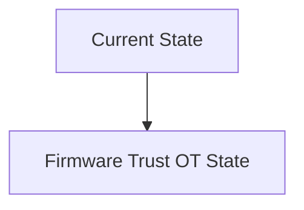
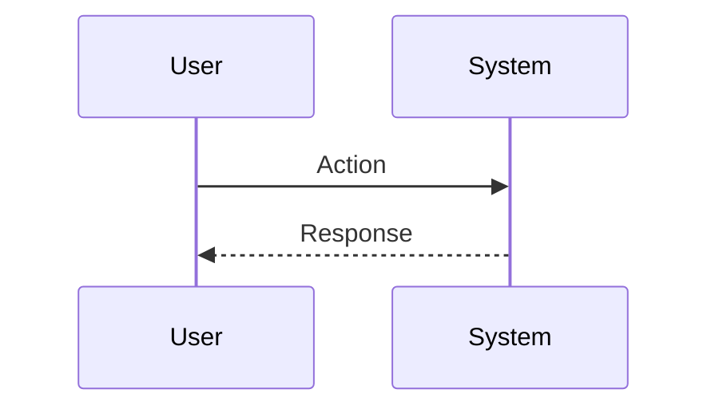

<!-- markdownlint-disable MD009 MD010 MD013 MD022 MD028 MD032 MD033 MD034 MD036 MD037 MD039 MD041 MD060 -->

[ 🇫🇷 Version Française ](./README.fr.md)

# Firmware Trust OT

> **Executive Summary:** A Zero-Trust architecture implemented at the micro-controller level: a bare-metal micro-hypervisor which isolates the execution of industrial code (ladder logic) from the network stacks, and validates the integrity of the memory in real time via TPM (Trusted Platform Module) chips.

---

## 1. Visual Overview & Wow Effect

## 2. Contrarian Thesis (Peter Thiel Style)

**Popular Belief:** General AI solutions can solve this problem.

**Hidden Truth:** Classic IT solutions (EDR such as Crowdstrike, VPNs) cannot be installed on a 500 MHz industrial PLC with 2 MB of RAM running under a real-time OS (RTOS). It requires low-level engineering (C/Rust) respecting strict real-time constraints.

## 3. Problem & Target Market

**Business Model:** B2B

**Target Audience:** Critical infrastructures (power plants, water treatment plants, pipelines), automation manufacturers (PLCs).

**Urgent Pain Point:** Industrial PLCs (OT/ICS) often run 10-year-old firmware without a cryptographic authentication mechanism. A compromised update (Supply Chain Attack) or physical access allows you to take control of critical physical infrastructures (e.g. Stuxnet).

## 4. Technical Architecture & Infrastructure

## 5. Business Model & Financial Viability

| Metric                 | Value                           |
| ---------------------- | ------------------------------- |
| Pricing Structure      | SaaS subscription               |
| 12-Month Target        | 10 customers                    |
| Revenue Formula        | 10 clients \* 10k€/year = 100k€ |
| Estimated Gross Margin | 80%                             |

## 6. Distribution Engine & Moat

**Acquisition Strategy:** B2B direct sales

**Moat (Defensibility):** Manufacturers are afraid to touch systems that work ("If it ain't broken, don't fix it"); requires partnerships with equipment manufacturers (Siemens, Schneider) or the risky injection of code into legacy hardware; longevity of replacement cycles (15-30 years).

## 7. Detailed Evaluation Grid

| Criterion                   | VC Score (/100) | Market Score (/100) |
| --------------------------- | --------------- | ------------------- |
| Thesis & Monopoly / Urgency | -- / 25         | -- / 25             |
| Moat / LLM Immunity         | -- / 25         | -- / 25             |
| Scalability / UX Friction   | -- / 25         | -- / 25             |
| Unit Economics / ROI        | -- / 25         | -- / 25             |
| **TOTAL**                   | **-- / 100**    | **-- / 100**        |

> **VC Verdict:** Pending evaluation.

> **Market Verdict:** Pending evaluation.
