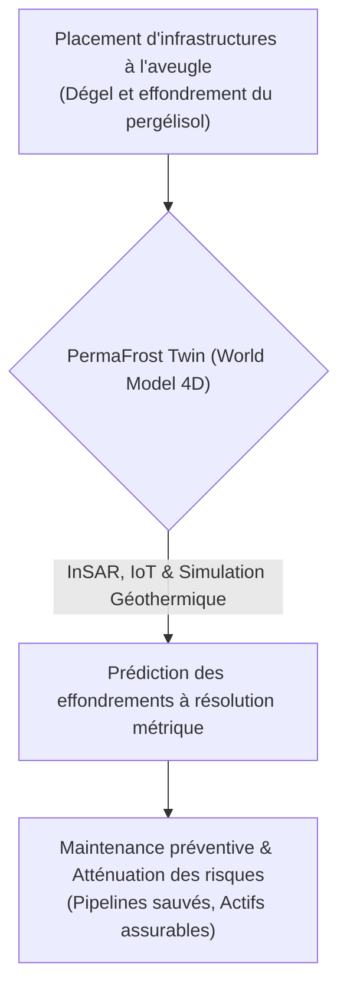
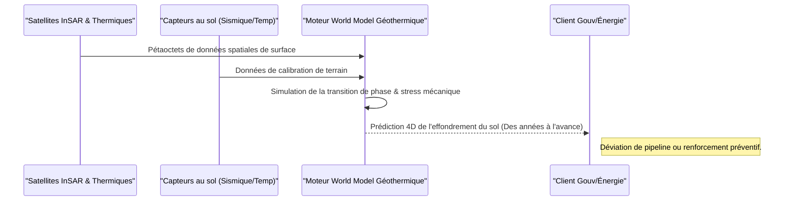

<!-- markdownlint-disable MD009 MD010 MD013 MD022 MD028 MD032 MD033 MD034 MD036 MD037 MD039 MD041 MD060 -->

[ 🇬🇧 English Version ](./README.md)

# PermaFrost Twin

> **Résumé exécutif :** PermaFrost Twin est un jumeau numérique géothermique et hydrologique 4D qui ingère des pétaoctets de données satellitaires et IoT pour prédire l'effondrement du pergélisol (thermokarsts) à une résolution métrique, évitant des milliards de dollars de dégâts aux gouvernements et aux entreprises énergétiques.

---

## 1. Aperçu visuel & Effet Wahou

## 2. La thèse contrariante (Peter Thiel Style)

**La croyance populaire :** Les systèmes d'information géographique (SIG) 2D traditionnels et les modèles de prévision météorologique standards suffisent pour surveiller la stabilité des sols dans l'Arctique.
**La vérité cachée :** Les outils SIG standards sont statiques et bidimensionnels. Ils ne modélisent absolument pas la physique complexe de la transition de phase (glace vers eau) dans les matrices poreuses du sol couplée au bilan radiatif de surface. Prédire l'effondrement des sols nécessite un moteur de simulation géophysique 4D de pointe agissant comme un jumeau numérique de la sous-surface.

## 3. Le problème & La cible

**Modèle économique :** B2G / B2B
**Cible précise :** Gouvernements (Arctique, Canada, Russie, Nordiques), compagnies pétrolières/gazières, assureurs, et gestionnaires d'infrastructures lourdes (routes, pipelines) dans les régions polaires.
**La douleur urgente :** Le dégel du pergélisol (permafrost) dû au réchauffement climatique déstabilise les sols, provoquant l'effondrement d'infrastructures critiques (pipelines, routes, fondations de bâtiments) et libérant massivement du méthane (un puissant gaz à effet de serre). Les acteurs n'ont aucune visibilité spatio-temporelle précise sur les zones à risque d'effondrement, entraînant des milliards de dégâts, des marées noires (ex: Norilsk) et une impossibilité d'assurer ces actifs.

## 4. Architecture technique & Plomberie

## 5. Modèle économique & Viabilité financière

| Métrique                | Valeur                                                                                             |
| ----------------------- | -------------------------------------------------------------------------------------------------- |
| **Structure de prix**   | Abonnement SaaS annuel (par km carré) + Accès API sur mesure                                       |
| **Objectif 12 mois**    | 3 contrats pilotes avec des gouvernements de la région Arctique / grandes entreprises énergétiques |
| **Calcul du CA**        | 3 Contrats \* 40 000€/an                                                                           |
| **Marge brute estimée** | >75% (Post-coûts d'acquisition des données)                                                        |

## 6. Moteur de distribution & Fossé défensif (Moat)

**Stratégie d'acquisition :** Ventes B2G et B2B directes, partenariats avec des réassureurs massifs (Swiss Re, Munich Re) pour imposer l'outil dans la souscription d'actifs arctiques.
**Moat (Barrière à l'entrée) :** Les outils SIG traditionnels sont incapables de traiter la physique impliquée. Le fossé défensif repose sur le moteur physique propriétaire capable de modéliser les transitions de phase thermodynamiques à grande échelle, la barrière massive d'acquisition et de stockage de pétaoctets de données satellitaires haute résolution, et les données de terrain (forages) cruciales et difficiles à acquérir, nécessaires pour calibrer les modèles dans des zones inhospitalières.

## 7. Grille d'évaluation détaillée

| Critère                               | Score VC (/100) | Score Terrain (/100) |
| ------------------------------------- | --------------- | -------------------- |
| **Thèse & Monopole / Urgence**        | -- / 25         | -- / 25              |
| **Moat / Résistance aux LLM natifs**  | -- / 25         | -- / 25              |
| **Scalabilité / Friction d'adoption** | -- / 25         | -- / 25              |
| **Unit Economics / ROI direct**       | -- / 25         | -- / 25              |
| **TOTAL**                             | -- / 100        | -- / 100             |

> **Verdict VC :** En attente d'évaluation.
> **Verdict Terrain :** En attente d'évaluation.
