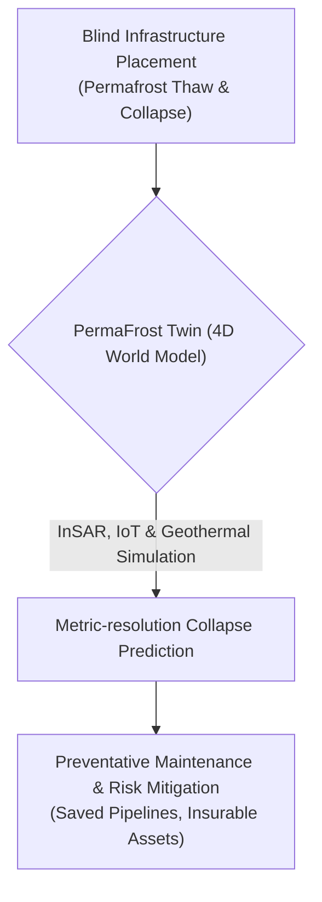
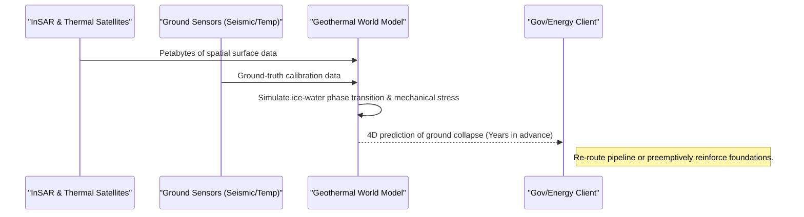

<!-- markdownlint-disable MD009 MD010 MD013 MD022 MD028 MD032 MD033 MD034 MD036 MD037 MD039 MD041 MD060 -->

[ 🇫🇷 Version Française ](./README.fr.md)

# PermaFrost Twin

> **Executive Summary:** PermaFrost Twin is a 4D geothermal and hydrological World Model that ingests petabytes of satellite and IoT data to predict permafrost collapse (thermokarsts) at metric resolution, saving governments and energy companies billions in infrastructure damage across polar regions.

---

## 1. Visual Overview & Wow Effect

## 2. Contrarian Thesis (Peter Thiel Style)

**Popular Belief:** Traditional 2D Geographic Information Systems (GIS) and standard weather forecasting models are sufficient to monitor ground stability in the Arctic.
**Hidden Truth:** Standard GIS tools are static and two-dimensional. They completely fail to model the complex physics of phase transitions (ice turning to water) within porous soil matrices coupled with surface radiative balance. Predicting ground collapse requires a cutting-edge, 4D geophysical simulation engine acting as a digital twin of the subsurface.

## 3. Problem & Target Market

**Business Model:** B2G / B2B
**Target Audience:** Governments (Arctic, Canada, Russia, Nordics), oil/gas companies, insurers, and heavy infrastructure managers (roads, pipelines) in polar regions.
**Urgent Pain Point:** The thawing of permafrost due to global warming destabilizes the ground, causing the collapse of critical infrastructure (pipelines, roads, building foundations) and massive releases of methane (a potent greenhouse gas). Stakeholders have no precise spatio-temporal visibility on areas at risk of collapse, leading to billions in damages, oil spills (e.g., Norilsk), and the inability to insure these assets.

## 4. Technical Architecture & Infrastructure

## 5. Business Model & Financial Viability

| Metric                     | Value                                                                 |
| -------------------------- | --------------------------------------------------------------------- |
| **Pricing Structure**      | Annual SaaS Subscription (tiered by sq km) + Custom API access        |
| **12-Month Target**        | 3 pilot contracts with Arctic region governments / major energy firms |
| **Revenue Formula**        | 3 Contracts \* €40k/year                                              |
| **Estimated Gross Margin** | >75% (Post-data acquisition costs)                                    |

## 6. Distribution Engine & Moat

**Acquisition Strategy:** Direct B2G and B2B enterprise sales, partnering with massive reinsurers (Swiss Re, Munich Re) to mandate the tool for underwriting Arctic assets.
**Moat (Defensibility):** Traditional GIS tools are incapable of processing the physics involved. The moat consists of the proprietary physics engine capable of modeling thermodynamic phase transitions at scale, the massive barrier of acquiring and storing petabytes of high-resolution satellite data, and the crucial, hard-to-acquire ground-truth bore-hole data required to calibrate the models in inhospitable zones.

## 7. Detailed Evaluation Grid

| Criterion                       | VC Score (/100) | Market Score (/100) |
| ------------------------------- | --------------- | ------------------- |
| **Thesis & Monopoly / Urgency** | -- / 25         | -- / 25             |
| **Moat / LLM Immunity**         | -- / 25         | -- / 25             |
| **Scalability / UX Friction**   | -- / 25         | -- / 25             |
| **Unit Economics / ROI**        | -- / 25         | -- / 25             |
| **TOTAL**                       | -- / 100        | -- / 100            |

> **VC Verdict:** Pending evaluation.
> **Market Verdict:** Pending evaluation.
