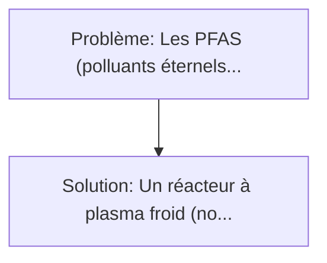
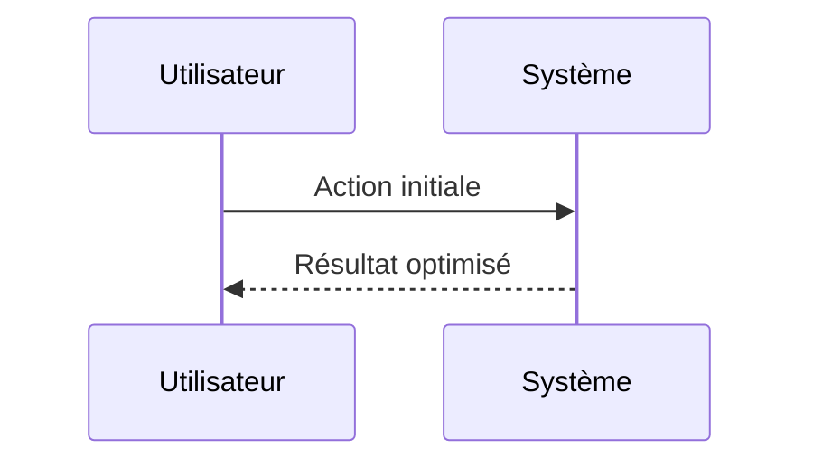

<!-- markdownlint-disable MD013 MD033 -->

[🇬🇧 English Version](./README.md)

# Cold Plasma PFAS Reactor

> **Résumé exécutif :** Un réacteur à plasma froid (non thermique) qui génère des électrons hautement énergétiques, des radicaux libres et des ions réactifs directement dans l'eau contaminée. Les PFAS ("polluants éternels") contaminent les nappes phréatiques mondiales.

---

## 1. Aperçu visuel & Effet Wahou

## 2. La thèse contrariante (Peter Thiel Style)

**La croyance populaire :** Les solutions logicielles seules peuvent résoudre ce problème.
**La vérité cachée :** C'est un défi purement matériel et physico-chimique. L'ingénierie repose sur la conception des électrodes, l'optimisation des impulsions haute tension (nanosecondes) pour maximiser l'efficacité énergétique du plasma sans chauffer l'eau, et la résistance des matériaux à l'érosion.

## 3. Le problème & La cible

- **Modèle économique :** B2B / B2G
- **Cible précise :** Usines de traitement des eaux usées municipales, industriels chimiques, bases militaires et aéroports (utilisateurs de mousses anti-incendie).
- **La douleur urgente :** Les PFAS ("polluants éternels") contaminent les nappes phréatiques mondiales. Les liaisons carbone-fluor sont parmi les plus fortes de la chimie organique, rendant ces molécules indestructibles par les méthodes de traitement de l'eau classiques (filtration, UV, ozonation). Les capturer ne fait que déplacer le problème (déchets toxiques concentrés à incinérer à très haute température).

## 4. Architecture technique & Plomberie

## 5. Modèle économique & Viabilité financière

| Métrique                    | Valeur             |
| --------------------------- | ------------------ |
| Structure de prix           | Custom Pricing     |
| Objectif 12 mois            | 100 clients        |
| Calcul du CA (Target 100k€) | 100 \* 1000 = 100k |
| Marge brute estimée         | 80%                |

## 6. Moteur de distribution & Fossé défensif (Moat)

- **Stratégie d'acquisition :** Ventes B2B directes
- **Moat (Barrière à l'entrée) :** C'est un défi purement matériel et physico-chimique. L'ingénierie repose sur la conception des électrodes, l'optimisation des impulsions haute tension (nanosecondes) pour maximiser l'efficacité énergétique du plasma sans chauffer l'eau, et la résistance des matériaux à l'érosion.

## 7. Grille d'évaluation détaillée

| Critère                           | Score VC (/100) | Score Terrain (/100) |
| --------------------------------- | --------------- | -------------------- |
| Thèse & Monopole / Urgence        | -- / 25         | -- / 25              |
| Moat / Résistance aux LLM natifs  | -- / 25         | -- / 25              |
| Scalabilité / Friction d'adoption | -- / 25         | -- / 25              |
| Unit Economics / ROI direct       | -- / 25         | -- / 25              |
| **TOTAL**                         | **-- / 100**    | **-- / 100**         |

> **Verdict VC :** En attente d'évaluation.

> **Verdict Terrain :** En attente d'évaluation.
