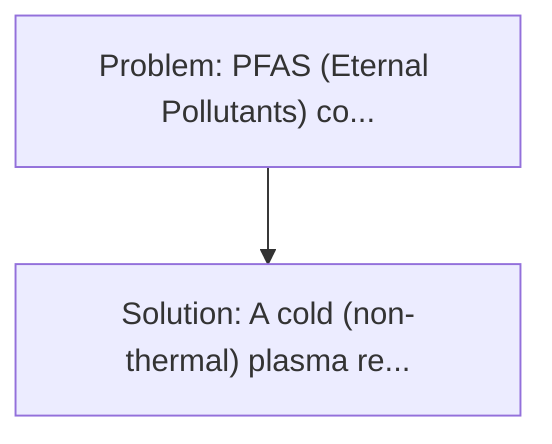
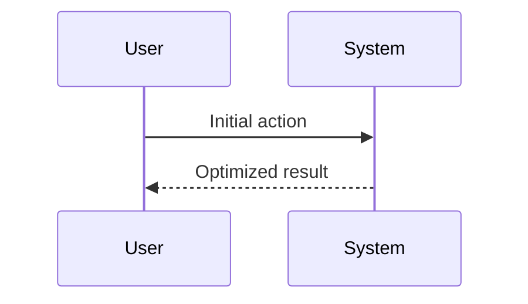

<!-- markdownlint-disable MD013 MD033 -->

[🇫🇷 Version Française](./README.fr.md)

# Cold Plasma PFAS Reactor

> **Executive Summary:** A cold (non-thermal) plasma reactor that generates high-energy electrons, free radicals and reactive ions directly in contaminated water. PFAS ("Eternal Pollutants") contaminate global groundwater.

---

## 1. Visual Overview & Wow Effect

## 2. Contrarian Thesis (Peter Thiel Style)

**Popular Belief:** Generic software solutions can solve this.
**Hidden Truth:** It is a purely physical and physical-chemical challenge. Engineering is based on electrode design, optimisation of high voltage pulses (nanoseconds) to maximize plasma energy efficiency without heating water, and material resistance to erosion.

## 3. Problem & Target Market

- **Business Model:** B2B / B2G
- **Target Audience:** Municipal wastewater treatment plants, chemical industry, military bases and airports (fire foam users).
- **Urgent Pain Point:** PFAS ("Eternal Pollutants") contaminate global groundwater. Carbon-fluor bonds are among the strongest in organic chemistry, making these molecules indestructible by conventional water treatment methods (filtration, UV, ozonation). Capturing them only moves the problem (toxic waste concentrated to incinerate at very high temperature).

## 4. Technical Architecture & Infrastructure

## 5. Business Model & Financial Viability

| Metric                 | Value              |
| ---------------------- | ------------------ |
| Pricing Structure      | Custom Pricing     |
| 12-Month Target        | 100 customers      |
| Revenue Formula        | 100 \* 1000 = 100k |
| Estimated Gross Margin | 80%                |

## 6. Distribution Engine & Moat

- **Acquisition Strategy:** Direct B2B Sales
- **Moat (Defensibility):** It is a purely physical and physical-chemical challenge. Engineering is based on electrode design, optimisation of high voltage pulses (nanoseconds) to maximize plasma energy efficiency without heating water, and material resistance to erosion.

## 7. Detailed Evaluation Grid

| Criterion                   | VC Score (/100) | Market Score (/100) |
| --------------------------- | --------------- | ------------------- |
| Thesis & Monopoly / Urgency | -- / 25         | -- / 25             |
| Moat / LLM Immunity         | -- / 25         | -- / 25             |
| Scalability / UX Friction   | -- / 25         | -- / 25             |
| Unit Economics / ROI        | -- / 25         | -- / 25             |
| **TOTAL**                   | **-- / 100**    | **-- / 100**        |

> **VC Verdict:** Pending evaluation.

> **Market Verdict:** Pending evaluation.
