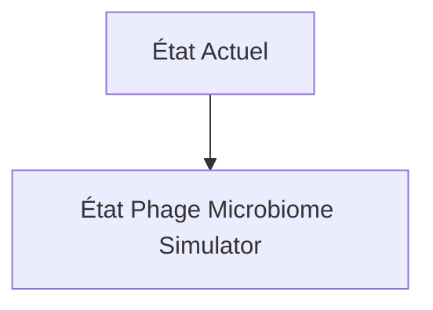
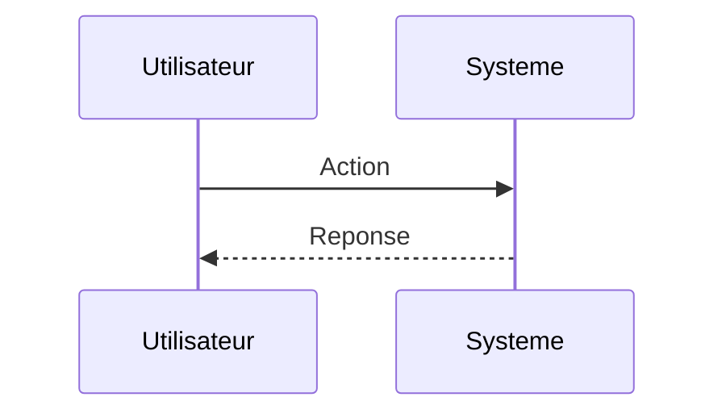

<!-- markdownlint-disable MD009 MD010 MD013 MD022 MD028 MD032 MD033 MD034 MD036 MD037 MD039 MD041 MD060 -->

[ 🇬🇧 English Version ](./README.md)

# Phage Microbiome Simulator

> **Résumé exécutif :** Un moteur de simulation spatio-temporelle (Digital Twin) du microbiome qui combine la dynamique des fluides (pour simuler la diffusion dans le mucus) et des modèles stochastiques d'infection au niveau cellulaire. Le modèle intègre des données multi-omiques pour prédire l'évolution des résistances croisées bactériennes face à un cocktail de phages synthétiques sur plusieurs générations.

---

## 1. Aperçu visuel & Effet Wahou

## 2. La thèse contrariante (Peter Thiel Style)

**La croyance populaire :** Les solutions généralistes IA peuvent résoudre ce problème.

**La vérité cachée :** L'analyse génomique standard (AlphaFold) prédit la structure d'une protéine, mais pas la dynamique de population d'un milliard de micro-organismes en compétition spatiale. Il faut un moteur de simulation physique stochastique couplé à une bio-informatique pointue.

## 3. Le problème & La cible

**Modèle économique :** B2B

**Cible précise :** Startups en thérapie phagique, laboratoires pharmaceutiques, entreprises d'agriculture de précision (microbiome des sols).

**La douleur urgente :** Le développement de thérapies à base de bactériophages (virus infectant les bactéries) pour contrer la résistance aux antibiotiques est freiné par la complexité extrême des interactions phage-bactérie dans un microbiome complexe (intestin, sol). Les tests in vitro classiques échouent souvent à prédire la dynamique d'infection in vivo, entraînant des années de R&D perdues et des essais cliniques ratés.

## 4. Architecture technique & Plomberie

## 5. Modèle économique & Viabilité financière

| Métrique                    | Valeur                        |
| --------------------------- | ----------------------------- |
| Structure de prix           | Abonnement SaaS               |
| Objectif 12 mois            | 10 clients                    |
| Calcul du CA (Target 100k€) | 10 clients \* 10k€/an = 100k€ |
| Marge brute estimée         | 80%                           |

## 6. Moteur de distribution & Fossé défensif (Moat)

**Stratégie d'acquisition :** Vente directe B2B

**Moat (Barrière à l'entrée) :** Besoin de données d'entraînement in vivo massives et très coûteuses à générer (séquençage métagénomique profond au fil du temps). Complexité de modéliser avec précision les interactions du système immunitaire de l'hôte avec le traitement phagique.

## 7. Grille d'évaluation détaillée

| Critère                           | Score VC (/100) | Score Terrain (/100) |
| --------------------------------- | --------------- | -------------------- |
| Thèse & Monopole / Urgence        | -- / 25         | -- / 25              |
| Moat / Résistance aux LLM natifs  | -- / 25         | -- / 25              |
| Scalabilité / Friction d'adoption | -- / 25         | -- / 25              |
| Unit Economics / ROI direct       | -- / 25         | -- / 25              |
| **TOTAL**                         | **-- / 100**    | **-- / 100**         |

> **Verdict VC :** En attente d'évaluation.

> **Verdict Terrain :** En attente d'évaluation.
