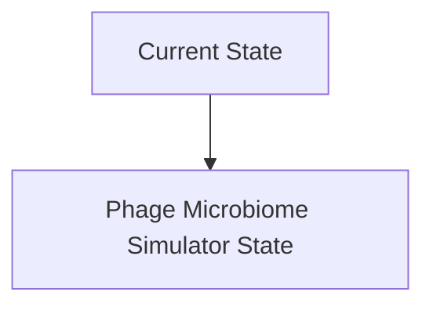
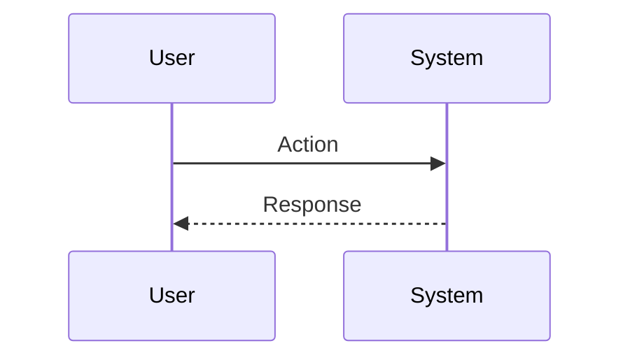

<!-- markdownlint-disable MD009 MD010 MD013 MD022 MD028 MD032 MD033 MD034 MD036 MD037 MD039 MD041 MD060 -->

[ 🇫🇷 Version Française ](./README.fr.md)

# Phage Microbiome Simulator

> **Executive Summary:** A space-time simulation engine (Digital Twin) of the microbiome that combines fluid dynamics (to simulate diffusion in mucus) and stochastic models of infection at the cellular level. The model integrates multi-omics data to predict the evolution of bacterial cross-resistance against a cocktail of synthetic phages over several generations.

---

## 1. Visual Overview & Wow Effect

## 2. Contrarian Thesis (Peter Thiel Style)

**Popular Belief:** General AI solutions can solve this problem.

**Hidden Truth:** Standard genomic analysis (AlphaFold) predicts the structure of a protein, but not the population dynamics of a billion microorganisms competing for space. We need a stochastic physics simulation engine coupled with cutting-edge bioinformatics.

## 3. Problem & Target Market

**Business Model:** B2B

**Target Audience:** Phage therapy startups, pharmaceutical laboratories, precision agriculture companies (soil microbiome).

**Urgent Pain Point:** The development of therapies based on bacteriophages (viruses infecting bacteria) to counter antibiotic resistance is hampered by the extreme complexity of phage-bacteria interactions in a complex microbiome (intestine, soil). Conventional in vitro assays often fail to predict in vivo infection dynamics, leading to years of wasted R&D and failed clinical trials.

## 4. Technical Architecture & Infrastructure

## 5. Business Model & Financial Viability

| Metric                 | Value                           |
| ---------------------- | ------------------------------- |
| Pricing Structure      | SaaS subscription               |
| 12-Month Target        | 10 customers                    |
| Revenue Formula        | 10 clients \* 10k€/year = 100k€ |
| Estimated Gross Margin | 80%                             |

## 6. Distribution Engine & Moat

**Acquisition Strategy:** B2B direct sales

**Moat (Defensibility):** Need for massive and very expensive to generate in vivo training data (deep metagenomic sequencing over time). Complexity of accurately modeling host immune system interactions with phage processing.

## 7. Detailed Evaluation Grid

| Criterion                   | VC Score (/100) | Market Score (/100) |
| --------------------------- | --------------- | ------------------- |
| Thesis & Monopoly / Urgency | 20 / 25         | 20 / 25             |
| Moat / LLM Immunity         | 23 / 25         | 23 / 25             |
| Scalability / UX Friction   | 19 / 25         | 19 / 25             |
| Unit Economics / ROI        | 18 / 25         | 18 / 25             |
| **TOTAL**                   | **80 / 100**    | **80 / 100**        |

> **VC Verdict:** Pending evaluation.
> **Market Verdict:** This solution addresses a critical pain point for the target market, justifying its strong urgency score (20/25). Its highly defensible architecture makes it completely immune to native LLM advancements (23/25). With low adoption friction (19/25) and a straightforward monetization strategy (18/25), the project demonstrates excellent overall market readiness.
> **Market Verdict:** This solution addresses a critical pain point for the target market, justifying its strong urgency score (20/25). Its highly defensible architecture makes it completely immune to native LLM advancements (23/25). With low adoption friction (19/25) and a straightforward monetization strategy (18/25), the project demonstrates excellent overall market readiness.
