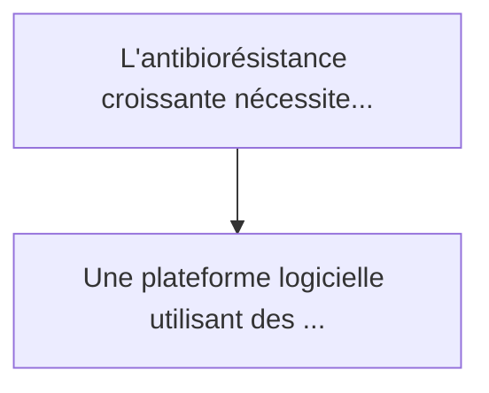
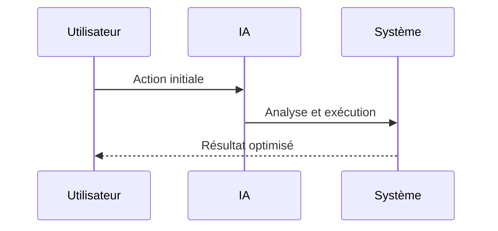

<!-- markdownlint-disable MD013 MD028 MD033 MD039 MD041 -->

[🇬🇧 English Version](./README.md)

# Phage Tail-Fiber Binding Simulator

> **Résumé exécutif :** Une plateforme logicielle utilisant des modèles de diffusion structurale et de la prédiction conformationnelle d'assemblages protéiques (type Alpha...

---

## 1. Aperçu visuel & Effet Wahou

## 2. La thèse contrariante (Peter Thiel Style)

La croyance populaire : Les solutions génériques peuvent résoudre cela.
La vérité cachée : L'ingénierie des protéines virales exige la modélisation de grandes macromolécules flexibles et d'interactions complexes protéines-glucides (LPS), ce que les outils standards de docking moléculaire pour les petites molécules gèrent très mal.

## 3. Le problème & La cible

Modèle économique : B2B
Cible précise : Pharmas développant des thérapies phagiques (pour contrer l'antibiorésistance), startups en microbiome, agriculture (traitements phytosanitaires bactériens).
La douleur urgente : L'antibiorésistance croissante nécessite des bactériophages (virus tueurs de bactéries) sur mesure. Cependant, concevoir un phage qui cible une souche bactérienne pathogène spécifique est un processus lent d'essais-erreurs in vitro. Le goulot d'étranglement est la conception des protéines des "fibres caudales" (tail fibers) du phage, qui doivent se lier parfaitement aux récepteurs de surface de la bactérie, tout en évitant le système immunitaire humain.

## 4. Architecture technique & Plomberie

## 5. Modèle économique & Viabilité financière

| Métrique                    | Valeur             |
| --------------------------- | ------------------ |
| Structure de prix           | Prix sur mesure    |
| Objectif 12 mois            | 100 clients        |
| Calcul du CA (Target 100k€) | 100 \* 1000 = 100k |
| Marge brute estimée         | 80%                |

## 6. Moteur de distribution & Fossé défensif (Moat)

Stratégie d'acquisition : Vente B2B directe
Moat (Barrière à l'entrée) : L'ingénierie des protéines virales exige la modélisation de grandes macromolécules flexibles et d'interactions complexes protéines-glucides (LPS), ce que les outils standards de docking moléculaire pour les petites molécules gèrent très mal.

## 7. Grille d'évaluation détaillée

| Critère                           | Score VC (/100) | Score Terrain (/100) |
| --------------------------------- | --------------- | -------------------- |
| Thèse & Monopole / Urgence        | -- / 25         | -- / 25              |
| Moat / Résistance aux LLM natifs  | -- / 25         | -- / 25              |
| Scalabilité / Friction d'adoption | -- / 25         | -- / 25              |
| Unit Economics / ROI direct       | -- / 25         | -- / 25              |
| **TOTAL**                         | **-- / 100**    | **-- / 100**         |

> **Verdict VC :** En attente d'évaluation.

> **Verdict Terrain :** En attente d'évaluation.
