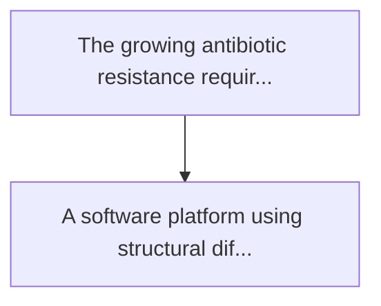
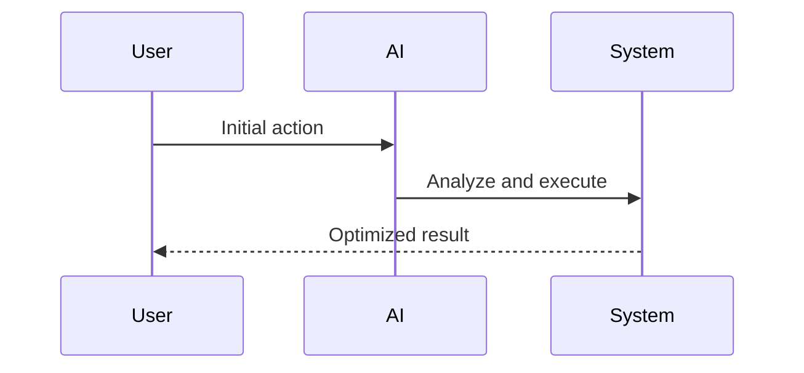

<!-- markdownlint-disable MD013 MD028 MD033 MD039 MD041 -->

[🇫🇷 Version Française](./README.fr.md)

# Phage tail-fiber binding simulator

> **Executive Summary:** A software platform using structural diffusion models and the conformational prediction of protein assemblages (alpha type...

---

## 1. Visual Overview & Wow Effect

## 2. Contrarian Thesis (Peter Thiel Style)

Popular Belief: Generic solutions can solve this.
Hidden Truth: Viral protein engineering requires the modelling of large flexible macromolecules and complex protein-glucose (lps) interactions, which the standard molecular docking tools for small molecules do very poorly.

## 3. Problem & Target Market

Business Model: B2B
Target Audience: Pharmaes developing phagic therapies (to counter antibiotic resistance), microbiome startups, agriculture (bacterial phytosanitary treatments).
Urgent Pain Point: The growing antibiotic resistance requires bacteriophages (bacterial killer viruses) tailored. however, designing a phage that targets a specific pathogenic bacterial strain is a slow process of in vitro error testing. the bottleneck is the design of the proteins of the "caudal fibers" (tail fibers) of the phage, which must bind perfectly to the surface receptors of the bacteria, while avoiding the human immune system.

## 4. Technical Architecture & Infrastructure

## 5. Business Model & Financial Viability

| Metric                 | Value              |
| ---------------------- | ------------------ |
| Pricing Structure      | Custom Pricing     |
| 12-Month Target        | 100 customers      |
| Revenue Formula        | 100 \* 1000 = 100k |
| Estimated Gross Margin | 80%                |

## 6. Distribution Engine & Moat

Acquisition Strategy: Direct B2B Sales
Moat (Defensibility): Viral protein engineering requires the modelling of large flexible macromolecules and complex protein-glucose (lps) interactions, which the standard molecular docking tools for small molecules do very poorly.

## 7. Detailed Evaluation Grid

| Criterion                   | VC Score (/100) | Market Score (/100) |
| --------------------------- | --------------- | ------------------- |
| Thesis & Monopoly / Urgency | 21 / 25         | -- / 25             |
| Moat / LLM Immunity         | 24 / 25         | -- / 25             |
| Scalability / UX Friction   | 20 / 25         | -- / 25             |
| Unit Economics / ROI        | 22 / 25         | -- / 25             |
| **TOTAL**                   | **87 / 100**    | **-- / 100**        |

> **VC Verdict:** The Phage Tail Binding Simulator applies generative structural biology to a hyper-specific but crucial problem: programmable bactericides. This specialized data and simulation moat completely shields it from generic LLMs. While navigating the complex pharma sales cycle presents scaling friction, the potential to monopolize the computational design layer of the next generation of antibiotics offers immense returns.

> **Market Verdict:** Pending evaluation.
