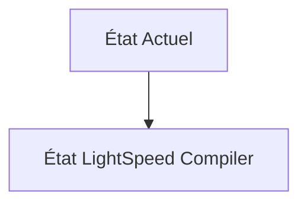
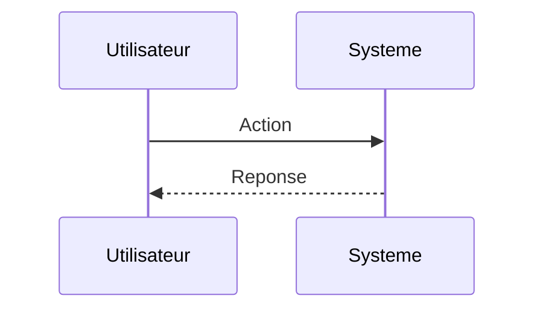

<!-- markdownlint-disable MD009 MD010 MD013 MD022 MD028 MD032 MD033 MD034 MD036 MD037 MD039 MD041 MD060 -->

[ 🇬🇧 English Version ](./README.md)

# LightSpeed Compiler

> **Résumé exécutif :** Un compilateur matériel et moteur de routage physique basé sur l'apprentissage par renforcement (RL) spécifiquement conçu pour l'Integrated Photonics, optimisant les guides d'ondes optiques, minimisant les pertes d'insertion et modélisant la diaphonie thermique/optique au nanomètre.

---

## 1. Aperçu visuel & Effet Wahou

## 2. La thèse contrariante (Peter Thiel Style)

**La croyance populaire :** Les solutions généralistes IA peuvent résoudre ce problème.

**La vérité cachée :** C'est un problème mathématique d'optimisation combinatoire et de physique ondulatoire. Les logiciels SaaS classiques n'ont aucune utilité ici; il faut un logiciel de deep tech lourd qui s'intègre aux flux de travail industriels obscurs des fonderies de silicium.

## 3. Le problème & La cible

**Modèle économique :** B2B

**Cible précise :** Concepteurs de puces IA (Nvidia, AMD, startups), fonderies (TSMC, Intel).

**La douleur urgente :** Le goulet d'étranglement de l'IA actuelle n'est plus le calcul, mais la bande passante mémoire (Interconnect/Memory Wall). L'intégration de puces photoniques (transfert de données par la lumière) est vitale, mais les outils de conception EDA (Electronic Design Automation) actuels sont conçus pour les électrons, pas pour les photons.

## 4. Architecture technique & Plomberie

## 5. Modèle économique & Viabilité financière

| Métrique                    | Valeur                        |
| --------------------------- | ----------------------------- |
| Structure de prix           | Abonnement SaaS               |
| Objectif 12 mois            | 10 clients                    |
| Calcul du CA (Target 100k€) | 10 clients \* 10k€/an = 100k€ |
| Marge brute estimée         | 80%                           |

## 6. Moteur de distribution & Fossé défensif (Moat)

**Stratégie d'acquisition :** Vente directe B2B

**Moat (Barrière à l'entrée) :** Domaine de niche extrêmement pointu; besoin d'experts rares maîtrisant à la fois la physique quantique/optique et la compilation logicielle; barrière d'entrée massive des acteurs historiques de l'EDA (Synopsys, Cadence).

## 7. Grille d'évaluation détaillée

| Critère                           | Score VC (/100) | Score Terrain (/100) |
| --------------------------------- | --------------- | -------------------- |
| Thèse & Monopole / Urgence        | -- / 25         | -- / 25              |
| Moat / Résistance aux LLM natifs  | -- / 25         | -- / 25              |
| Scalabilité / Friction d'adoption | -- / 25         | -- / 25              |
| Unit Economics / ROI direct       | -- / 25         | -- / 25              |
| **TOTAL**                         | **-- / 100**    | **-- / 100**         |

> **Verdict VC :** En attente d'évaluation.

> **Verdict Terrain :** En attente d'évaluation.
