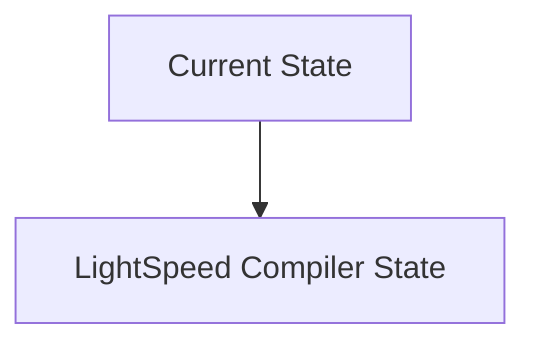
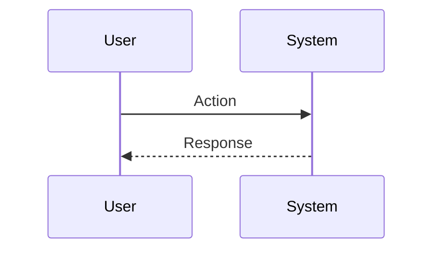

<!-- markdownlint-disable MD009 MD010 MD013 MD022 MD028 MD032 MD033 MD034 MD036 MD037 MD039 MD041 MD060 -->

[ 🇫🇷 Version Française ](./README.fr.md)

# LightSpeed Compiler

> **Executive Summary:** A reinforcement learning (RL)-based hardware compiler and physical routing engine specifically designed for Integrated Photonics, optimizing optical waveguides, minimizing insertion losses, and modeling thermal/optical crosstalk at the nanometer level.

---

## 1. Visual Overview & Wow Effect

## 2. Contrarian Thesis (Peter Thiel Style)

**Popular Belief:** General AI solutions can solve this problem.

**Hidden Truth:** It is a mathematical problem of combinatorial optimization and wave physics. Classic SaaS software has no use here; it requires heavyweight deep tech software that integrates with the arcane industrial workflows of silicon foundries.

## 3. Problem & Target Market

**Business Model:** B2B

**Target Audience:** AI chip designers (Nvidia, AMD, startups), foundries (TSMC, Intel).

**Urgent Pain Point:** The bottleneck of today's AI is no longer calculation, but memory bandwidth (Interconnect/Memory Wall). Integrating photonic chips (transferring data through light) is vital, but today's Electronic Design Automation (EDA) design tools are designed for electrons, not photons.

## 4. Technical Architecture & Infrastructure

## 5. Business Model & Financial Viability

| Metric                 | Value                           |
| ---------------------- | ------------------------------- |
| Pricing Structure      | SaaS subscription               |
| 12-Month Target        | 10 customers                    |
| Revenue Formula        | 10 clients \* 10k€/year = 100k€ |
| Estimated Gross Margin | 80%                             |

## 6. Distribution Engine & Moat

**Acquisition Strategy:** B2B direct sales

**Moat (Defensibility):** Extremely niche niche area; need for rare experts proficient in both quantum/optical physics and software compilation; massive entry barrier for historic EDA players (Synopsys, Cadence).

## 7. Detailed Evaluation Grid

| Criterion                   | VC Score (/100) | Market Score (/100) |
| --------------------------- | --------------- | ------------------- |
| Thesis & Monopoly / Urgency | -- / 25         | -- / 25             |
| Moat / LLM Immunity         | -- / 25         | -- / 25             |
| Scalability / UX Friction   | -- / 25         | -- / 25             |
| Unit Economics / ROI        | -- / 25         | -- / 25             |
| **TOTAL**                   | **-- / 100**    | **-- / 100**        |

> **VC Verdict:** Pending evaluation.

> **Market Verdict:** Pending evaluation.
