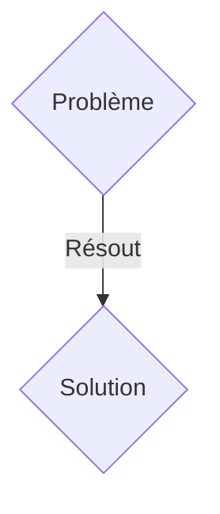
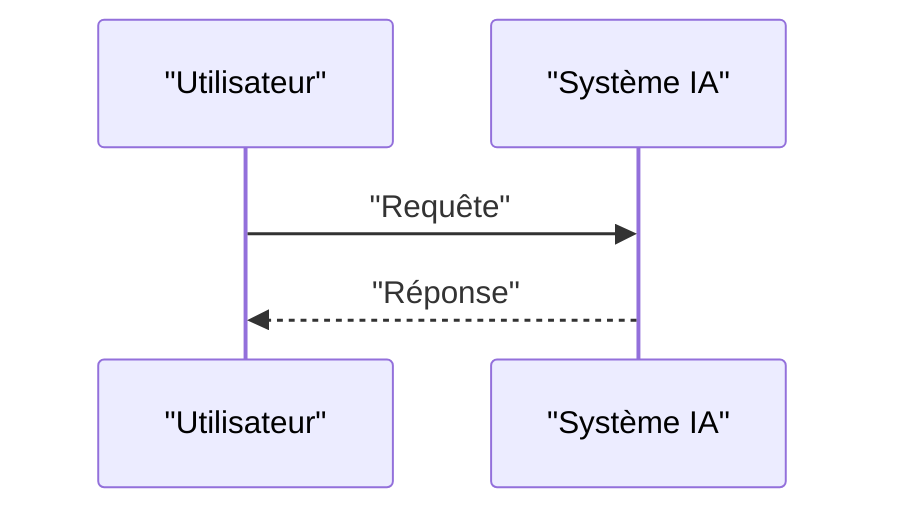

<!-- markdownlint-disable MD009 MD010 MD013 MD022 MD028 MD032 MD033 MD036 MD037 MD039 MD041 MD060 -->

[ 🇬🇧 English Version ](./README.md)

# ElectroTwin PINN

> **Résumé exécutif :** Une solution B2B ciblant Constructeurs automobiles (EV), fabricants de cellules (Gigafactories), opérateurs de stockage réseau (Grid Storage). pour résoudre : Le vieillissement prématuré des batteries Li-ion et Solid-State provoque des risques d'incendie (emballement thermique) et des dégradations de capacité imprévisibles, entraînant des rappels coûteux et une sur-conception (surpoids) des packs.

---

## 1. Aperçu visuel & Effet Wahou

## 2. La thèse contrariante (Peter Thiel Style)

- **La croyance populaire :** Les solutions génériques suffisent.
- **La vérité cachée :** Jumeau numérique électrochimique via des Physics-Informed Neural Networks (PINNs). Ce modèle ingère la télémétrie BMS (tension, courant, température) et résout en temps réel les équations de diffusion ionique (équations de Newman) pour prédire l'état de santé (SoH) interne et la formation de dendrites.

## 3. Le problème & La cible

- **Modèle économique :** B2B
- **Cible précise :** Constructeurs automobiles (EV), fabricants de cellules (Gigafactories), opérateurs de stockage réseau (Grid Storage).
- **La douleur urgente :** Le vieillissement prématuré des batteries Li-ion et Solid-State provoque des risques d'incendie (emballement thermique) et des dégradations de capacité imprévisibles, entraînant des rappels coûteux et une sur-conception (surpoids) des packs.

## 4. Architecture technique & Plomberie

Jumeau numérique électrochimique via des Physics-Informed Neural Networks (PINNs). Ce modèle ingère la télémétrie BMS (tension, courant, température) et résout en temps réel les équations de diffusion ionique (équations de Newman) pour prédire l'état de santé (SoH) interne et la formation de dendrites.

## 5. Modèle économique & Viabilité financière

| Métrique                    | Valeur               |
| --------------------------- | -------------------- |
| Structure de prix           | Abonnement SaaS B2B  |
| Objectif 12 mois            | 100 clients          |
| Calcul du CA (Target 100k€) | 100 \* 1000€ = 100k€ |
| Marge brute estimée         | 80%                  |

## 6. Moteur de distribution & Fossé défensif (Moat)

- **Stratégie d'acquisition :** Vente directe et partenariats stratégiques.
- **Moat (Barrière à l'entrée) :** Les modèles purement basés sur les données (Data-Driven ML) échouent sur les cas marginaux (edge cases thermiques). Les simulations physiques classiques (FEM/COMSOL) sont impossibles à exécuter en temps réel dans un véhicule (trop de calculs).

## 7. Grille d'évaluation détaillée

| Critère                           | Score VC (/100) | Score Terrain (/100) |
| --------------------------------- | --------------- | -------------------- |
| Thèse & Monopole / Urgence        | -- / 25         | -- / 25              |
| Moat / Résistance aux LLM natifs  | -- / 25         | -- / 25              |
| Scalabilité / Friction d'adoption | -- / 25         | -- / 25              |
| Unit Economics / ROI direct       | -- / 25         | -- / 25              |
| TOTAL                             | -- / 100        | -- / 100             |

> **Verdict VC :** En attente d'évaluation.
> **Verdict Terrain :** En attente d'évaluation.
