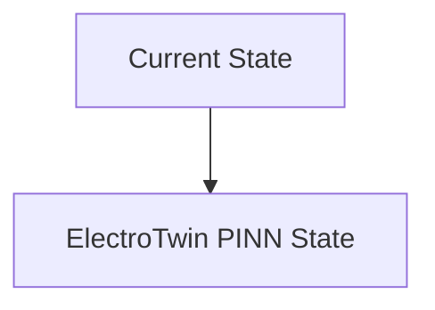
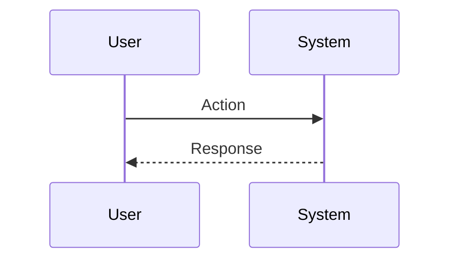

<!-- markdownlint-disable MD009 MD010 MD013 MD022 MD028 MD032 MD033 MD034 MD036 MD037 MD039 MD041 MD060 -->

[ 🇫🇷 Version Française ](./README.fr.md)

# ElectroTwin PINN

> **Executive Summary:** Electrochemical digital twin via Physics-Informed Neural Networks (PINNs). This model ingests BMS telemetry (voltage, current, temperature) and solves ion diffusion equations (Newman equations) in real time to predict internal state of health (SoH) and dendrite formation.

---

## 1. Visual Overview & Wow Effect

## 2. Contrarian Thesis (Peter Thiel Style)

**Popular Belief:** General AI solutions can solve this problem.

**Hidden Truth:** Purely data-driven models (Data-Driven ML) fail on marginal cases (thermal edge cases). Classic physical simulations (FEM/COMSOL) are impossible to run in real time in a vehicle (too many calculations).

## 3. Problem & Target Market

**Business Model:** B2B

**Target Audience:** Automotive manufacturers (EV), cell manufacturers (Gigafactories), network storage operators (Grid Storage).

**Urgent Pain Point:** Premature aging of Li-ion and Solid-State batteries causes fire risks (thermal runaway) and unpredictable capacity degradation, leading to costly recalls and over-design (overweight) of packs.

## 4. Technical Architecture & Infrastructure

## 5. Business Model & Financial Viability

| Metric                 | Value                           |
| ---------------------- | ------------------------------- |
| Pricing Structure      | SaaS subscription               |
| 12-Month Target        | 10 customers                    |
| Revenue Formula        | 10 clients \* 10k€/year = 100k€ |
| Estimated Gross Margin | 80%                             |

## 6. Distribution Engine & Moat

**Acquisition Strategy:** B2B direct sales

**Moat (Defensibility):** Limited access to high-resolution telemetry data from manufacturers' proprietary BMS (Battery Management Systems), variability in cell chemistry from one supplier to another.

## 7. Detailed Evaluation Grid

| Criterion                   | VC Score (/100) | Market Score (/100) |
| --------------------------- | --------------- | ------------------- |
| Thesis & Monopoly / Urgency | -- / 25         | -- / 25             |
| Moat / LLM Immunity         | -- / 25         | -- / 25             |
| Scalability / UX Friction   | -- / 25         | -- / 25             |
| Unit Economics / ROI        | -- / 25         | -- / 25             |
| **TOTAL**                   | **-- / 100**    | **-- / 100**        |

> **VC Verdict:** Pending evaluation.

> **Market Verdict:** Pending evaluation.
