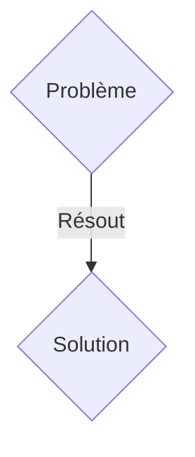
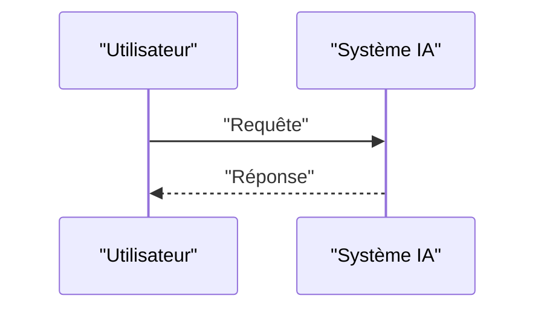

<!-- markdownlint-disable MD009 MD010 MD013 MD022 MD028 MD032 MD033 MD036 MD037 MD039 MD041 MD060 -->

[ 🇬🇧 English Version ](./README.md)

# ICS Sentinel Sandboxing

> **Résumé exécutif :** Une solution B2B ciblant Opérateurs industriels (pétrole/gaz, traitement de l'eau, centrales électriques, usines de production). pour résoudre : Les systèmes de contrôle industriel (PLC, SCADA) reçoivent des mises à jour de firmware qui peuvent être compromises (Supply Chain Attack, cf. Stuxnet ou SolarWinds). Il est impossible de tester ces firmwares en production sans risquer un arrêt d'usine ou une catastrophe physique.

---

## 1. Aperçu visuel & Effet Wahou

## 2. La thèse contrariante (Peter Thiel Style)

- **La croyance populaire :** Les solutions génériques suffisent.
- **La vérité cachée :** Création d'une plateforme d'émulation matérielle hyper-réaliste (Digital Twin de niveau instruction) qui exécute et observe le comportement dynamique d'un firmware PLC ciblé en temps réel pour détecter les anomalies logiques avant le flashage.

## 3. Le problème & La cible

- **Modèle économique :** B2B
- **Cible précise :** Opérateurs industriels (pétrole/gaz, traitement de l'eau, centrales électriques, usines de production).
- **La douleur urgente :** Les systèmes de contrôle industriel (PLC, SCADA) reçoivent des mises à jour de firmware qui peuvent être compromises (Supply Chain Attack, cf. Stuxnet ou SolarWinds). Il est impossible de tester ces firmwares en production sans risquer un arrêt d'usine ou une catastrophe physique.

## 4. Architecture technique & Plomberie

Création d'une plateforme d'émulation matérielle hyper-réaliste (Digital Twin de niveau instruction) qui exécute et observe le comportement dynamique d'un firmware PLC ciblé en temps réel pour détecter les anomalies logiques avant le flashage.

## 5. Modèle économique & Viabilité financière

| Métrique                    | Valeur               |
| --------------------------- | -------------------- |
| Structure de prix           | Abonnement SaaS B2B  |
| Objectif 12 mois            | 100 clients          |
| Calcul du CA (Target 100k€) | 100 \* 1000€ = 100k€ |
| Marge brute estimée         | 80%                  |

## 6. Moteur de distribution & Fossé défensif (Moat)

- **Stratégie d'acquisition :** Vente directe et partenariats stratégiques.
- **Moat (Barrière à l'entrée) :** Les antivirus IT classiques ne comprennent pas les protocoles OT (Modbus, DNP3) ni les architectures matérielles exotiques (ARM, PowerPC anciens). Il faut une émulation au niveau des registres processeurs spécifiques à chaque équipementier industriel (Siemens, Schneider, Rockwell).

## 7. Grille d'évaluation détaillée

| Critère                           | Score VC (/100) | Score Terrain (/100) |
| --------------------------------- | --------------- | -------------------- |
| Thèse & Monopole / Urgence        | -- / 25         | -- / 25              |
| Moat / Résistance aux LLM natifs  | -- / 25         | -- / 25              |
| Scalabilité / Friction d'adoption | -- / 25         | -- / 25              |
| Unit Economics / ROI direct       | -- / 25         | -- / 25              |
| TOTAL                             | -- / 100        | -- / 100             |

> **Verdict VC :** En attente d'évaluation.
> **Verdict Terrain :** En attente d'évaluation.
