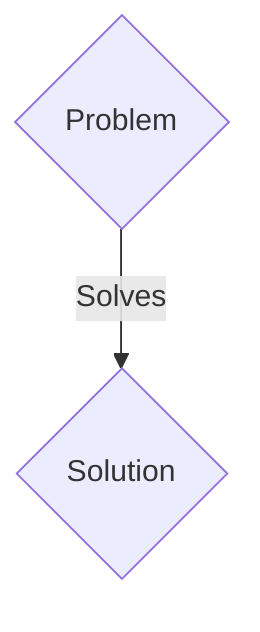
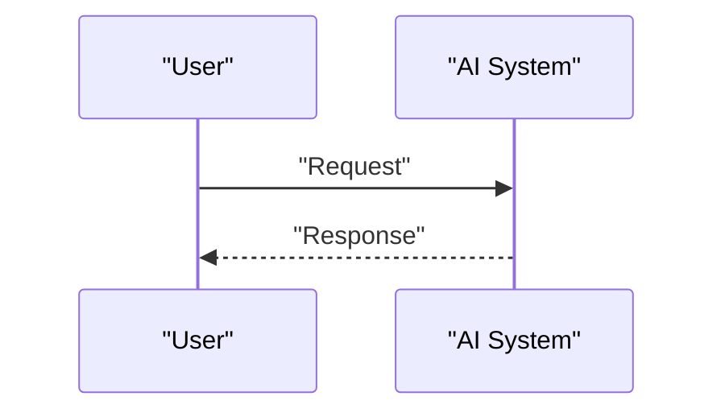

<!-- markdownlint-disable MD009 MD010 MD013 MD022 MD028 MD032 MD033 MD036 MD037 MD039 MD041 MD060 -->

[ 🇫🇷 Version Française ](./README.fr.md)

# ICS Sentinel Sandboxing

> **Executive Summary:** A B2B solution targeting Industrial operators (oil/gas, water treatment, power plants, production plants). to solve: Industrial control systems (PLC, SCADA) receive firmware updates that can be compromised (Supply Chain Attack, cf. Stuxnet or SolarWinds). It is impossible to test these firmwares in production without risking a factory shutdown or physical disaster.

---

## 1. Visual Overview & Wow Effect

## 2. Contrarian Thesis (Peter Thiel Style)

- **Popular Belief:** Generic solutions are enough.
- **Hidden Truth:** Created a hyper-realistic hardware emulation platform (instruction-level Digital Twin) that executes and observes the dynamic behavior of targeted PLC firmware in real time to detect logic anomalies before flashing.

## 3. Problem & Target Market

- **Business Model:** B2B
- **Target Audience:** Industrial operators (oil/gas, water treatment, power plants, production plants).
- **Urgent Pain Point:** Industrial control systems (PLC, SCADA) receive firmware updates that can be compromised (Supply Chain Attack, cf. Stuxnet or SolarWinds). It is impossible to test these firmwares in production without risking a factory shutdown or physical disaster.

## 4. Technical Architecture & Infrastructure

Created a hyper-realistic hardware emulation platform (instruction-level Digital Twin) that executes and observes the dynamic behavior of targeted PLC firmware in real time to detect logic anomalies before flashing.

## 5. Business Model & Financial Viability

| Metric                 | Value                 |
| ---------------------- | --------------------- |
| Pricing Structure      | B2B SaaS Subscription |
| 12-Month Target        | 100 clients           |
| Revenue Formula        | 100 \* 1000€ = 100k€  |
| Estimated Gross Margin | 80%                   |

## 6. Distribution Engine & Moat

- **Acquisition Strategy:** Direct sales and strategic partnerships.
- **Moat (Defensibility):** Classic IT antiviruses do not understand OT protocols (Modbus, DNP3) or exotic hardware architectures (ARM, old PowerPC). Emulation is required at the level of processor registers specific to each industrial equipment manufacturer (Siemens, Schneider, Rockwell).

## 7. Detailed Evaluation Grid

| Criterion                   | VC Score (/100) | Market Score (/100) |
| --------------------------- | --------------- | ------------------- |
| Thesis & Monopoly / Urgency | -- / 25         | -- / 25             |
| Moat / LLM Immunity         | -- / 25         | -- / 25             |
| Scalability / UX Friction   | -- / 25         | -- / 25             |
| Unit Economics / ROI        | -- / 25         | -- / 25             |
| TOTAL                       | -- / 100        | -- / 100            |

> **VC Verdict:** Pending evaluation.
> **Market Verdict:** Pending evaluation.
