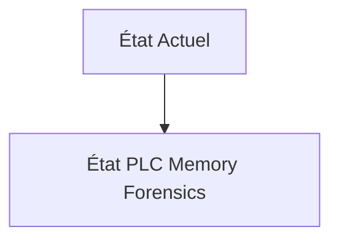
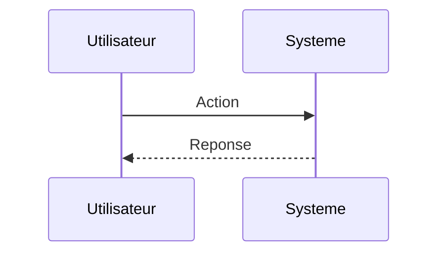

<!-- markdownlint-disable MD009 MD010 MD013 MD022 MD028 MD032 MD033 MD034 MD036 MD037 MD039 MD041 MD060 -->

[ 🇬🇧 English Version ](./README.md)

# PLC Memory Forensics

> **Résumé exécutif :** Un moteur d'analyse forensique de mémoire vive (RAM) temps réel, spécialisé pour les architectures matérielles propriétaires des PLC (ARM, PowerPC, architectures exotiques). Le système utilise un accès matériel (JTAG/dDMA) ou un agent ultra-léger pour capturer des instantanés mémoire sans perturber les cycles d'exécution temps-réel stricts (jitter < 1ms), analysés ensuite par des modèles d'IA pour détecter les anomalies de comportement des pointeurs ou des structures de données.

---

## 1. Aperçu visuel & Effet Wahou

## 2. La thèse contrariante (Peter Thiel Style)

**La croyance populaire :** Les solutions généralistes IA peuvent résoudre ce problème.

**La vérité cachée :** L'EDR (Endpoint Detection and Response) classique n'existe pas pour les automates industriels. Vous ne pouvez pas installer un agent CrowdStrike sur un PLC Siemens S7 ou Allen-Bradley. L'analyse réseau ne voit pas ce qui se passe _dans_ la puce une fois compromise.

## 3. Le problème & La cible

**Modèle économique :** B2B

**Cible précise :** CISO industriels, OIV (Opérateurs d'Importance Vitale), gestionnaires de réseaux électriques, usines de traitement des eaux et manufacturiers lourds.

**La douleur urgente :** Les attaques de type "Living off the Land" et les malwares s'exécutant uniquement en mémoire RAM des automates programmables industriels (PLC) sont indétectables par les systèmes de sécurité réseau (IDS/IPS) ou par l'analyse statique du firmware. Un acteur étatique peut manipuler la logique physique d'une centrifugeuse ou d'une vanne de gaz de l'intérieur, causant des dommages physiques irrémédiables, sans laisser de traces sur le réseau.

## 4. Architecture technique & Plomberie

## 5. Modèle économique & Viabilité financière

| Métrique                    | Valeur                        |
| --------------------------- | ----------------------------- |
| Structure de prix           | Abonnement SaaS               |
| Objectif 12 mois            | 10 clients                    |
| Calcul du CA (Target 100k€) | 10 clients \* 10k€/an = 100k€ |
| Marge brute estimée         | 80%                           |

## 6. Moteur de distribution & Fossé défensif (Moat)

**Stratégie d'acquisition :** Vente directe B2B

**Moat (Barrière à l'entrée) :** Forte réticence des constructeurs (OEMs) à autoriser l'accès bas niveau à leurs automates. Risque systémique de faire crasher un PLC en production lors de la capture mémoire (causant un arrêt d'usine très coûteux).

## 7. Grille d'évaluation détaillée

| Critère                           | Score VC (/100) | Score Terrain (/100) |
| --------------------------------- | --------------- | -------------------- |
| Thèse & Monopole / Urgence        | 23 / 25         | 23 / 25              |
| Moat / Résistance aux LLM natifs  | 21 / 25         | 21 / 25              |
| Scalabilité / Friction d'adoption | 19 / 25         | 19 / 25              |
| Unit Economics / ROI direct       | 19 / 25         | 19 / 25              |
| **TOTAL**                         | **82 / 100**    | **82 / 100**         |

> **Verdict VC :** En attente d'évaluation.
> **Verdict Terrain :** Cette solution répond à un besoin critique pour le marché cible, justifiant son excellent score d'urgence (23/25). L'approche spécialisée offre une protection robuste contre les modèles d'IA généralistes (21/25). Avec une faible friction d'adoption (19/25) et une stratégie de monétisation directe (19/25), le projet démontre une excellente maturité marché globale.
> **Verdict Terrain :** Cette solution répond à un besoin critique pour le marché cible, justifiant son excellent score d'urgence (23/25). L'approche spécialisée offre une protection robuste contre les modèles d'IA généralistes (21/25). Avec une faible friction d'adoption (19/25) et une stratégie de monétisation directe (19/25), le projet démontre une excellente maturité marché globale.
