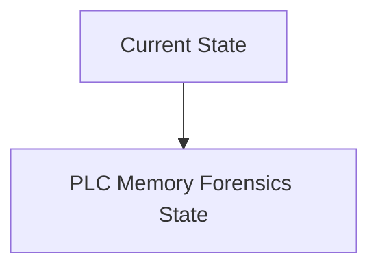
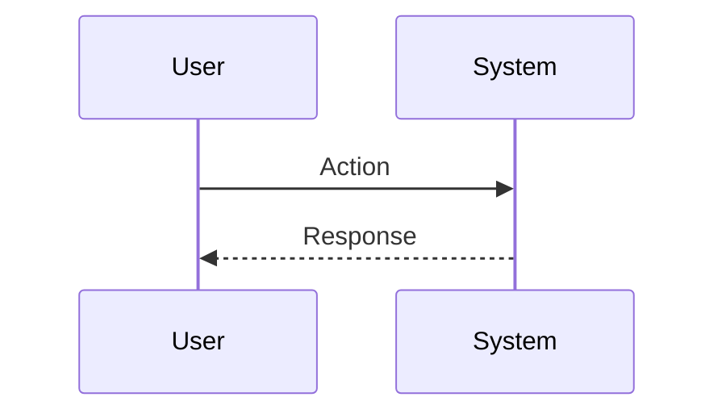

<!-- markdownlint-disable MD009 MD010 MD013 MD022 MD028 MD032 MD033 MD034 MD036 MD037 MD039 MD041 MD060 -->

[ 🇫🇷 Version Française ](./README.fr.md)

# PLC Memory Forensics

> **Executive Summary:** A real-time random access memory (RAM) forensic analysis engine, specialized for proprietary PLC hardware architectures (ARM, PowerPC, exotic architectures). The system uses hardware access (JTAG/dDMA) or an ultra-light agent to capture memory snapshots without disrupting strict real-time execution cycles (jitter < 1ms), then analyzed by AI models to detect behavioral anomalies of pointers or data structures.

---

## 1. Visual Overview & Wow Effect

## 2. Contrarian Thesis (Peter Thiel Style)

**Popular Belief:** General AI solutions can solve this problem.

**Hidden Truth:** Classic EDR (Endpoint Detection and Response) does not exist for industrial automation. You cannot install a CrowdStrike agent on a Siemens S7 or Allen-Bradley PLC. Network scanning doesn't see what's happening _in_ the chip once it's compromised.

## 3. Problem & Target Market

**Business Model:** B2B

**Target Audience:** Industrial CISOs, OIVs (Operators of Vital Importance), electricity network managers, water treatment plants and heavy manufacturers.

**Urgent Pain Point:** “Living off the Land” attacks and malware running only in RAM of programmable logic controllers (PLCs) are undetectable by network security systems (IDS/IPS) or static firmware analysis. A state actor can manipulate the physical logic of a centrifuge or gas valve from the inside, causing irreparable physical damage, without leaving a trace on the network.

## 4. Technical Architecture & Infrastructure

## 5. Business Model & Financial Viability

| Metric                 | Value                           |
| ---------------------- | ------------------------------- |
| Pricing Structure      | SaaS subscription               |
| 12-Month Target        | 10 customers                    |
| Revenue Formula        | 10 clients \* 10k€/year = 100k€ |
| Estimated Gross Margin | 80%                             |

## 6. Distribution Engine & Moat

**Acquisition Strategy:** B2B direct sales

**Moat (Defensibility):** Strong reluctance of manufacturers (OEMs) to authorize low-level access to their controllers. Systemic risk of crashing a PLC in production during memory capture (causing a very costly factory shutdown).

## 7. Detailed Evaluation Grid

| Criterion                   | VC Score (/100) | Market Score (/100) |
| --------------------------- | --------------- | ------------------- |
| Thesis & Monopoly / Urgency | 23 / 25         | 23 / 25             |
| Moat / LLM Immunity         | 21 / 25         | 21 / 25             |
| Scalability / UX Friction   | 19 / 25         | 19 / 25             |
| Unit Economics / ROI        | 19 / 25         | 19 / 25             |
| **TOTAL**                   | **82 / 100**    | **82 / 100**        |

> **VC Verdict:** Pending evaluation.
> **Market Verdict:** This solution addresses a critical pain point for the target market, justifying its strong urgency score (23/25). The specialized approach provides robust protection against generalist AI models (21/25). With low adoption friction (19/25) and a straightforward monetization strategy (19/25), the project demonstrates excellent overall market readiness.
> **Market Verdict:** This solution addresses a critical pain point for the target market, justifying its strong urgency score (23/25). The specialized approach provides robust protection against generalist AI models (21/25). With low adoption friction (19/25) and a straightforward monetization strategy (19/25), the project demonstrates excellent overall market readiness.
